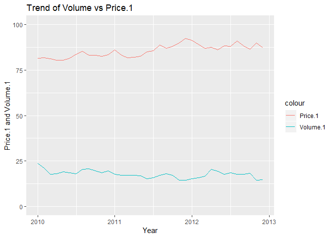

MarketMix
================
Shweta Tyagi
24/04/2019

``` r
## Load data in R and understand its contents. Rearrange the columns for ease of view and understanding
volmart<- read.csv(file.choose(), header=TRUE)
str(volmart)
```

    ## 'data.frame':    36 obs. of  24 variables:
    ##  $ Weekending         : Factor w/ 36 levels "01-01-2010","01-01-2011",..: 1 4 7 10 13 16 19 22 25 28 ...
    ##  $ Volume.1           : num  23.7 20.9 17.7 17.9 19 ...
    ##  $ Price.1            : num  81.6 81.9 81.3 80.5 80.4 ...
    ##  $ Comp.Price.1       : num  97.6 87 87.2 88.8 89 ...
    ##  $ Distribution.1     : num  1939 1567 1561 1438 1549 ...
    ##  $ TV.1               : num  0 0 0 0 0 0 0 0 0 0 ...
    ##  $ TV.2               : num  1 0.894 1 1 1 ...
    ##  $ Magazine.1         : num  0 58.2 0 0 7.5 0 0 20.5 37.1 0 ...
    ##  $ Trade.promotion.1  : num  0 0 0 0 0 ...
    ##  $ Volume.2           : num  28 23.5 26.8 26.9 27.5 ...
    ##  $ Price.2            : num  17.8 17.8 17.8 18 18 ...
    ##  $ Discount.1         : num  0 0 0 0 4.55 ...
    ##  $ Distribution.2     : num  98.2 96.7 99.2 98.6 100 ...
    ##  $ TV.3               : num  0.93999 0.00945 0.6423 0.65097 0.53587 ...
    ##  $ Trade.promotion.2  : num  0 0 0 0 0 ...
    ##  $ Trade.Promotion.3  : num  0.1081 0.0742 0.0546 0.0755 0.1615 ...
    ##  $ Instore.Promotion  : int  0 0 61 0 0 55 179 0 0 0 ...
    ##  $ Price.Discount     : num  0 0 0 0 0 ...
    ##  $ Competition.Price.2: num  19.6 19.2 19.2 20.6 20.2 ...
    ##  $ Print.1            : int  0 0 0 0 0 0 0 0 0 0 ...
    ##  $ OOH.1              : num  1.277 0.99 0.439 0.286 1.874 ...
    ##  $ Trade.Promotion.4  : num  1.172 1.155 1.022 1.041 0.758 ...
    ##  $ TV.4               : num  0.2918 0.0304 0.1791 0.2063 0.1431 ...
    ##  $ TV.5               : num  0 0 0 0 0 0 0 0 0 0 ...

``` r
volmart<-volmart[,c(1,2,10,3,11,4,19,5,13,6,7,14,23,24,8,9,15,16,22,12,18,17,20,21)]
str(volmart)  
```

    ## 'data.frame':    36 obs. of  24 variables:
    ##  $ Weekending         : Factor w/ 36 levels "01-01-2010","01-01-2011",..: 1 4 7 10 13 16 19 22 25 28 ...
    ##  $ Volume.1           : num  23.7 20.9 17.7 17.9 19 ...
    ##  $ Volume.2           : num  28 23.5 26.8 26.9 27.5 ...
    ##  $ Price.1            : num  81.6 81.9 81.3 80.5 80.4 ...
    ##  $ Price.2            : num  17.8 17.8 17.8 18 18 ...
    ##  $ Comp.Price.1       : num  97.6 87 87.2 88.8 89 ...
    ##  $ Competition.Price.2: num  19.6 19.2 19.2 20.6 20.2 ...
    ##  $ Distribution.1     : num  1939 1567 1561 1438 1549 ...
    ##  $ Distribution.2     : num  98.2 96.7 99.2 98.6 100 ...
    ##  $ TV.1               : num  0 0 0 0 0 0 0 0 0 0 ...
    ##  $ TV.2               : num  1 0.894 1 1 1 ...
    ##  $ TV.3               : num  0.93999 0.00945 0.6423 0.65097 0.53587 ...
    ##  $ TV.4               : num  0.2918 0.0304 0.1791 0.2063 0.1431 ...
    ##  $ TV.5               : num  0 0 0 0 0 0 0 0 0 0 ...
    ##  $ Magazine.1         : num  0 58.2 0 0 7.5 0 0 20.5 37.1 0 ...
    ##  $ Trade.promotion.1  : num  0 0 0 0 0 ...
    ##  $ Trade.promotion.2  : num  0 0 0 0 0 ...
    ##  $ Trade.Promotion.3  : num  0.1081 0.0742 0.0546 0.0755 0.1615 ...
    ##  $ Trade.Promotion.4  : num  1.172 1.155 1.022 1.041 0.758 ...
    ##  $ Discount.1         : num  0 0 0 0 4.55 ...
    ##  $ Price.Discount     : num  0 0 0 0 0 ...
    ##  $ Instore.Promotion  : int  0 0 61 0 0 55 179 0 0 0 ...
    ##  $ Print.1            : int  0 0 0 0 0 0 0 0 0 0 ...
    ##  $ OOH.1              : num  1.277 0.99 0.439 0.286 1.874 ...

``` r
summary(volmart)
```

    ##       Weekending    Volume.1        Volume.2        Price.1     
    ##  01-01-2010: 1   Min.   :14.30   Min.   :18.98   Min.   :80.43  
    ##  01-01-2011: 1   1st Qu.:16.78   1st Qu.:22.82   1st Qu.:82.70  
    ##  01-01-2012: 1   Median :17.71   Median :25.28   Median :85.85  
    ##  01-02-2010: 1   Mean   :17.73   Mean   :25.73   Mean   :85.64  
    ##  01-02-2011: 1   3rd Qu.:18.71   3rd Qu.:28.05   3rd Qu.:88.25  
    ##  01-02-2012: 1   Max.   :23.70   Max.   :40.56   Max.   :92.55  
    ##  (Other)   :30                                                  
    ##     Price.2       Comp.Price.1   Competition.Price.2 Distribution.1
    ##  Min.   :15.77   Min.   :85.70   Min.   :15.98       Min.   :1293  
    ##  1st Qu.:17.81   1st Qu.:87.77   1st Qu.:17.95       1st Qu.:1413  
    ##  Median :18.07   Median :89.45   Median :19.14       Median :1493  
    ##  Mean   :18.36   Mean   :90.13   Mean   :19.47       Mean   :1568  
    ##  3rd Qu.:18.79   3rd Qu.:92.15   3rd Qu.:20.51       3rd Qu.:1678  
    ##  Max.   :20.91   Max.   :97.55   Max.   :23.88       Max.   :2083  
    ##                                                                    
    ##  Distribution.2        TV.1              TV.2             TV.3          
    ##  Min.   : 89.10   Min.   :0.00000   Min.   :0.0000   Min.   :0.0000112  
    ##  1st Qu.: 92.46   1st Qu.:0.00000   1st Qu.:0.0000   1st Qu.:0.4071385  
    ##  Median : 98.42   Median :0.04679   Median :0.0000   Median :0.7097653  
    ##  Mean   : 96.31   Mean   :0.08848   Mean   :0.3160   Mean   :0.6323173  
    ##  3rd Qu.: 99.87   3rd Qu.:0.12476   3rd Qu.:0.9996   3rd Qu.:0.9742166  
    ##  Max.   :100.00   Max.   :0.42948   Max.   :1.0000   Max.   :1.0000000  
    ##                                                                         
    ##       TV.4              TV.5           Magazine.1     Trade.promotion.1
    ##  Min.   :0.00000   Min.   :0.00000   Min.   : 0.000   Min.   :     0   
    ##  1st Qu.:0.00000   1st Qu.:0.00000   1st Qu.: 0.000   1st Qu.:     0   
    ##  Median :0.00000   Median :0.06698   Median : 0.000   Median :     0   
    ##  Mean   :0.05668   Mean   :0.17178   Mean   : 3.425   Mean   : 65972   
    ##  3rd Qu.:0.09046   3rd Qu.:0.23053   3rd Qu.: 0.000   3rd Qu.:     0   
    ##  Max.   :0.33364   Max.   :0.67433   Max.   :58.200   Max.   :666667   
    ##                                                                        
    ##  Trade.promotion.2 Trade.Promotion.3 Trade.Promotion.4   Discount.1   
    ##  Min.   :     0    Min.   :0.03628   Min.   :0.7294    Min.   : 0.00  
    ##  1st Qu.:     0    1st Qu.:0.07762   1st Qu.:0.9290    1st Qu.: 0.00  
    ##  Median :     0    Median :0.09395   Median :1.0208    Median : 0.00  
    ##  Mean   :115972    Mean   :0.10666   Mean   :0.9981    Mean   : 3.36  
    ##  3rd Qu.: 31250    3rd Qu.:0.13297   3rd Qu.:1.0677    3rd Qu.: 6.26  
    ##  Max.   :666667    Max.   :0.21804   Max.   :1.1716    Max.   :13.06  
    ##                                                                       
    ##  Price.Discount  Instore.Promotion    Print.1           OOH.1       
    ##  Min.   : 0.00   Min.   :  0.00    Min.   :     0   Min.   :0.0000  
    ##  1st Qu.: 0.00   1st Qu.:  0.00    1st Qu.:     0   1st Qu.:0.4920  
    ##  Median : 0.00   Median :  0.00    Median :     0   Median :0.8945  
    ##  Mean   : 2.73   Mean   : 13.17    Mean   : 25000   Mean   :1.0045  
    ##  3rd Qu.: 6.26   3rd Qu.: 13.75    3rd Qu.:     0   3rd Qu.:1.3313  
    ##  Max.   :13.06   Max.   :179.00    Max.   :585000   Max.   :2.8930  
    ## 

``` r
## Check if dependent variable, Volume1, is normally distributed using Shapiro Wilk Normality Test. 
#The hypothesis of SW is that data is normally distributed. Running the test gives us a P value of 0.2507,hence the dependant variable is normal. 
qqnorm(volmart$Volume.1,col="blue")
shapiro.test(volmart$Volume.1)
```

    ## 
    ##  Shapiro-Wilk normality test
    ## 
    ## data:  volmart$Volume.1
    ## W = 0.96218, p-value = 0.2507

``` r
##Load the necessary libraries in R
library(ggplot2)
```

<!-- -->

``` r
library(lubridate)
```

    ## 
    ## Attaching package: 'lubridate'

    ## The following object is masked from 'package:base':
    ## 
    ##     date

``` r
library(dplyr)
```

    ## 
    ## Attaching package: 'dplyr'

    ## The following objects are masked from 'package:lubridate':
    ## 
    ##     intersect, setdiff, union

    ## The following objects are masked from 'package:stats':
    ## 
    ##     filter, lag

    ## The following objects are masked from 'package:base':
    ## 
    ##     intersect, setdiff, setequal, union

``` r
library(caret)
```

    ## Loading required package: lattice

``` r
library(caTools)

##Extract the 'year' from the 'Weekending' column into a new column Year. 
class(volmart$Weekending)
```

    ## [1] "factor"

``` r
volmart$Weekending <- dmy(volmart$Weekending)
class(volmart$Weekending)
```

    ## [1] "Date"

``` r
volmart$Year<-as.numeric(format(volmart$Weekending, "%Y"))
head(volmart$Year)
```

    ## [1] 2010 2010 2010 2010 2010 2010

``` r
class(volmart$Year)
```

    ## [1] "numeric"

``` r
#Plot the volume by year to show the y-o-y trend. The volume decreases in 2011 and marginally increases in 2012
volmart%>% 
  filter(Year,Volume.1)%>%
  group_by (Year)%>% 
  summarize(value = sum(Volume.1))%>%
  ggplot(aes(x=Year,y=value))+geom_col(fill="blue")+geom_text(aes(label=value),color="white",vjust=1.6)+labs(title="Volume1 for 2010-2012", y="Volume.1", x="Year")
```

<!-- -->

``` r
## Understand the relationship of Price.1 with Volume.1 and look at its y-o-y trend
#Check for the strength of the relationship of Volume1 with Price through correlation test. 
#The value of cor test for Price1 is -0.53. P value is  0.0008599
cor(volmart$Volume.1,volmart$Price.1)
```

    ## [1] -0.5311036

``` r
cor.test(volmart$Volume.1,volmart$Price.1)
```

    ## 
    ##  Pearson's product-moment correlation
    ## 
    ## data:  volmart$Volume.1 and volmart$Price.1
    ## t = -3.6549, df = 34, p-value = 0.0008599
    ## alternative hypothesis: true correlation is not equal to 0
    ## 95 percent confidence interval:
    ##  -0.7319278 -0.2453841
    ## sample estimates:
    ##        cor 
    ## -0.5311036

``` r
ggplot(volmart, aes(x=Price.1,y=Volume.1))+ geom_point(color="blue", alpha=0.8)+stat_smooth(method="loess", formula=y~x)
```

<!-- -->

``` r
#Show the trend of Price.1. The trend show y-o-y increase in Price.1
volmart%>% 
  filter(Year,Price.1) %>%
  group_by(Year)%>%
  summarize(value = mean(Price.1))%>%
  ggplot(aes(x=Year, y=value))+ geom_col(fill="blue")+geom_text(aes(label=value),color="white",vjust=1.6)+labs(title="Average Price.1 for 2010-2012",y="Average Price.1", x="Year")
```

<!-- -->

``` r
#Plot the Price.1 and Volume.1 on the same graph
ggplot(volmart,aes(x=Weekending))+geom_line(aes(y=Volume.1, color="Volume.1"))+geom_line(aes(y=Price.1, color="Price.1"))+ylim(0,100)+labs(title="Trend of Volume vs Price.1", x="Year",y="Price.1 and Volume.1")
```

<!-- -->

``` r
## Understand the relationship of Price.2 with Volume.1 and look at its y-o-y trend
#Check for the strength of the relationship of Volume1 with Price.2 through correlation test. 
#The value of cor test for Price1 is -0.47 . P value is 0.003279
cor.test(volmart$Volume.1,volmart$Price.2)
```

    ## 
    ##  Pearson's product-moment correlation
    ## 
    ## data:  volmart$Volume.1 and volmart$Price.2
    ## t = -3.1632, df = 34, p-value = 0.003279
    ## alternative hypothesis: true correlation is not equal to 0
    ## 95 percent confidence interval:
    ##  -0.6962943 -0.1758522
    ## sample estimates:
    ##        cor 
    ## -0.4768392

``` r
ggplot(volmart, aes(x=Price.2,y=Volume.1)) + geom_point(colour = "blue", alpha = 0.8) + 
  theme(axis.title = element_text(size = 8.5))+stat_smooth(method="loess", formula= y~x)
```

<!-- -->

``` r
#Show the trend of Price.2. It increased by 2 units in 2011 and then reduced by 1 unit in 2012
volmart%>% 
  filter(Year,Price.2) %>%
  group_by(Year)%>%
  summarize(value = mean(Price.2))%>%
  ggplot(aes(x=Year, y=value))+ geom_col(fill="blue")+geom_text(aes(label=value),color="white",vjust=1.6)+labs(title="Average Price.2 for 2010-2012",y="Average Price.2", x="Year")
```

<!-- -->

``` r
#Plot the Price.2 and Volume.1 on the same graph
ggplot(volmart,aes(x=Weekending))+geom_line(aes(y=Volume.1, color="Volume.1"))+geom_line(aes(y=Price.2, color="Price.2"))+ylim(10,25)+labs(title="Trend of Volume.1 vs Price.2", x="Year",y="Price.2 and Volume.1")
```

<!-- -->

``` r
##Take the average of the two prices in the two markets and analyse its corelation on volume1
volmart$averageprice<- ((volmart$Price.1+volmart$Price.2)/2)
summary(volmart$averageprice)
```

    ##    Min. 1st Qu.  Median    Mean 3rd Qu.    Max. 
    ##   49.21   50.20   52.43   52.00   53.32   55.61

``` r
#Run the correlation test on the average price and volume.1. The p value is less than 5% indicating strong corelation.
#The correlation value is -0.63.
cor.test(volmart$Volume.1,volmart$averageprice)
```

    ## 
    ##  Pearson's product-moment correlation
    ## 
    ## data:  volmart$Volume.1 and volmart$averageprice
    ## t = -4.7319, df = 34, p-value = 3.814e-05
    ## alternative hypothesis: true correlation is not equal to 0
    ## 95 percent confidence interval:
    ##  -0.7942425 -0.3803323
    ## sample estimates:
    ##        cor 
    ## -0.6301314

``` r
ggplot(volmart,aes(x=Weekending))+geom_line(aes(y=averageprice, color="averageprice"))+geom_line(aes(y=Volume.1,color="Volume,1"))+labs(title="Trend of Volume.1 vs. Average Price", x="Year", y="Average Price and Volume.1")
```

<!-- -->

``` r
ggplot(volmart,aes(averageprice,Volume.1)) + geom_point(colour = "blue", alpha = 0.8) +
  theme(axis.title = element_text(size = 8.5))+stat_smooth(method="loess", formula= y~x)
```

<!-- -->

``` r
## Calculating sales/revenues for the company for the years 2010-2012 and look at the trend
volmart$ValueSales.1<- (volmart$Volume.1 * volmart$Price.1)
summary(volmart$ValueSales.1)
```

    ##    Min. 1st Qu.  Median    Mean 3rd Qu.    Max. 
    ##    1268    1400    1517    1515    1608    1934

``` r
volmart$Weekending[which.min(volmart$ValueSales.1)]
```

    ## [1] "2012-12-01"

``` r
volmart$Weekending[which.max(volmart$ValueSales.1)]
```

    ## [1] "2010-01-01"

``` r
#Show the y-o-y trend of the total sales for Market 1
volmart%>% 
  filter(Year,ValueSales.1) %>%
  group_by(Year)%>%
  summarize(value = sum(ValueSales.1))%>%
  ggplot(aes(x=Year, y=value))+ geom_col(fill="blue")+geom_text(aes(label=value),color="white",vjust=1.6)+labs(title="Total sales for 2010-2012 for Market 1",y="Total Value Sales", x="Year")
```

<!-- -->

``` r
#Create a new variable Year 1 of the class Factor
volmart$Year1<-volmart$Year
volmart$Year1<-as.factor(volmart$Year1)
ggplot(volmart,aes(x=Year1,y=ValueSales.1))+geom_boxplot()+labs(title="Distribution of ValueSales.1 y-o-y")
```

<!-- -->

``` r
##Study the competition prices in both markets,Comp.Price.1 and Competition.Price.2 
summary(volmart$Comp.Price.1)
```

    ##    Min. 1st Qu.  Median    Mean 3rd Qu.    Max. 
    ##   85.70   87.77   89.45   90.13   92.15   97.55

``` r
summary(volmart$Competition.Price.2)
```

    ##    Min. 1st Qu.  Median    Mean 3rd Qu.    Max. 
    ##   15.98   17.95   19.14   19.47   20.51   23.88

``` r
#Correlation between the competition prices and Volume.1
#The corrtest value of Volume1 with Comp Price 1 and CompPrice 2 respectively is 0.48 and -0.32.
#Only for Comp Price1, the p value is significant. 
cor.test(volmart$Volume.1,volmart$Comp.Price.1)
```

    ## 
    ##  Pearson's product-moment correlation
    ## 
    ## data:  volmart$Volume.1 and volmart$Comp.Price.1
    ## t = 3.2397, df = 34, p-value = 0.002675
    ## alternative hypothesis: true correlation is not equal to 0
    ## 95 percent confidence interval:
    ##  0.1869798 0.7021748
    ## sample estimates:
    ##       cor 
    ## 0.4856804

``` r
cor.test(volmart$Volume.1,volmart$Competition.Price.2)
```

    ## 
    ##  Pearson's product-moment correlation
    ## 
    ## data:  volmart$Volume.1 and volmart$Competition.Price.2
    ## t = -1.9929, df = 34, p-value = 0.05434
    ## alternative hypothesis: true correlation is not equal to 0
    ## 95 percent confidence interval:
    ##  -0.589333695  0.005727223
    ## sample estimates:
    ##        cor 
    ## -0.3234171

``` r
ggplot(volmart,aes(x=Year1,y=Comp.Price.1))+geom_boxplot()+labs(title="Distribution of Competition Price 1 y-o-y")
```

<!-- -->

``` r
ggplot(volmart,aes(x=Weekending))+geom_line(aes(y=Price.1, color="Price.1"))+geom_line(aes(y=Comp.Price.1, color="Comp.Price.1"))+ ylim(75,100)+labs(title="Trend of Price.1 vs Comp Price.1", x="Year",y="Prices")
```

<!-- -->

``` r
#Add average competition price and look at its correlation with Volume.The p value is insignificant hence no correlation with volume1
volmart$AverageComprice <- ((volmart$Comp.Price.1+volmart$Competition.Price.2)/2)
summary(volmart$AverageComprice)
```

    ##    Min. 1st Qu.  Median    Mean 3rd Qu.    Max. 
    ##   51.99   53.38   54.91   54.80   55.75   58.57

``` r
cor.test(volmart$Volume.1,volmart$AverageComprice)
```

    ## 
    ##  Pearson's product-moment correlation
    ## 
    ## data:  volmart$Volume.1 and volmart$AverageComprice
    ## t = 1.6457, df = 34, p-value = 0.109
    ## alternative hypothesis: true correlation is not equal to 0
    ## 95 percent confidence interval:
    ##  -0.06248921  0.55098955
    ## sample estimates:
    ##       cor 
    ## 0.2716229

``` r
##Study the distribution outlets and its correlation with Volume.1
summary(volmart$Distribution.1)
```

    ##    Min. 1st Qu.  Median    Mean 3rd Qu.    Max. 
    ##    1293    1413    1493    1568    1678    2083

``` r
cor.test(volmart$Volume.1,volmart$Distribution.1)
```

    ## 
    ##  Pearson's product-moment correlation
    ## 
    ## data:  volmart$Volume.1 and volmart$Distribution.1
    ## t = 1.7816, df = 34, p-value = 0.08375
    ## alternative hypothesis: true correlation is not equal to 0
    ## 95 percent confidence interval:
    ##  -0.04019253  0.56636690
    ## sample estimates:
    ##       cor 
    ## 0.2922016

``` r
cor.test(volmart$Volume.1,volmart$Distribution.2)
```

    ## 
    ##  Pearson's product-moment correlation
    ## 
    ## data:  volmart$Volume.1 and volmart$Distribution.2
    ## t = 1.6143, df = 34, p-value = 0.1157
    ## alternative hypothesis: true correlation is not equal to 0
    ## 95 percent confidence interval:
    ##  -0.06764626  0.54737256
    ## sample estimates:
    ##       cor 
    ## 0.2668193

``` r
#For both distribution outlets, there is no correlation with volume with insignificant P values. 
#The corrtest value is around 0.25 for both distribution.1 and distribution.2 with volume.1
#Plot the distribution trend y-o-y and scatter plot of volume1 and distribution1
ggplot(volmart, aes(x=Distribution.1, y= Volume.1))+geom_point(color="blue", alpha=0.8)+stat_smooth(method="loess", formula="y~x")
```

<!-- -->

``` r
volmart%>%
  filter(Year, Distribution.1)%>%
  group_by(Year)%>%
  summarize(value=sum(Distribution.1))%>%
  ggplot(aes(x=Year, y=value))+geom_col(fill="blue")+geom_text(aes(label=value),color="white",vjust=1.6)+labs(title="Distribution.1 trend",y="Number of outlets",x="Year")
```

<!-- -->

``` r
#Consider total distribution
volmart$TotalDist <-(volmart$Distribution.1+volmart$Distribution.2)
#Correlation test for volume1 and total distribution gives insignificant p values and corrtest value of 0.30
cor.test(volmart$Volume.1,volmart$TotalDist)
```

    ## 
    ##  Pearson's product-moment correlation
    ## 
    ## data:  volmart$Volume.1 and volmart$TotalDist
    ## t = 1.8392, df = 34, p-value = 0.07463
    ## alternative hypothesis: true correlation is not equal to 0
    ## 95 percent confidence interval:
    ##  -0.03076759  0.57274244
    ## sample estimates:
    ##       cor 
    ## 0.3008088

``` r
#Plot the total distribution trend y-o-y and scatter plot of volume1 and total distribution
ggplot(volmart, aes(x=TotalDist, y= Volume.1))+geom_point(color="blue", alpha=0.8)+stat_smooth(method="loess", formula="y~x")
```

<!-- -->

``` r
volmart%>%
  filter(Year, TotalDist)%>%
  group_by(Year)%>%
  summarize(value=sum(TotalDist))%>%
  ggplot(aes(x=Year, y=value))+geom_col(fill="blue")+geom_text(aes(label=value),color="white",vjust=1.6)+labs(title="Total Distribution trend",y="Number of total outlets",x="Year")
```

<!-- -->

``` r
#Consider the Trade Promotions 3,4 and its correlation with Volume.1
#The p value for Trade Prom 3 and Volume.1 is 0.188 and vor Trade Prom 4 is 0.459, indicating no significant correlation
cor.test(volmart$Volume.1,volmart$Trade.Promotion.3)
```

    ## 
    ##  Pearson's product-moment correlation
    ## 
    ## data:  volmart$Volume.1 and volmart$Trade.Promotion.3
    ## t = -1.3437, df = 34, p-value = 0.188
    ## alternative hypothesis: true correlation is not equal to 0
    ## 95 percent confidence interval:
    ##  -0.5150878  0.1122663
    ## sample estimates:
    ##        cor 
    ## -0.2245517

``` r
cor.test(volmart$Volume.1,volmart$Trade.Promotion.4)
```

    ## 
    ##  Pearson's product-moment correlation
    ## 
    ## data:  volmart$Volume.1 and volmart$Trade.Promotion.4
    ## t = 0.74787, df = 34, p-value = 0.4597
    ## alternative hypothesis: true correlation is not equal to 0
    ## 95 percent confidence interval:
    ##  -0.2100998  0.4374687
    ## sample estimates:
    ##       cor 
    ## 0.1272171

``` r
volmart$TradeProm34<- (volmart$Trade.Promotion.3+volmart$Trade.Promotion.4)
cor.test(volmart$Volume.1,volmart$TradeProm34)
```

    ## 
    ##  Pearson's product-moment correlation
    ## 
    ## data:  volmart$Volume.1 and volmart$TradeProm34
    ## t = 0.17364, df = 34, p-value = 0.8632
    ## alternative hypothesis: true correlation is not equal to 0
    ## 95 percent confidence interval:
    ##  -0.3017204  0.3548317
    ## sample estimates:
    ##       cor 
    ## 0.0297659

``` r
#Plot the trend for combined trade promotion 3 and 4. It was consistent at 12.8 units for year 2010-11 and increased by 2 units to 14 in 2012
volmart%>%
  filter(Year, TradeProm34)%>%
  group_by(Year)%>%
  summarize(value=sum(TradeProm34))%>%
  ggplot(aes(x=Year, y=value))+geom_col(fill="blue")+geom_text(aes(label=value),color="white",vjust=1.6)+labs(title="Total Trade Promotion34",y="Trade Promotion34",x="Year")
```

<!-- -->

``` r
##Consider the Trade Promotions 1,2 and its correlation with Volume.1. The p values for both is insignificant 
cor.test(volmart$Volume.1,volmart$Trade.promotion.1)
```

    ## 
    ##  Pearson's product-moment correlation
    ## 
    ## data:  volmart$Volume.1 and volmart$Trade.promotion.1
    ## t = 1.7253, df = 34, p-value = 0.09355
    ## alternative hypothesis: true correlation is not equal to 0
    ## 95 percent confidence interval:
    ##  -0.04941453  0.56005757
    ## sample estimates:
    ##       cor 
    ## 0.2837274

``` r
cor.test(volmart$Volume.1,volmart$Trade.promotion.2)
```

    ## 
    ##  Pearson's product-moment correlation
    ## 
    ## data:  volmart$Volume.1 and volmart$Trade.promotion.2
    ## t = -0.75376, df = 34, p-value = 0.4562
    ## alternative hypothesis: true correlation is not equal to 0
    ## 95 percent confidence interval:
    ##  -0.4382781  0.2091424
    ## sample estimates:
    ##        cor 
    ## -0.1282022

``` r
volmart$TradeProm12 <- volmart$Trade.promotion.1+volmart$Trade.promotion.2
#Show the trend of Trade Promotion 1 and 2
volmart%>%
  filter(Year, TradeProm12)%>%
  group_by(Year)%>%
  summarize(value=sum(TradeProm12))%>%
  ggplot(aes(x=Year, y=value))+geom_col(fill="blue")+geom_text(aes(label=value),color="white",vjust=1.6)+labs(title="Total Trade Promotion12",y="Trade Promotion 12",x="Year")
```

<!-- -->

``` r
ggplot(volmart,aes(x=Weekending, y=TradeProm12))+geom_col(fill="blue")+geom_text(aes(label=TradeProm12),color="black",vjust=1.6)+labs(title="Total Trade Promotion12",y="Trade Promotion7",x="Year")
```

<!-- -->

``` r
##Consider the TV spends and its correlation with Volume.1
volmart$TotalTV<- (volmart$TV.1+volmart$TV.2+volmart$TV.3+volmart$TV.4+volmart$TV.5)
head(volmart$TotalTV)
```

    ## [1] 2.2317844 0.9342639 1.8214283 1.8572244 1.6789357 1.3784859

``` r
#The p value for correlation btw TV spends and volume is 1.6%, indicating it is significant at corrvalue of 0.4
cor.test(volmart$Volume.1,volmart$TotalTV)
```

    ## 
    ##  Pearson's product-moment correlation
    ## 
    ## data:  volmart$Volume.1 and volmart$TotalTV
    ## t = 2.5252, df = 34, p-value = 0.01639
    ## alternative hypothesis: true correlation is not equal to 0
    ## 95 percent confidence interval:
    ##  0.07920609 0.64210320
    ## sample estimates:
    ##       cor 
    ## 0.3974007

``` r
#Plot the y-o-y trend of Tv spends. It was the highest in 2010 and then reduced considerably in 2011 and 2012
volmart%>%
  filter(Year, TotalTV)%>%
  group_by(Year)%>%
  summarize(value=sum(TotalTV))%>%
  ggplot(aes(x=Year, y=value))+geom_col(fill="blue")+geom_text(aes(label=value),color="white",vjust=1.6)+labs(title="Total TV Spends",y="TV Spends",x="Year")
```

<!-- -->

``` r
ggplot(volmart,aes(x=Weekending))+geom_line(aes(y=TotalTV, color="TotalTV"))+geom_line(aes(y=Volume.1,color="Volume.1"))
```

<!-- -->

``` r
ggplot(volmart, aes(TotalTV,Volume.1)) + geom_point(colour = "blue", alpha = 0.8) +
  theme(axis.title = element_text(size = 8.5))+stat_smooth(method="loess", formula=y~x)
```

<!-- -->

``` r
##Consider the magazine spends and its correlation with volume.1.Correlation is high at 0.42 with significant p value of 1.06%
cor.test(volmart$Magazine.1,volmart$Volume.1)
```

    ## 
    ##  Pearson's product-moment correlation
    ## 
    ## data:  volmart$Magazine.1 and volmart$Volume.1
    ## t = 2.7036, df = 34, p-value = 0.01063
    ## alternative hypothesis: true correlation is not equal to 0
    ## 95 percent confidence interval:
    ##  0.1068811 0.6582179
    ## sample estimates:
    ##       cor 
    ## 0.4206461

``` r
##COnsider the price discounts and its correlation with VOlume.1
cor.test(volmart$Volume.1,volmart$Discount.1)
```

    ## 
    ##  Pearson's product-moment correlation
    ## 
    ## data:  volmart$Volume.1 and volmart$Discount.1
    ## t = -0.76694, df = 34, p-value = 0.4484
    ## alternative hypothesis: true correlation is not equal to 0
    ## 95 percent confidence interval:
    ##  -0.4400874  0.2069978
    ## sample estimates:
    ##        cor 
    ## -0.1304064

``` r
cor.test(volmart$Volume.1,volmart$Price.Discount)
```

    ## 
    ##  Pearson's product-moment correlation
    ## 
    ## data:  volmart$Volume.1 and volmart$Price.Discount
    ## t = -0.66444, df = 34, p-value = 0.5109
    ## alternative hypothesis: true correlation is not equal to 0
    ## 95 percent confidence interval:
    ##  -0.4259117  0.2236359
    ## sample estimates:
    ##        cor 
    ## -0.1132182

``` r
#Both correlations are insignificant with p values greater than 5%
volmart$avgdiscounts<- ((volmart$Discount.1+volmart$Price.Discount)/2)
head(volmart$avgdiscounts)
```

    ## [1]  0.000000  0.000000  0.000000  0.000000  2.277064 12.328041

``` r
cor.test(volmart$Volume.1,volmart$avgdiscounts)
```

    ## 
    ##  Pearson's product-moment correlation
    ## 
    ## data:  volmart$Volume.1 and volmart$avgdiscounts
    ## t = -0.72478, df = 34, p-value = 0.4735
    ## alternative hypothesis: true correlation is not equal to 0
    ## 95 percent confidence interval:
    ##  -0.4342854  0.2138531
    ## sample estimates:
    ##        cor 
    ## -0.1233489

``` r
ggplot(volmart,aes(x=Year1,y=avgdiscounts))+geom_boxplot()+labs(title="Distribution of Average Discounts y-o-y")
```

<!-- -->

``` r
##Consider the Instore Promotions and its correlation with VOlume1
cor.test(volmart$Volume.1,volmart$Instore.Promotion)
```

    ## 
    ##  Pearson's product-moment correlation
    ## 
    ## data:  volmart$Volume.1 and volmart$Instore.Promotion
    ## t = -0.75874, df = 34, p-value = 0.4532
    ## alternative hypothesis: true correlation is not equal to 0
    ## 95 percent confidence interval:
    ##  -0.4389615  0.2083331
    ## sample estimates:
    ##        cor 
    ## -0.1290343

``` r
#p value come to 0.45 indicating insignificant correlation
ggplot(volmart,aes(x=Weekending,y=Instore.Promotion))+geom_col()
```

<!-- -->

``` r
##Consider the OOH spends and its correlation with Volume1
cor.test(volmart$Volume.1,volmart$OOH.1)
```

    ## 
    ##  Pearson's product-moment correlation
    ## 
    ## data:  volmart$Volume.1 and volmart$OOH.1
    ## t = -0.4164, df = 34, p-value = 0.6797
    ## alternative hypothesis: true correlation is not equal to 0
    ## 95 percent confidence interval:
    ##  -0.3906254  0.2634704
    ## sample estimates:
    ##         cor 
    ## -0.07123109

``` r
#p value is insignificant at 0.67
volmart%>%
  filter(Year, OOH.1)%>%
  group_by(Year)%>%
  summarize(value=sum(OOH.1))%>%
  ggplot(aes(x=Year, y=value))+geom_col(fill="blue")+geom_text(aes(label=value), color="white", vjust=1.6)+labs(title="OOH Spends y-o-y", x="Year", y= "OOH Spends")
```

<!-- -->

``` r
##Consider the Print spends and its correlation with Volume1
#P value is significant at 0.02 but the corr value is -0.38 which intuitvely does not make sense
cor.test(volmart$Volume.1,volmart$Print.1)
```

    ## 
    ##  Pearson's product-moment correlation
    ## 
    ## data:  volmart$Volume.1 and volmart$Print.1
    ## t = -2.4136, df = 34, p-value = 0.02133
    ## alternative hypothesis: true correlation is not equal to 0
    ## 95 percent confidence interval:
    ##  -0.63163363 -0.06167923
    ## sample estimates:
    ##        cor 
    ## -0.3824648

``` r
ggplot(volmart,aes(x=Weekending,y=Print.1))+geom_col()
```

<!-- -->

``` r
##Modeling with Linear Regression. We will select a model with a more diverse set of variables, each having a significant p value and with a higher Adjusted R2.

#Final Models: 
modelA<-lm(Volume.1~Price.1+Distribution.1+Trade.promotion.1+Magazine.1+Discount.1+TV.3,data=volmart)
summary(modelA)
```

    ## 
    ## Call:
    ## lm(formula = Volume.1 ~ Price.1 + Distribution.1 + Trade.promotion.1 + 
    ##     Magazine.1 + Discount.1 + TV.3, data = volmart)
    ## 
    ## Residuals:
    ##     Min      1Q  Median      3Q     Max 
    ## -3.3069 -0.5257 -0.1114  0.5533  2.8063 
    ## 
    ## Coefficients:
    ##                     Estimate Std. Error t value Pr(>|t|)    
    ## (Intercept)        3.906e+01  5.043e+00   7.746 1.53e-08 ***
    ## Price.1           -3.740e-01  6.138e-02  -6.093 1.24e-06 ***
    ## Distribution.1     5.882e-03  9.805e-04   5.999 1.60e-06 ***
    ## Trade.promotion.1  4.527e-06  1.090e-06   4.152 0.000265 ***
    ## Magazine.1         6.249e-02  1.642e-02   3.806 0.000675 ***
    ## Discount.1         9.535e-02  4.708e-02   2.025 0.052137 .  
    ## TV.3               1.004e+00  5.280e-01   1.902 0.067179 .  
    ## ---
    ## Signif. codes:  0 '***' 0.001 '**' 0.01 '*' 0.05 '.' 0.1 ' ' 1
    ## 
    ## Residual standard error: 1.084 on 29 degrees of freedom
    ## Multiple R-squared:  0.7709, Adjusted R-squared:  0.7235 
    ## F-statistic: 16.26 on 6 and 29 DF,  p-value: 4.149e-08

``` r
modelB<-lm(Volume.1~Price.1+Distribution.1+Trade.promotion.1+Magazine.1+Discount.1+TV.3+AverageComprice,data=volmart)
summary(modelB)
```

    ## 
    ## Call:
    ## lm(formula = Volume.1 ~ Price.1 + Distribution.1 + Trade.promotion.1 + 
    ##     Magazine.1 + Discount.1 + TV.3 + AverageComprice, data = volmart)
    ## 
    ## Residuals:
    ##     Min      1Q  Median      3Q     Max 
    ## -3.2397 -0.4119 -0.0303  0.5243  1.9820 
    ## 
    ## Coefficients:
    ##                     Estimate Std. Error t value Pr(>|t|)    
    ## (Intercept)        2.598e+01  7.733e+00   3.359 0.002270 ** 
    ## Price.1           -4.017e-01  5.931e-02  -6.773 2.35e-07 ***
    ## Distribution.1     4.905e-03  1.031e-03   4.759 5.36e-05 ***
    ## Trade.promotion.1  3.877e-06  1.072e-06   3.618 0.001160 ** 
    ## Magazine.1         6.398e-02  1.550e-02   4.128 0.000298 ***
    ## Discount.1         1.207e-01  4.595e-02   2.627 0.013801 *  
    ## TV.3               8.334e-01  5.042e-01   1.653 0.109537    
    ## AverageComprice    3.113e-01  1.450e-01   2.147 0.040634 *  
    ## ---
    ## Signif. codes:  0 '***' 0.001 '**' 0.01 '*' 0.05 '.' 0.1 ' ' 1
    ## 
    ## Residual standard error: 1.023 on 28 degrees of freedom
    ## Multiple R-squared:  0.8033, Adjusted R-squared:  0.7541 
    ## F-statistic: 16.33 on 7 and 28 DF,  p-value: 2.317e-08

``` r
## Model A Validation
#Predict volume1 with Mode lA 
modelA <-lm(Volume.1~averageprice+Comp.Price.1+Distribution.1+Distribution.2+Trade.promotion.1+Magazine.1+avgdiscounts,data=volmart)
volmart$predvolA<-fitted(modelA)
#Calculate Residuals for modelA
volmart$modelAresi<-residuals(modelA)

#Check for MAPE. It comes to 3.9% for modelA
library(MLmetrics)
```

    ## 
    ## Attaching package: 'MLmetrics'

    ## The following objects are masked from 'package:caret':
    ## 
    ##     MAE, RMSE

    ## The following object is masked from 'package:base':
    ## 
    ##     Recall

``` r
MAPE(volmart$predvolA,volmart$Volume.1)
```

    ## [1] 0.03259209

``` r
#Check for Multicollinearity. VIF less than 6 for all variables 
library(car)
```

    ## Loading required package: carData

    ## 
    ## Attaching package: 'car'

    ## The following object is masked from 'package:dplyr':
    ## 
    ##     recode

``` r
vif(modelA)
```

    ##      averageprice      Comp.Price.1    Distribution.1    Distribution.2 
    ##          1.890780          1.977905          3.523936          2.705935 
    ## Trade.promotion.1        Magazine.1      avgdiscounts 
    ##          1.832701          1.163046          1.117675

``` r
#Check for normality of errors. Results indicate it is normally distributed with p value of 0.147
qqnorm(volmart$modelAresi, col="blue")
qqline(volmart$modelAresi, col="red")
```

<!-- -->

``` r
shapiro.test(volmart$modelAresi)
```

    ## 
    ##  Shapiro-Wilk normality test
    ## 
    ## data:  volmart$modelAresi
    ## W = 0.9547, p-value = 0.147

``` r
#Check for Homoscedasticity using BreuschPagan Test. Ho is constant variance assumption. Pvalue is 0.2718. WE accept the null hypothesis
library(car)
ncvTest(modelA)
```

    ## Non-constant Variance Score Test 
    ## Variance formula: ~ fitted.values 
    ## Chisquare = 1.207617, Df = 1, p = 0.2718

``` r
#Check for Autocorrelation using Durbin Watson Test. DW Stats is 1.67 indicating very slight  autocorrelation between errors
library(car)
durbinWatsonTest(modelA)
```

    ##  lag Autocorrelation D-W Statistic p-value
    ##    1    -0.007959077      1.677614     0.1
    ##  Alternative hypothesis: rho != 0

``` r
##Model B Validation
#Predict volume1 with Model B 
modelB <- lm(Volume.1~Price.1+Distribution.1+Trade.promotion.1+Magazine.1+Discount.1+TV.3+AverageComprice,data=volmart)
summary(modelB)
```

    ## 
    ## Call:
    ## lm(formula = Volume.1 ~ Price.1 + Distribution.1 + Trade.promotion.1 + 
    ##     Magazine.1 + Discount.1 + TV.3 + AverageComprice, data = volmart)
    ## 
    ## Residuals:
    ##     Min      1Q  Median      3Q     Max 
    ## -3.2397 -0.4119 -0.0303  0.5243  1.9820 
    ## 
    ## Coefficients:
    ##                     Estimate Std. Error t value Pr(>|t|)    
    ## (Intercept)        2.598e+01  7.733e+00   3.359 0.002270 ** 
    ## Price.1           -4.017e-01  5.931e-02  -6.773 2.35e-07 ***
    ## Distribution.1     4.905e-03  1.031e-03   4.759 5.36e-05 ***
    ## Trade.promotion.1  3.877e-06  1.072e-06   3.618 0.001160 ** 
    ## Magazine.1         6.398e-02  1.550e-02   4.128 0.000298 ***
    ## Discount.1         1.207e-01  4.595e-02   2.627 0.013801 *  
    ## TV.3               8.334e-01  5.042e-01   1.653 0.109537    
    ## AverageComprice    3.113e-01  1.450e-01   2.147 0.040634 *  
    ## ---
    ## Signif. codes:  0 '***' 0.001 '**' 0.01 '*' 0.05 '.' 0.1 ' ' 1
    ## 
    ## Residual standard error: 1.023 on 28 degrees of freedom
    ## Multiple R-squared:  0.8033, Adjusted R-squared:  0.7541 
    ## F-statistic: 16.33 on 7 and 28 DF,  p-value: 2.317e-08

``` r
volmart$predvolB<-fitted(modelB)

#Calculate Residuals for modelB
volmart$modelBresi<-residuals(modelB)

#Check for MAPE. It comes to 3.7% for model B
MAPE(volmart$predvolB,volmart$Volume.1)
```

    ## [1] 0.03734994

``` r
#Check for Multicollinearity. VIF less than 6 for all variables 
library(car)
vif(modelB)
```

    ##           Price.1    Distribution.1 Trade.promotion.1        Magazine.1 
    ##          1.352570          1.680218          1.378317          1.106606 
    ##        Discount.1              TV.3   AverageComprice 
    ##          1.269643          1.187624          1.610499

``` r
#Check for normality of errors. Results indicate it is not normally distributed with p value of 0.04314
qqnorm(volmart$modelBresi, color="blue")
```

    ## Warning in plot.window(...): "color" is not a graphical parameter

    ## Warning in plot.xy(xy, type, ...): "color" is not a graphical parameter

    ## Warning in axis(side = side, at = at, labels = labels, ...): "color" is not
    ## a graphical parameter
    
    ## Warning in axis(side = side, at = at, labels = labels, ...): "color" is not
    ## a graphical parameter

    ## Warning in box(...): "color" is not a graphical parameter

    ## Warning in title(...): "color" is not a graphical parameter

``` r
qqline(volmart$modelBresi, col="red")
```

<!-- -->

``` r
shapiro.test(volmart$modelBresi)
```

    ## 
    ##  Shapiro-Wilk normality test
    ## 
    ## data:  volmart$modelBresi
    ## W = 0.93771, p-value = 0.04314

``` r
#Check for Homoscedasticity using BreuschPagan Test. Ho is constant variance assumption. Pvalue is 0.2438. WE accept the null hypothesis
library(car)
ncvTest(modelB)
```

    ## Non-constant Variance Score Test 
    ## Variance formula: ~ fitted.values 
    ## Chisquare = 1.358006, Df = 1, p = 0.24388

``` r
#Check for Autocorrelation using Durbin Watson Test. DW Stats is 1.16 indicating  autocorrelation between errors
library(car)
durbinWatsonTest(modelB)
```

    ##  lag Autocorrelation D-W Statistic p-value
    ##    1       0.1705088      1.166454       0
    ##  Alternative hypothesis: rho != 0

``` r
##Adding Dummy Variables to account for Auto Correlation
##We add  dummy variables in the dataset for 2010-2012 Jan and 2010-2011 Dec
volmart$month_Yr<-format(as.Date(volmart$Weekending), "%Y-%m")
volmart$Jan <- ifelse(volmart$month_Yr == "2010-01" | volmart$month_Yr == "2011-01" | volmart$month_Yr == "2012-01", 1,0)
volmart$Dec <- ifelse(volmart$month_Yr == "2010-12" | volmart$month_Yr == "2011-12", 1,0)

#Running the models again using the above two variables

modelAD <-lm(Volume.1~Price.1+Distribution.1+Trade.promotion.1+Magazine.1+Discount.1+TV.3+Jan+Dec,data=volmart)
summary(modelAD)
```

    ## 
    ## Call:
    ## lm(formula = Volume.1 ~ Price.1 + Distribution.1 + Trade.promotion.1 + 
    ##     Magazine.1 + Discount.1 + TV.3 + Jan + Dec, data = volmart)
    ## 
    ## Residuals:
    ##     Min      1Q  Median      3Q     Max 
    ## -3.1969 -0.4789  0.0000  0.5144  1.5283 
    ## 
    ## Coefficients:
    ##                     Estimate Std. Error t value Pr(>|t|)    
    ## (Intercept)        4.082e+01  4.873e+00   8.377 5.48e-09 ***
    ## Price.1           -3.980e-01  6.008e-02  -6.625 4.15e-07 ***
    ## Distribution.1     5.956e-03  9.116e-04   6.534 5.25e-07 ***
    ## Trade.promotion.1  4.089e-06  1.076e-06   3.799 0.000751 ***
    ## Magazine.1         6.587e-02  1.530e-02   4.304 0.000197 ***
    ## Discount.1         8.232e-02  4.393e-02   1.874 0.071808 .  
    ## TV.3               1.107e+00  5.470e-01   2.023 0.053091 .  
    ## Jan                1.358e+00  6.275e-01   2.163 0.039528 *  
    ## Dec                1.251e+00  9.088e-01   1.377 0.179975    
    ## ---
    ## Signif. codes:  0 '***' 0.001 '**' 0.01 '*' 0.05 '.' 0.1 ' ' 1
    ## 
    ## Residual standard error: 1.005 on 27 degrees of freedom
    ## Multiple R-squared:  0.8167, Adjusted R-squared:  0.7624 
    ## F-statistic: 15.04 on 8 and 27 DF,  p-value: 3.974e-08

``` r
modelBD<-lm(Volume.1~Price.1+Distribution.1+Trade.promotion.1+Magazine.1+Discount.1+TV.3+AverageComprice+Jan+Dec,data=volmart)
summary(modelBD)
```

    ## 
    ## Call:
    ## lm(formula = Volume.1 ~ Price.1 + Distribution.1 + Trade.promotion.1 + 
    ##     Magazine.1 + Discount.1 + TV.3 + AverageComprice + Jan + 
    ##     Dec, data = volmart)
    ## 
    ## Residuals:
    ##      Min       1Q   Median       3Q      Max 
    ## -3.15746 -0.40540  0.06818  0.55127  1.54061 
    ## 
    ## Coefficients:
    ##                     Estimate Std. Error t value Pr(>|t|)    
    ## (Intercept)        2.858e+01  7.182e+00   3.979 0.000494 ***
    ## Price.1           -4.279e-01  5.779e-02  -7.404 7.32e-08 ***
    ## Distribution.1     5.037e-03  9.487e-04   5.310 1.49e-05 ***
    ## Trade.promotion.1  3.403e-06  1.054e-06   3.230 0.003343 ** 
    ## Magazine.1         6.740e-02  1.433e-02   4.703 7.36e-05 ***
    ## Discount.1         1.071e-01  4.259e-02   2.515 0.018405 *  
    ## TV.3               1.002e+00  5.138e-01   1.950 0.061987 .  
    ## AverageComprice    2.970e-01  1.346e-01   2.207 0.036355 *  
    ## Jan                1.209e+00  5.907e-01   2.047 0.050941 .  
    ## Dec                1.398e+00  8.525e-01   1.639 0.113170    
    ## ---
    ## Signif. codes:  0 '***' 0.001 '**' 0.01 '*' 0.05 '.' 0.1 ' ' 1
    ## 
    ## Residual standard error: 0.9401 on 26 degrees of freedom
    ## Multiple R-squared:  0.8456, Adjusted R-squared:  0.7922 
    ## F-statistic: 15.83 on 9 and 26 DF,  p-value: 1.944e-08

``` r
##We will go with model B as all the p values and sign are acceptable. 

#Predicting the volumes and calculating the residuals

volmart$predvolBD<-fitted(modelBD)

volmart$modelBDresi<-residuals(modelBD) 

# Running further tests

#Check for normality of errors. Results indicate it is not normally distributed with p value of less than 5%
shapiro.test(volmart$modelBDresi)
```

    ## 
    ##  Shapiro-Wilk normality test
    ## 
    ## data:  volmart$modelBDresi
    ## W = 0.89003, p-value = 0.001843

``` r
#Check for Homoscedasticity using BreuschPagan Test. Ho is constant variance assumption. Pvalue is 0.85. We accept the null hypothesis
ncvTest(modelBD)
```

    ## Non-constant Variance Score Test 
    ## Variance formula: ~ fitted.values 
    ## Chisquare = 0.03266752, Df = 1, p = 0.85657

``` r
#Check for Autocorrelation using Durbin Watson Test. DW Stats is 1.26 
durbinWatsonTest(modelBD)
```

    ##  lag Autocorrelation D-W Statistic p-value
    ##    1        0.138072      1.266525   0.002
    ##  Alternative hypothesis: rho != 0
