MarketMix
================
Shweta Tyagi
24/04/2019

``` r
## Load data in R and understand its contents. Rearrange the columns for ease of view and understanding
volmart<- read.csv(file.choose(), header=TRUE)
str(volmart)
```

    ## 'data.frame':    36 obs. of  24 variables:
    ##  $ Weekending         : Factor w/ 36 levels "01-01-2010","01-01-2011",..: 1 4 7 10 13 16 19 22 25 28 ...
    ##  $ Volume.1           : num  23.7 20.9 17.7 17.9 19 ...
    ##  $ Price.1            : num  81.6 81.9 81.3 80.5 80.4 ...
    ##  $ Comp.Price.1       : num  97.6 87 87.2 88.8 89 ...
    ##  $ Distribution.1     : num  1939 1567 1561 1438 1549 ...
    ##  $ TV.1               : num  0 0 0 0 0 0 0 0 0 0 ...
    ##  $ TV.2               : num  1 0.894 1 1 1 ...
    ##  $ Magazine.1         : num  0 58.2 0 0 7.5 0 0 20.5 37.1 0 ...
    ##  $ Trade.promotion.1  : num  0 0 0 0 0 ...
    ##  $ Volume.2           : num  28 23.5 26.8 26.9 27.5 ...
    ##  $ Price.2            : num  17.8 17.8 17.8 18 18 ...
    ##  $ Discount.1         : num  0 0 0 0 4.55 ...
    ##  $ Distribution.2     : num  98.2 96.7 99.2 98.6 100 ...
    ##  $ TV.3               : num  0.93999 0.00945 0.6423 0.65097 0.53587 ...
    ##  $ Trade.promotion.2  : num  0 0 0 0 0 ...
    ##  $ Trade.Promotion.3  : num  0.1081 0.0742 0.0546 0.0755 0.1615 ...
    ##  $ Instore.Promotion  : int  0 0 61 0 0 55 179 0 0 0 ...
    ##  $ Price.Discount     : num  0 0 0 0 0 ...
    ##  $ Competition.Price.2: num  19.6 19.2 19.2 20.6 20.2 ...
    ##  $ Print.1            : int  0 0 0 0 0 0 0 0 0 0 ...
    ##  $ OOH.1              : num  1.277 0.99 0.439 0.286 1.874 ...
    ##  $ Trade.Promotion.4  : num  1.172 1.155 1.022 1.041 0.758 ...
    ##  $ TV.4               : num  0.2918 0.0304 0.1791 0.2063 0.1431 ...
    ##  $ TV.5               : num  0 0 0 0 0 0 0 0 0 0 ...

``` r
volmart<-volmart[,c(1,2,10,3,11,4,19,5,13,6,7,14,23,24,8,9,15,16,22,12,18,17,20,21)]
str(volmart)  
```

    ## 'data.frame':    36 obs. of  24 variables:
    ##  $ Weekending         : Factor w/ 36 levels "01-01-2010","01-01-2011",..: 1 4 7 10 13 16 19 22 25 28 ...
    ##  $ Volume.1           : num  23.7 20.9 17.7 17.9 19 ...
    ##  $ Volume.2           : num  28 23.5 26.8 26.9 27.5 ...
    ##  $ Price.1            : num  81.6 81.9 81.3 80.5 80.4 ...
    ##  $ Price.2            : num  17.8 17.8 17.8 18 18 ...
    ##  $ Comp.Price.1       : num  97.6 87 87.2 88.8 89 ...
    ##  $ Competition.Price.2: num  19.6 19.2 19.2 20.6 20.2 ...
    ##  $ Distribution.1     : num  1939 1567 1561 1438 1549 ...
    ##  $ Distribution.2     : num  98.2 96.7 99.2 98.6 100 ...
    ##  $ TV.1               : num  0 0 0 0 0 0 0 0 0 0 ...
    ##  $ TV.2               : num  1 0.894 1 1 1 ...
    ##  $ TV.3               : num  0.93999 0.00945 0.6423 0.65097 0.53587 ...
    ##  $ TV.4               : num  0.2918 0.0304 0.1791 0.2063 0.1431 ...
    ##  $ TV.5               : num  0 0 0 0 0 0 0 0 0 0 ...
    ##  $ Magazine.1         : num  0 58.2 0 0 7.5 0 0 20.5 37.1 0 ...
    ##  $ Trade.promotion.1  : num  0 0 0 0 0 ...
    ##  $ Trade.promotion.2  : num  0 0 0 0 0 ...
    ##  $ Trade.Promotion.3  : num  0.1081 0.0742 0.0546 0.0755 0.1615 ...
    ##  $ Trade.Promotion.4  : num  1.172 1.155 1.022 1.041 0.758 ...
    ##  $ Discount.1         : num  0 0 0 0 4.55 ...
    ##  $ Price.Discount     : num  0 0 0 0 0 ...
    ##  $ Instore.Promotion  : int  0 0 61 0 0 55 179 0 0 0 ...
    ##  $ Print.1            : int  0 0 0 0 0 0 0 0 0 0 ...
    ##  $ OOH.1              : num  1.277 0.99 0.439 0.286 1.874 ...

``` r
summary(volmart)
```

    ##       Weekending    Volume.1        Volume.2        Price.1     
    ##  01-01-2010: 1   Min.   :14.30   Min.   :18.98   Min.   :80.43  
    ##  01-01-2011: 1   1st Qu.:16.78   1st Qu.:22.82   1st Qu.:82.70  
    ##  01-01-2012: 1   Median :17.71   Median :25.28   Median :85.85  
    ##  01-02-2010: 1   Mean   :17.73   Mean   :25.73   Mean   :85.64  
    ##  01-02-2011: 1   3rd Qu.:18.71   3rd Qu.:28.05   3rd Qu.:88.25  
    ##  01-02-2012: 1   Max.   :23.70   Max.   :40.56   Max.   :92.55  
    ##  (Other)   :30                                                  
    ##     Price.2       Comp.Price.1   Competition.Price.2 Distribution.1
    ##  Min.   :15.77   Min.   :85.70   Min.   :15.98       Min.   :1293  
    ##  1st Qu.:17.81   1st Qu.:87.77   1st Qu.:17.95       1st Qu.:1413  
    ##  Median :18.07   Median :89.45   Median :19.14       Median :1493  
    ##  Mean   :18.36   Mean   :90.13   Mean   :19.47       Mean   :1568  
    ##  3rd Qu.:18.79   3rd Qu.:92.15   3rd Qu.:20.51       3rd Qu.:1678  
    ##  Max.   :20.91   Max.   :97.55   Max.   :23.88       Max.   :2083  
    ##                                                                    
    ##  Distribution.2        TV.1              TV.2             TV.3          
    ##  Min.   : 89.10   Min.   :0.00000   Min.   :0.0000   Min.   :0.0000112  
    ##  1st Qu.: 92.46   1st Qu.:0.00000   1st Qu.:0.0000   1st Qu.:0.4071385  
    ##  Median : 98.42   Median :0.04679   Median :0.0000   Median :0.7097653  
    ##  Mean   : 96.31   Mean   :0.08848   Mean   :0.3160   Mean   :0.6323173  
    ##  3rd Qu.: 99.87   3rd Qu.:0.12476   3rd Qu.:0.9996   3rd Qu.:0.9742166  
    ##  Max.   :100.00   Max.   :0.42948   Max.   :1.0000   Max.   :1.0000000  
    ##                                                                         
    ##       TV.4              TV.5           Magazine.1     Trade.promotion.1
    ##  Min.   :0.00000   Min.   :0.00000   Min.   : 0.000   Min.   :     0   
    ##  1st Qu.:0.00000   1st Qu.:0.00000   1st Qu.: 0.000   1st Qu.:     0   
    ##  Median :0.00000   Median :0.06698   Median : 0.000   Median :     0   
    ##  Mean   :0.05668   Mean   :0.17178   Mean   : 3.425   Mean   : 65972   
    ##  3rd Qu.:0.09046   3rd Qu.:0.23053   3rd Qu.: 0.000   3rd Qu.:     0   
    ##  Max.   :0.33364   Max.   :0.67433   Max.   :58.200   Max.   :666667   
    ##                                                                        
    ##  Trade.promotion.2 Trade.Promotion.3 Trade.Promotion.4   Discount.1   
    ##  Min.   :     0    Min.   :0.03628   Min.   :0.7294    Min.   : 0.00  
    ##  1st Qu.:     0    1st Qu.:0.07762   1st Qu.:0.9290    1st Qu.: 0.00  
    ##  Median :     0    Median :0.09395   Median :1.0208    Median : 0.00  
    ##  Mean   :115972    Mean   :0.10666   Mean   :0.9981    Mean   : 3.36  
    ##  3rd Qu.: 31250    3rd Qu.:0.13297   3rd Qu.:1.0677    3rd Qu.: 6.26  
    ##  Max.   :666667    Max.   :0.21804   Max.   :1.1716    Max.   :13.06  
    ##                                                                       
    ##  Price.Discount  Instore.Promotion    Print.1           OOH.1       
    ##  Min.   : 0.00   Min.   :  0.00    Min.   :     0   Min.   :0.0000  
    ##  1st Qu.: 0.00   1st Qu.:  0.00    1st Qu.:     0   1st Qu.:0.4920  
    ##  Median : 0.00   Median :  0.00    Median :     0   Median :0.8945  
    ##  Mean   : 2.73   Mean   : 13.17    Mean   : 25000   Mean   :1.0045  
    ##  3rd Qu.: 6.26   3rd Qu.: 13.75    3rd Qu.:     0   3rd Qu.:1.3313  
    ##  Max.   :13.06   Max.   :179.00    Max.   :585000   Max.   :2.8930  
    ## 

``` r
## Check if dependent variable, Volume1, is normally distributed using Shapiro Wilk Normality Test. 
#The hypothesis of SW is that data is normally distributed. Running the test gives us a P value of 0.2507,hence the dependant variable is normal. 
qqnorm(volmart$Volume.1,col="blue")
shapiro.test(volmart$Volume.1)
```

    ## 
    ##  Shapiro-Wilk normality test
    ## 
    ## data:  volmart$Volume.1
    ## W = 0.96218, p-value = 0.2507

``` r
##Load the necessary libraries in R
library(ggplot2)
```

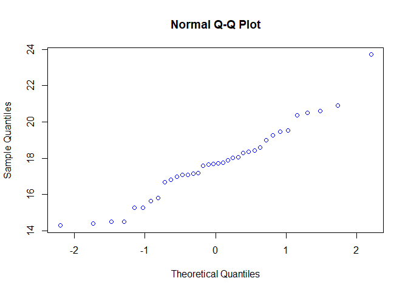<!-- -->

``` r
library(lubridate)
```

    ## 
    ## Attaching package: 'lubridate'

    ## The following object is masked from 'package:base':
    ## 
    ##     date

``` r
library(dplyr)
```

    ## 
    ## Attaching package: 'dplyr'

    ## The following objects are masked from 'package:lubridate':
    ## 
    ##     intersect, setdiff, union

    ## The following objects are masked from 'package:stats':
    ## 
    ##     filter, lag

    ## The following objects are masked from 'package:base':
    ## 
    ##     intersect, setdiff, setequal, union

``` r
library(caret)
```

    ## Loading required package: lattice

``` r
library(caTools)

##Extract the 'year' from the 'Weekending' column into a new column Year. 
class(volmart$Weekending)
```

    ## [1] "factor"

``` r
volmart$Weekending <- dmy(volmart$Weekending)
class(volmart$Weekending)
```

    ## [1] "Date"

``` r
volmart$Year<-as.numeric(format(volmart$Weekending, "%Y"))
head(volmart$Year)
```

    ## [1] 2010 2010 2010 2010 2010 2010

``` r
class(volmart$Year)
```

    ## [1] "numeric"

``` r
#Plot the volume by year to show the y-o-y trend. The volume decreases in 2011 and marginally increases in 2012
volmart%>% 
  filter(Year,Volume.1)%>%
  group_by (Year)%>% 
  summarize(value = sum(Volume.1))%>%
  ggplot(aes(x=Year,y=value))+geom_col(fill="blue")+geom_text(aes(label=value),color="white",vjust=1.6)+labs(title="Volume1 for 2010-2012", y="Volume.1", x="Year")
```

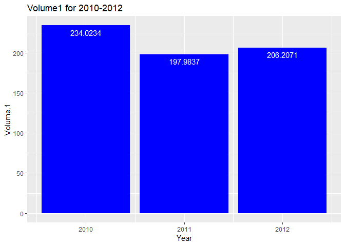<!-- -->

``` r
## Understand the relationship of Price.1 with Volume.1 and look at its y-o-y trend
#Check for the strength of the relationship of Volume1 with Price through correlation test. 
#The value of cor test for Price1 is -0.53. P value is  0.0008599
cor(volmart$Volume.1,volmart$Price.1)
```

    ## [1] -0.5311036

``` r
cor.test(volmart$Volume.1,volmart$Price.1)
```

    ## 
    ##  Pearson's product-moment correlation
    ## 
    ## data:  volmart$Volume.1 and volmart$Price.1
    ## t = -3.6549, df = 34, p-value = 0.0008599
    ## alternative hypothesis: true correlation is not equal to 0
    ## 95 percent confidence interval:
    ##  -0.7319278 -0.2453841
    ## sample estimates:
    ##        cor 
    ## -0.5311036

``` r
ggplot(volmart, aes(x=Price.1,y=Volume.1))+ geom_point(color="blue", alpha=0.8)+stat_smooth(method="loess", formula=y~x)
```

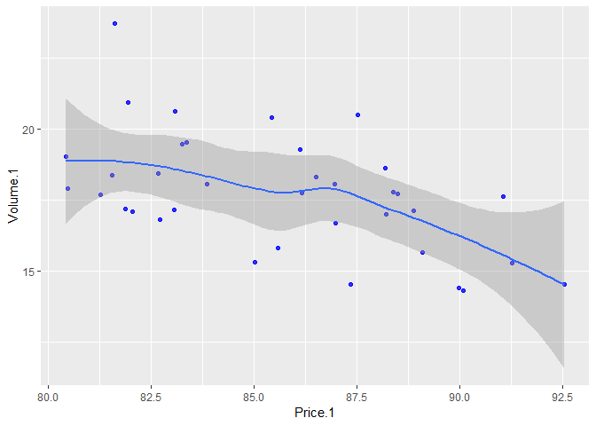<!-- -->

``` r
#Show the trend of Price.1. The trend show y-o-y increase in Price.1
volmart%>% 
  filter(Year,Price.1) %>%
  group_by(Year)%>%
  summarize(value = mean(Price.1))%>%
  ggplot(aes(x=Year, y=value))+ geom_col(fill="blue")+geom_text(aes(label=value),color="white",vjust=1.6)+labs(title="Average Price.1 for 2010-2012",y="Average Price.1", x="Year")
```

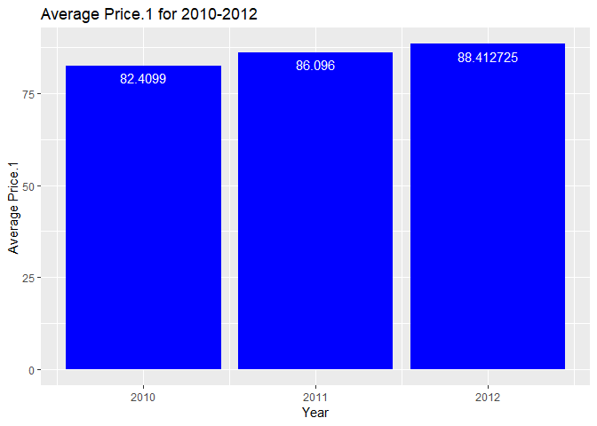<!-- -->

``` r
#Plot the Price.1 and Volume.1 on the same graph
ggplot(volmart,aes(x=Weekending))+geom_line(aes(y=Volume.1, color="Volume.1"))+geom_line(aes(y=Price.1, color="Price.1"))+ylim(0,100)+labs(title="Trend of Volume vs Price.1", x="Year",y="Price.1 and Volume.1")
```

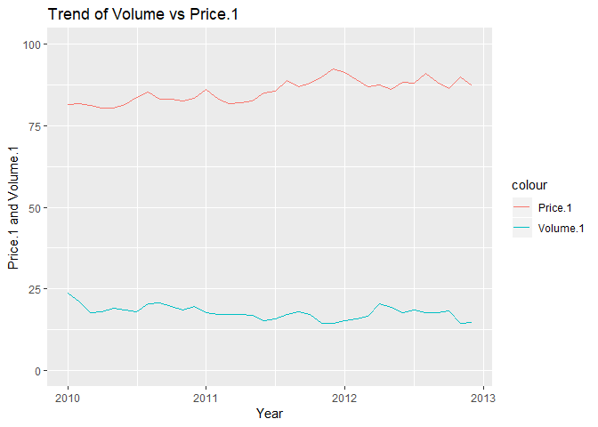<!-- -->

``` r
## Understand the relationship of Price.2 with Volume.1 and look at its y-o-y trend
#Check for the strength of the relationship of Volume1 with Price.2 through correlation test. 
#The value of cor test for Price1 is -0.47 . P value is 0.003279
cor.test(volmart$Volume.1,volmart$Price.2)
```

    ## 
    ##  Pearson's product-moment correlation
    ## 
    ## data:  volmart$Volume.1 and volmart$Price.2
    ## t = -3.1632, df = 34, p-value = 0.003279
    ## alternative hypothesis: true correlation is not equal to 0
    ## 95 percent confidence interval:
    ##  -0.6962943 -0.1758522
    ## sample estimates:
    ##        cor 
    ## -0.4768392

``` r
ggplot(volmart, aes(x=Price.2,y=Volume.1)) + geom_point(colour = "blue", alpha = 0.8) + 
  theme(axis.title = element_text(size = 8.5))+stat_smooth(method="loess", formula= y~x)
```

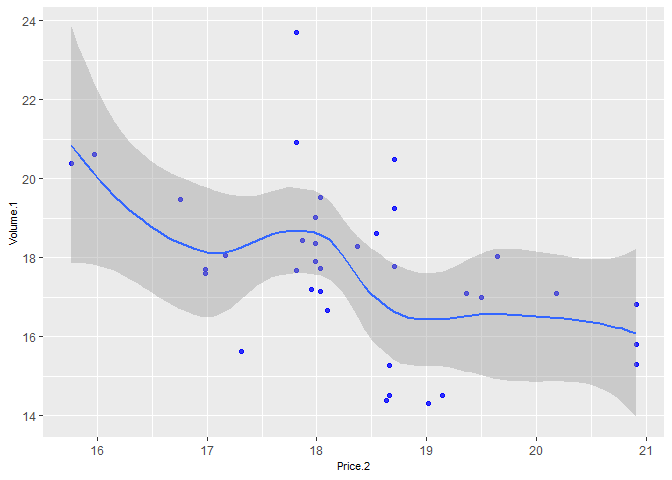<!-- -->

``` r
#Show the trend of Price.2. It increased by 2 units in 2011 and then reduced by 1 unit in 2012
volmart%>% 
  filter(Year,Price.2) %>%
  group_by(Year)%>%
  summarize(value = mean(Price.2))%>%
  ggplot(aes(x=Year, y=value))+ geom_col(fill="blue")+geom_text(aes(label=value),color="white",vjust=1.6)+labs(title="Average Price.2 for 2010-2012",y="Average Price.2", x="Year")
```

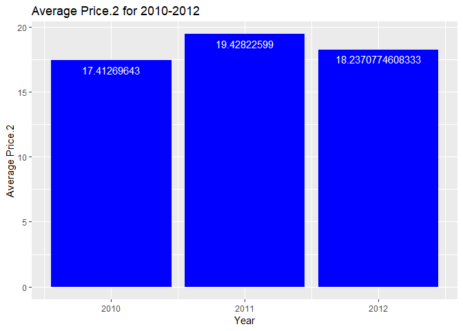<!-- -->

``` r
#Plot the Price.2 and Volume.1 on the same graph
ggplot(volmart,aes(x=Weekending))+geom_line(aes(y=Volume.1, color="Volume.1"))+geom_line(aes(y=Price.2, color="Price.2"))+ylim(10,25)+labs(title="Trend of Volume.1 vs Price.2", x="Year",y="Price.2 and Volume.1")
```

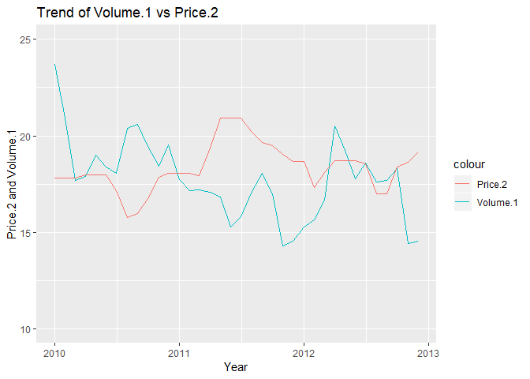<!-- -->

``` r
##Take the average of the two prices in the two markets and analyse its corelation on volume1
volmart$averageprice<- ((volmart$Price.1+volmart$Price.2)/2)
summary(volmart$averageprice)
```

    ##    Min. 1st Qu.  Median    Mean 3rd Qu.    Max. 
    ##   49.21   50.20   52.43   52.00   53.32   55.61

``` r
#Run the correlation test on the average price and volume.1. The p value is less than 5% indicating strong corelation.
#The correlation value is -0.63.
cor.test(volmart$Volume.1,volmart$averageprice)
```

    ## 
    ##  Pearson's product-moment correlation
    ## 
    ## data:  volmart$Volume.1 and volmart$averageprice
    ## t = -4.7319, df = 34, p-value = 3.814e-05
    ## alternative hypothesis: true correlation is not equal to 0
    ## 95 percent confidence interval:
    ##  -0.7942425 -0.3803323
    ## sample estimates:
    ##        cor 
    ## -0.6301314

``` r
ggplot(volmart,aes(x=Weekending))+geom_line(aes(y=averageprice, color="averageprice"))+geom_line(aes(y=Volume.1,color="Volume,1"))+labs(title="Trend of Volume.1 vs. Average Price", x="Year", y="Average Price and Volume.1")
```

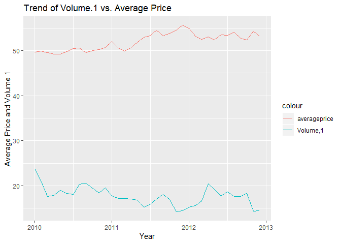<!-- -->

``` r
ggplot(volmart,aes(averageprice,Volume.1)) + geom_point(colour = "blue", alpha = 0.8) +
  theme(axis.title = element_text(size = 8.5))+stat_smooth(method="loess", formula= y~x)
```

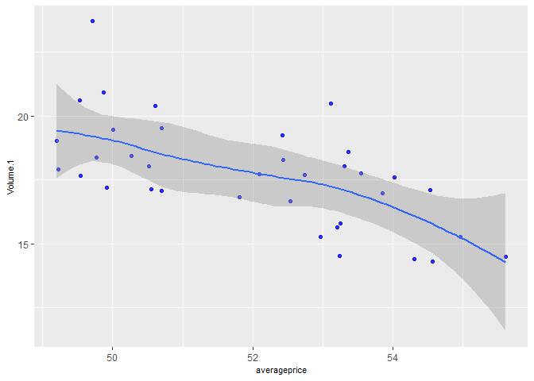<!-- -->

``` r
## Calculating sales/revenues for the company for the years 2010-2012 and look at the trend
volmart$ValueSales.1<- (volmart$Volume.1 * volmart$Price.1)
summary(volmart$ValueSales.1)
```

    ##    Min. 1st Qu.  Median    Mean 3rd Qu.    Max. 
    ##    1268    1400    1517    1515    1608    1934

``` r
volmart$Weekending[which.min(volmart$ValueSales.1)]
```

    ## [1] "2012-12-01"

``` r
volmart$Weekending[which.max(volmart$ValueSales.1)]
```

    ## [1] "2010-01-01"

``` r
#Show the y-o-y trend of the total sales for Market 1
volmart%>% 
  filter(Year,ValueSales.1) %>%
  group_by(Year)%>%
  summarize(value = sum(ValueSales.1))%>%
  ggplot(aes(x=Year, y=value))+ geom_col(fill="blue")+geom_text(aes(label=value),color="white",vjust=1.6)+labs(title="Total sales for 2010-2012 for Market 1",y="Total Value Sales", x="Year")
```

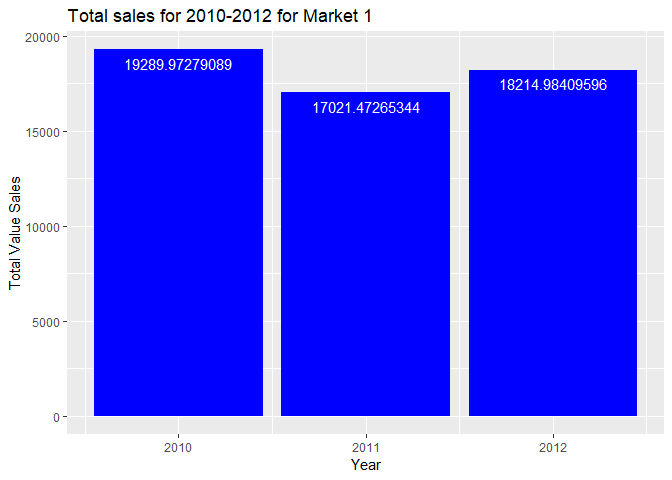<!-- -->

``` r
#Create a new variable Year 1 of the class Factor
volmart$Year1<-volmart$Year
volmart$Year1<-as.factor(volmart$Year1)
ggplot(volmart,aes(x=Year1,y=ValueSales.1))+geom_boxplot()+labs(title="Distribution of ValueSales.1 y-o-y")
```

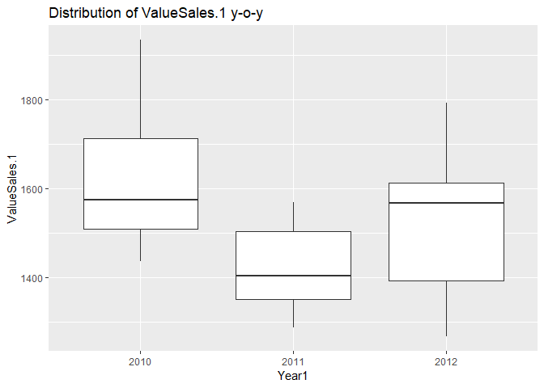<!-- -->

``` r
##Study the competition prices in both markets,Comp.Price.1 and Competition.Price.2 
summary(volmart$Comp.Price.1)
```

    ##    Min. 1st Qu.  Median    Mean 3rd Qu.    Max. 
    ##   85.70   87.77   89.45   90.13   92.15   97.55

``` r
summary(volmart$Competition.Price.2)
```

    ##    Min. 1st Qu.  Median    Mean 3rd Qu.    Max. 
    ##   15.98   17.95   19.14   19.47   20.51   23.88

``` r
#Correlation between the competition prices and Volume.1
#The corrtest value of Volume1 with Comp Price 1 and CompPrice 2 respectively is 0.48 and -0.32.
#Only for Comp Price1, the p value is significant. 
cor.test(volmart$Volume.1,volmart$Comp.Price.1)
```

    ## 
    ##  Pearson's product-moment correlation
    ## 
    ## data:  volmart$Volume.1 and volmart$Comp.Price.1
    ## t = 3.2397, df = 34, p-value = 0.002675
    ## alternative hypothesis: true correlation is not equal to 0
    ## 95 percent confidence interval:
    ##  0.1869798 0.7021748
    ## sample estimates:
    ##       cor 
    ## 0.4856804

``` r
cor.test(volmart$Volume.1,volmart$Competition.Price.2)
```

    ## 
    ##  Pearson's product-moment correlation
    ## 
    ## data:  volmart$Volume.1 and volmart$Competition.Price.2
    ## t = -1.9929, df = 34, p-value = 0.05434
    ## alternative hypothesis: true correlation is not equal to 0
    ## 95 percent confidence interval:
    ##  -0.589333695  0.005727223
    ## sample estimates:
    ##        cor 
    ## -0.3234171

``` r
ggplot(volmart,aes(x=Year1,y=Comp.Price.1))+geom_boxplot()+labs(title="Distribution of Competition Price 1 y-o-y")
```

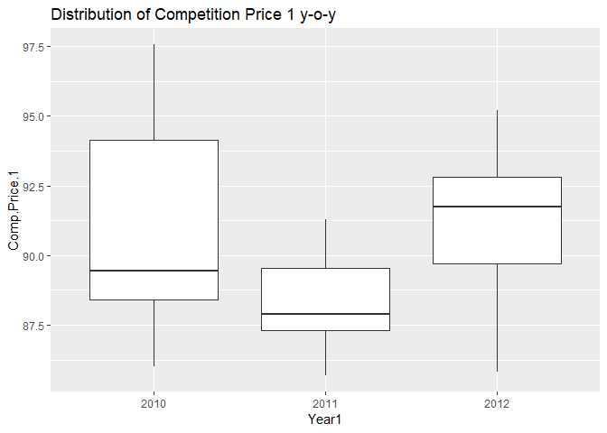<!-- -->

``` r
ggplot(volmart,aes(x=Weekending))+geom_line(aes(y=Price.1, color="Price.1"))+geom_line(aes(y=Comp.Price.1, color="Comp.Price.1"))+ ylim(75,100)+labs(title="Trend of Price.1 vs Comp Price.1", x="Year",y="Prices")
```

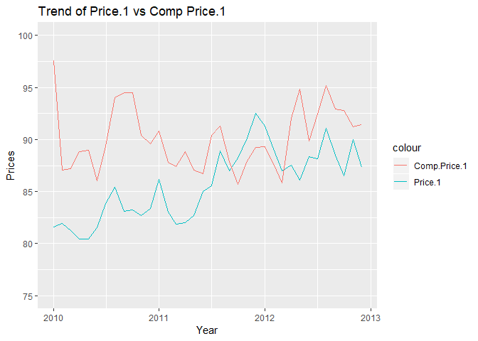<!-- -->

``` r
#Add average competition price and look at its correlation with Volume.The p value is insignificant hence no correlation with volume1
volmart$AverageComprice <- ((volmart$Comp.Price.1+volmart$Competition.Price.2)/2)
summary(volmart$AverageComprice)
```

    ##    Min. 1st Qu.  Median    Mean 3rd Qu.    Max. 
    ##   51.99   53.38   54.91   54.80   55.75   58.57

``` r
cor.test(volmart$Volume.1,volmart$AverageComprice)
```

    ## 
    ##  Pearson's product-moment correlation
    ## 
    ## data:  volmart$Volume.1 and volmart$AverageComprice
    ## t = 1.6457, df = 34, p-value = 0.109
    ## alternative hypothesis: true correlation is not equal to 0
    ## 95 percent confidence interval:
    ##  -0.06248921  0.55098955
    ## sample estimates:
    ##       cor 
    ## 0.2716229

``` r
##Study the distribution outlets and its correlation with Volume.1
summary(volmart$Distribution.1)
```

    ##    Min. 1st Qu.  Median    Mean 3rd Qu.    Max. 
    ##    1293    1413    1493    1568    1678    2083

``` r
cor.test(volmart$Volume.1,volmart$Distribution.1)
```

    ## 
    ##  Pearson's product-moment correlation
    ## 
    ## data:  volmart$Volume.1 and volmart$Distribution.1
    ## t = 1.7816, df = 34, p-value = 0.08375
    ## alternative hypothesis: true correlation is not equal to 0
    ## 95 percent confidence interval:
    ##  -0.04019253  0.56636690
    ## sample estimates:
    ##       cor 
    ## 0.2922016

``` r
cor.test(volmart$Volume.1,volmart$Distribution.2)
```

    ## 
    ##  Pearson's product-moment correlation
    ## 
    ## data:  volmart$Volume.1 and volmart$Distribution.2
    ## t = 1.6143, df = 34, p-value = 0.1157
    ## alternative hypothesis: true correlation is not equal to 0
    ## 95 percent confidence interval:
    ##  -0.06764626  0.54737256
    ## sample estimates:
    ##       cor 
    ## 0.2668193

``` r
#For both distribution outlets, there is no correlation with volume with insignificant P values. 
#The corrtest value is around 0.25 for both distribution.1 and distribution.2 with volume.1
#Plot the distribution trend y-o-y and scatter plot of volume1 and distribution1
ggplot(volmart, aes(x=Distribution.1, y= Volume.1))+geom_point(color="blue", alpha=0.8)+stat_smooth(method="loess", formula="y~x")
```

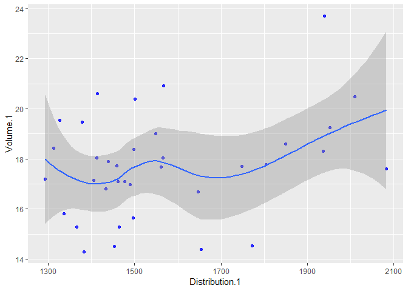<!-- -->

``` r
volmart%>%
  filter(Year, Distribution.1)%>%
  group_by(Year)%>%
  summarize(value=sum(Distribution.1))%>%
  ggplot(aes(x=Year, y=value))+geom_col(fill="blue")+geom_text(aes(label=value),color="white",vjust=1.6)+labs(title="Distribution.1 trend",y="Number of outlets",x="Year")
```

<!-- -->

``` r
#Consider total distribution
volmart$TotalDist <-(volmart$Distribution.1+volmart$Distribution.2)
#Correlation test for volume1 and total distribution gives insignificant p values and corrtest value of 0.30
cor.test(volmart$Volume.1,volmart$TotalDist)
```

    ## 
    ##  Pearson's product-moment correlation
    ## 
    ## data:  volmart$Volume.1 and volmart$TotalDist
    ## t = 1.8392, df = 34, p-value = 0.07463
    ## alternative hypothesis: true correlation is not equal to 0
    ## 95 percent confidence interval:
    ##  -0.03076759  0.57274244
    ## sample estimates:
    ##       cor 
    ## 0.3008088

``` r
#Plot the total distribution trend y-o-y and scatter plot of volume1 and total distribution
ggplot(volmart, aes(x=TotalDist, y= Volume.1))+geom_point(color="blue", alpha=0.8)+stat_smooth(method="loess", formula="y~x")
```

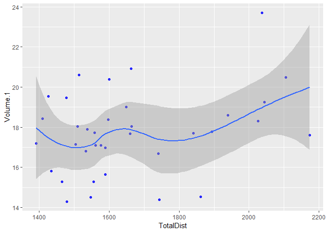<!-- -->

``` r
volmart%>%
  filter(Year, TotalDist)%>%
  group_by(Year)%>%
  summarize(value=sum(TotalDist))%>%
  ggplot(aes(x=Year, y=value))+geom_col(fill="blue")+geom_text(aes(label=value),color="white",vjust=1.6)+labs(title="Total Distribution trend",y="Number of total outlets",x="Year")
```

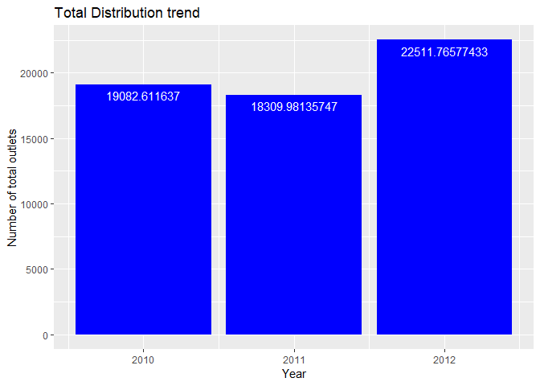<!-- -->

``` r
#Consider the Trade Promotions 3,4 and its correlation with Volume.1
#The p value for Trade Prom 3 and Volume.1 is 0.188 and vor Trade Prom 4 is 0.459, indicating no significant correlation
cor.test(volmart$Volume.1,volmart$Trade.Promotion.3)
```

    ## 
    ##  Pearson's product-moment correlation
    ## 
    ## data:  volmart$Volume.1 and volmart$Trade.Promotion.3
    ## t = -1.3437, df = 34, p-value = 0.188
    ## alternative hypothesis: true correlation is not equal to 0
    ## 95 percent confidence interval:
    ##  -0.5150878  0.1122663
    ## sample estimates:
    ##        cor 
    ## -0.2245517

``` r
cor.test(volmart$Volume.1,volmart$Trade.Promotion.4)
```

    ## 
    ##  Pearson's product-moment correlation
    ## 
    ## data:  volmart$Volume.1 and volmart$Trade.Promotion.4
    ## t = 0.74787, df = 34, p-value = 0.4597
    ## alternative hypothesis: true correlation is not equal to 0
    ## 95 percent confidence interval:
    ##  -0.2100998  0.4374687
    ## sample estimates:
    ##       cor 
    ## 0.1272171

``` r
volmart$TradeProm34<- (volmart$Trade.Promotion.3+volmart$Trade.Promotion.4)
cor.test(volmart$Volume.1,volmart$TradeProm34)
```

    ## 
    ##  Pearson's product-moment correlation
    ## 
    ## data:  volmart$Volume.1 and volmart$TradeProm34
    ## t = 0.17364, df = 34, p-value = 0.8632
    ## alternative hypothesis: true correlation is not equal to 0
    ## 95 percent confidence interval:
    ##  -0.3017204  0.3548317
    ## sample estimates:
    ##       cor 
    ## 0.0297659

``` r
#Plot the trend for combined trade promotion 3 and 4. It was consistent at 12.8 units for year 2010-11 and increased by 2 units to 14 in 2012
volmart%>%
  filter(Year, TradeProm34)%>%
  group_by(Year)%>%
  summarize(value=sum(TradeProm34))%>%
  ggplot(aes(x=Year, y=value))+geom_col(fill="blue")+geom_text(aes(label=value),color="white",vjust=1.6)+labs(title="Total Trade Promotion34",y="Trade Promotion34",x="Year")
```

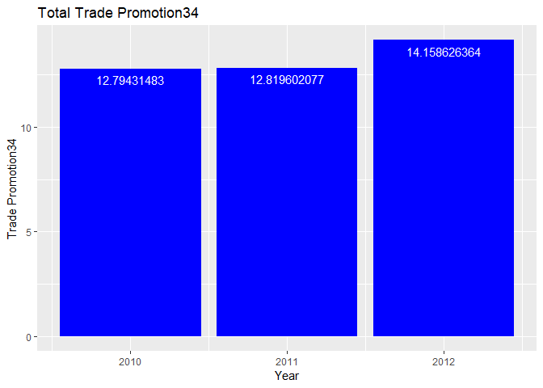<!-- -->

``` r
##Consider the Trade Promotions 1,2 and its correlation with Volume.1. The p values for both is insignificant 
cor.test(volmart$Volume.1,volmart$Trade.promotion.1)
```

    ## 
    ##  Pearson's product-moment correlation
    ## 
    ## data:  volmart$Volume.1 and volmart$Trade.promotion.1
    ## t = 1.7253, df = 34, p-value = 0.09355
    ## alternative hypothesis: true correlation is not equal to 0
    ## 95 percent confidence interval:
    ##  -0.04941453  0.56005757
    ## sample estimates:
    ##       cor 
    ## 0.2837274

``` r
cor.test(volmart$Volume.1,volmart$Trade.promotion.2)
```

    ## 
    ##  Pearson's product-moment correlation
    ## 
    ## data:  volmart$Volume.1 and volmart$Trade.promotion.2
    ## t = -0.75376, df = 34, p-value = 0.4562
    ## alternative hypothesis: true correlation is not equal to 0
    ## 95 percent confidence interval:
    ##  -0.4382781  0.2091424
    ## sample estimates:
    ##        cor 
    ## -0.1282022

``` r
volmart$TradeProm12 <- volmart$Trade.promotion.1+volmart$Trade.promotion.2
#Show the trend of Trade Promotion 1 and 2
volmart%>%
  filter(Year, TradeProm12)%>%
  group_by(Year)%>%
  summarize(value=sum(TradeProm12))%>%
  ggplot(aes(x=Year, y=value))+geom_col(fill="blue")+geom_text(aes(label=value),color="white",vjust=1.6)+labs(title="Total Trade Promotion12",y="Trade Promotion 12",x="Year")
```

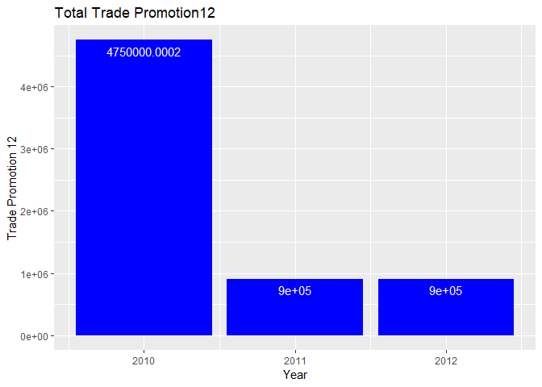<!-- -->

``` r
ggplot(volmart,aes(x=Weekending, y=TradeProm12))+geom_col(fill="blue")+geom_text(aes(label=TradeProm12),color="black",vjust=1.6)+labs(title="Total Trade Promotion12",y="Trade Promotion7",x="Year")
```

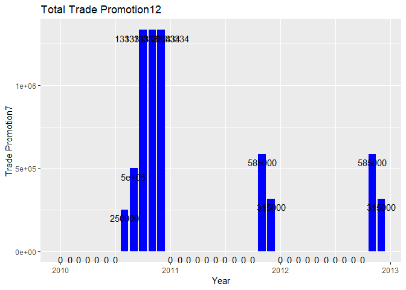<!-- -->

``` r
##Consider the TV spends and its correlation with Volume.1
volmart$TotalTV<- (volmart$TV.1+volmart$TV.2+volmart$TV.3+volmart$TV.4+volmart$TV.5)
head(volmart$TotalTV)
```

    ## [1] 2.2317844 0.9342639 1.8214283 1.8572244 1.6789357 1.3784859

``` r
#The p value for correlation btw TV spends and volume is 1.6%, indicating it is significant at corrvalue of 0.4
cor.test(volmart$Volume.1,volmart$TotalTV)
```

    ## 
    ##  Pearson's product-moment correlation
    ## 
    ## data:  volmart$Volume.1 and volmart$TotalTV
    ## t = 2.5252, df = 34, p-value = 0.01639
    ## alternative hypothesis: true correlation is not equal to 0
    ## 95 percent confidence interval:
    ##  0.07920609 0.64210320
    ## sample estimates:
    ##       cor 
    ## 0.3974007

``` r
#Plot the y-o-y trend of Tv spends. It was the highest in 2010 and then reduced considerably in 2011 and 2012
volmart%>%
  filter(Year, TotalTV)%>%
  group_by(Year)%>%
  summarize(value=sum(TotalTV))%>%
  ggplot(aes(x=Year, y=value))+geom_col(fill="blue")+geom_text(aes(label=value),color="white",vjust=1.6)+labs(title="Total TV Spends",y="TV Spends",x="Year")
```

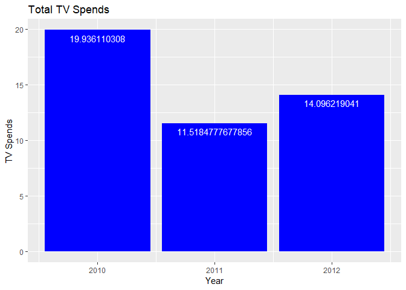<!-- -->

``` r
ggplot(volmart,aes(x=Weekending))+geom_line(aes(y=TotalTV, color="TotalTV"))+geom_line(aes(y=Volume.1,color="Volume.1"))
```

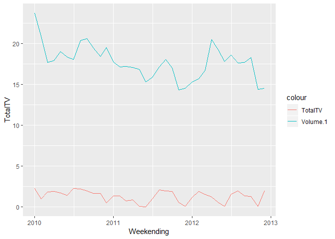<!-- -->

``` r
ggplot(volmart, aes(TotalTV,Volume.1)) + geom_point(colour = "blue", alpha = 0.8) +
  theme(axis.title = element_text(size = 8.5))+stat_smooth(method="loess", formula=y~x)
```

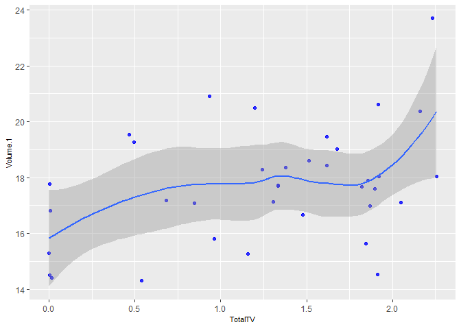<!-- -->

``` r
##Consider the magazine spends and its correlation with volume.1.Correlation is high at 0.42 with significant p value of 1.06%
cor.test(volmart$Magazine.1,volmart$Volume.1)
```

    ## 
    ##  Pearson's product-moment correlation
    ## 
    ## data:  volmart$Magazine.1 and volmart$Volume.1
    ## t = 2.7036, df = 34, p-value = 0.01063
    ## alternative hypothesis: true correlation is not equal to 0
    ## 95 percent confidence interval:
    ##  0.1068811 0.6582179
    ## sample estimates:
    ##       cor 
    ## 0.4206461

``` r
##COnsider the price discounts and its correlation with VOlume.1
cor.test(volmart$Volume.1,volmart$Discount.1)
```

    ## 
    ##  Pearson's product-moment correlation
    ## 
    ## data:  volmart$Volume.1 and volmart$Discount.1
    ## t = -0.76694, df = 34, p-value = 0.4484
    ## alternative hypothesis: true correlation is not equal to 0
    ## 95 percent confidence interval:
    ##  -0.4400874  0.2069978
    ## sample estimates:
    ##        cor 
    ## -0.1304064

``` r
cor.test(volmart$Volume.1,volmart$Price.Discount)
```

    ## 
    ##  Pearson's product-moment correlation
    ## 
    ## data:  volmart$Volume.1 and volmart$Price.Discount
    ## t = -0.66444, df = 34, p-value = 0.5109
    ## alternative hypothesis: true correlation is not equal to 0
    ## 95 percent confidence interval:
    ##  -0.4259117  0.2236359
    ## sample estimates:
    ##        cor 
    ## -0.1132182

``` r
#Both correlations are insignificant with p values greater than 5%
volmart$avgdiscounts<- ((volmart$Discount.1+volmart$Price.Discount)/2)
head(volmart$avgdiscounts)
```

    ## [1]  0.000000  0.000000  0.000000  0.000000  2.277064 12.328041

``` r
cor.test(volmart$Volume.1,volmart$avgdiscounts)
```

    ## 
    ##  Pearson's product-moment correlation
    ## 
    ## data:  volmart$Volume.1 and volmart$avgdiscounts
    ## t = -0.72478, df = 34, p-value = 0.4735
    ## alternative hypothesis: true correlation is not equal to 0
    ## 95 percent confidence interval:
    ##  -0.4342854  0.2138531
    ## sample estimates:
    ##        cor 
    ## -0.1233489

``` r
ggplot(volmart,aes(x=Year1,y=avgdiscounts))+geom_boxplot()+labs(title="Distribution of Average Discounts y-o-y")
```

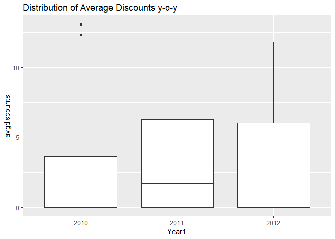<!-- -->

``` r
##Consider the Instore Promotions and its correlation with VOlume1
cor.test(volmart$Volume.1,volmart$Instore.Promotion)
```

    ## 
    ##  Pearson's product-moment correlation
    ## 
    ## data:  volmart$Volume.1 and volmart$Instore.Promotion
    ## t = -0.75874, df = 34, p-value = 0.4532
    ## alternative hypothesis: true correlation is not equal to 0
    ## 95 percent confidence interval:
    ##  -0.4389615  0.2083331
    ## sample estimates:
    ##        cor 
    ## -0.1290343

``` r
#p value come to 0.45 indicating insignificant correlation
ggplot(volmart,aes(x=Weekending,y=Instore.Promotion))+geom_col()
```

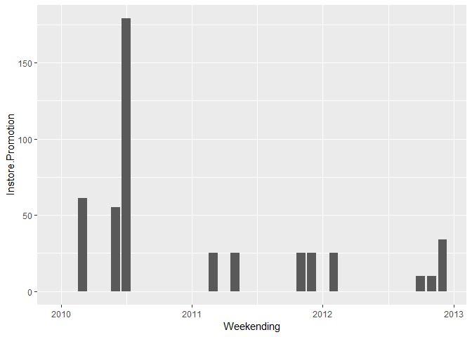<!-- -->

``` r
##Consider the OOH spends and its correlation with Volume1
cor.test(volmart$Volume.1,volmart$OOH.1)
```

    ## 
    ##  Pearson's product-moment correlation
    ## 
    ## data:  volmart$Volume.1 and volmart$OOH.1
    ## t = -0.4164, df = 34, p-value = 0.6797
    ## alternative hypothesis: true correlation is not equal to 0
    ## 95 percent confidence interval:
    ##  -0.3906254  0.2634704
    ## sample estimates:
    ##         cor 
    ## -0.07123109

``` r
#p value is insignificant at 0.67
volmart%>%
  filter(Year, OOH.1)%>%
  group_by(Year)%>%
  summarize(value=sum(OOH.1))%>%
  ggplot(aes(x=Year, y=value))+geom_col(fill="blue")+geom_text(aes(label=value), color="white", vjust=1.6)+labs(title="OOH Spends y-o-y", x="Year", y= "OOH Spends")
```

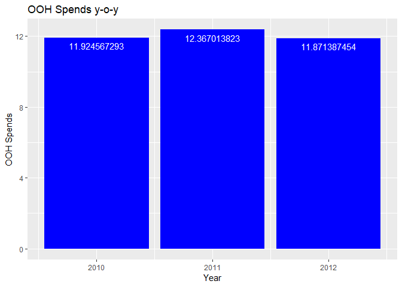<!-- -->

``` r
##Consider the Print spends and its correlation with Volume1
#P value is significant at 0.02 but the corr value is -0.38 which intuitvely does not make sense
cor.test(volmart$Volume.1,volmart$Print.1)
```

    ## 
    ##  Pearson's product-moment correlation
    ## 
    ## data:  volmart$Volume.1 and volmart$Print.1
    ## t = -2.4136, df = 34, p-value = 0.02133
    ## alternative hypothesis: true correlation is not equal to 0
    ## 95 percent confidence interval:
    ##  -0.63163363 -0.06167923
    ## sample estimates:
    ##        cor 
    ## -0.3824648

``` r
ggplot(volmart,aes(x=Weekending,y=Print.1))+geom_col()
```

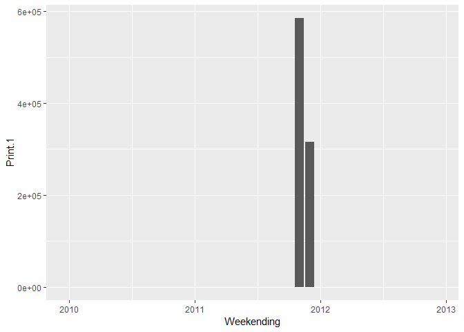<!-- -->

``` r
##Modeling with Linear Regression. We will select a model with a more diverse set of variables, each having a significant p value and with a higher Adjusted R2.

#Model1: Price P1 and Price P2

model1a<-lm(Volume.1~Price.1, data=volmart)
summary(model1a)
```

    ## 
    ## Call:
    ## lm(formula = Volume.1 ~ Price.1, data = volmart)
    ## 
    ## Residuals:
    ##     Min      1Q  Median      3Q     Max 
    ## -2.6592 -1.4774 -0.2588  0.9910  4.6709 
    ## 
    ## Coefficients:
    ##             Estimate Std. Error t value Pr(>|t|)    
    ## (Intercept) 45.40157    7.57731   5.992 8.83e-07 ***
    ## Price.1     -0.32314    0.08841  -3.655  0.00086 ***
    ## ---
    ## Signif. codes:  0 '***' 0.001 '**' 0.01 '*' 0.05 '.' 0.1 ' ' 1
    ## 
    ## Residual standard error: 1.773 on 34 degrees of freedom
    ## Multiple R-squared:  0.2821, Adjusted R-squared:  0.261 
    ## F-statistic: 13.36 on 1 and 34 DF,  p-value: 0.0008599

``` r
model1b<-lm(Volume.1~Price.2, data=volmart)
summary(model1b)
```

    ## 
    ## Call:
    ## lm(formula = Volume.1 ~ Price.2, data = volmart)
    ## 
    ## Residuals:
    ##     Min      1Q  Median      3Q     Max 
    ## -3.1134 -0.9400  0.1739  0.9595  5.5332 
    ## 
    ## Coefficients:
    ##             Estimate Std. Error t value Pr(>|t|)    
    ## (Intercept)  32.5414     4.6930   6.934 5.42e-08 ***
    ## Price.2      -0.8068     0.2551  -3.163  0.00328 ** 
    ## ---
    ## Signif. codes:  0 '***' 0.001 '**' 0.01 '*' 0.05 '.' 0.1 ' ' 1
    ## 
    ## Residual standard error: 1.839 on 34 degrees of freedom
    ## Multiple R-squared:  0.2274, Adjusted R-squared:  0.2047 
    ## F-statistic: 10.01 on 1 and 34 DF,  p-value: 0.003279

``` r
model1c<-lm(Volume.1~Price.1 + Price.2, data=volmart)
summary(model1c)
```

    ## 
    ## Call:
    ## lm(formula = Volume.1 ~ Price.1 + Price.2, data = volmart)
    ## 
    ## Residuals:
    ##     Min      1Q  Median      3Q     Max 
    ## -2.1913 -1.0106 -0.1748  0.8537  4.4560 
    ## 
    ## Coefficients:
    ##             Estimate Std. Error t value Pr(>|t|)    
    ## (Intercept) 54.59489    7.42797   7.350 1.94e-08 ***
    ## Price.1     -0.28435    0.08025  -3.543  0.00120 ** 
    ## Price.2     -0.68170    0.22317  -3.055  0.00444 ** 
    ## ---
    ## Signif. codes:  0 '***' 0.001 '**' 0.01 '*' 0.05 '.' 0.1 ' ' 1
    ## 
    ## Residual standard error: 1.589 on 33 degrees of freedom
    ## Multiple R-squared:  0.4403, Adjusted R-squared:  0.4064 
    ## F-statistic: 12.98 on 2 and 33 DF,  p-value: 6.935e-05

``` r
model1d<-lm(Volume.1~averageprice, data=volmart)
summary(model1d)
```

    ## 
    ## Call:
    ## lm(formula = Volume.1 ~ averageprice, data = volmart)
    ## 
    ## Residuals:
    ##     Min      1Q  Median      3Q     Max 
    ## -2.3544 -1.3341 -0.4569  1.1346  4.4002 
    ## 
    ## Coefficients:
    ##              Estimate Std. Error t value Pr(>|t|)    
    ## (Intercept)   53.4896     7.5624   7.073 3.61e-08 ***
    ## averageprice  -0.6877     0.1453  -4.732 3.81e-05 ***
    ## ---
    ## Signif. codes:  0 '***' 0.001 '**' 0.01 '*' 0.05 '.' 0.1 ' ' 1
    ## 
    ## Residual standard error: 1.625 on 34 degrees of freedom
    ## Multiple R-squared:  0.3971, Adjusted R-squared:  0.3793 
    ## F-statistic: 22.39 on 1 and 34 DF,  p-value: 3.814e-05

``` r
#Model 2: Model1d + Competition Prices CP1 and CP2

model2a<-lm(Volume.1~averageprice + Comp.Price.1, data=volmart)
summary(model2a)
```

    ## 
    ## Call:
    ## lm(formula = Volume.1 ~ averageprice + Comp.Price.1, data = volmart)
    ## 
    ## Residuals:
    ##     Min      1Q  Median      3Q     Max 
    ## -2.8000 -0.7844 -0.2351  0.7247  2.8903 
    ## 
    ## Coefficients:
    ##              Estimate Std. Error t value Pr(>|t|)    
    ## (Intercept)   23.5617     9.0082   2.616   0.0133 *  
    ## averageprice  -0.6812     0.1163  -5.857 1.47e-06 ***
    ## Comp.Price.1   0.3283     0.0732   4.485 8.35e-05 ***
    ## ---
    ## Signif. codes:  0 '***' 0.001 '**' 0.01 '*' 0.05 '.' 0.1 ' ' 1
    ## 
    ## Residual standard error: 1.3 on 33 degrees of freedom
    ## Multiple R-squared:  0.6254, Adjusted R-squared:  0.6027 
    ## F-statistic: 27.54 on 2 and 33 DF,  p-value: 9.212e-08

``` r
model2b<-lm(Volume.1~averageprice +Competition.Price.2, data=volmart)
summary(model2b)
```

    ## 
    ## Call:
    ## lm(formula = Volume.1 ~ averageprice + Competition.Price.2, data = volmart)
    ## 
    ## Residuals:
    ##     Min      1Q  Median      3Q     Max 
    ## -2.3535 -1.4662 -0.4295  0.9797  4.4969 
    ## 
    ## Coefficients:
    ##                     Estimate Std. Error t value Pr(>|t|)    
    ## (Intercept)         53.29850    7.64367   6.973 5.68e-08 ***
    ## averageprice        -0.65042    0.16005  -4.064 0.000281 ***
    ## Competition.Price.2 -0.08984    0.15373  -0.584 0.562938    
    ## ---
    ## Signif. codes:  0 '***' 0.001 '**' 0.01 '*' 0.05 '.' 0.1 ' ' 1
    ## 
    ## Residual standard error: 1.641 on 33 degrees of freedom
    ## Multiple R-squared:  0.4032, Adjusted R-squared:  0.3671 
    ## F-statistic: 11.15 on 2 and 33 DF,  p-value: 0.0001998

``` r
model2c<-lm(Volume.1~averageprice + AverageComprice, data=volmart)
summary(model2c)
```

    ## 
    ## Call:
    ## lm(formula = Volume.1 ~ averageprice + AverageComprice, data = volmart)
    ## 
    ## Residuals:
    ##      Min       1Q   Median       3Q      Max 
    ## -2.77880 -0.93346  0.09456  0.75874  2.58379 
    ## 
    ## Coefficients:
    ##                 Estimate Std. Error t value Pr(>|t|)    
    ## (Intercept)      25.8737     9.4074   2.750 0.009587 ** 
    ## averageprice     -0.8104     0.1253  -6.466 2.46e-07 ***
    ## AverageComprice   0.6203     0.1565   3.962 0.000374 ***
    ## ---
    ## Signif. codes:  0 '***' 0.001 '**' 0.01 '*' 0.05 '.' 0.1 ' ' 1
    ## 
    ## Residual standard error: 1.358 on 33 degrees of freedom
    ## Multiple R-squared:  0.5914, Adjusted R-squared:  0.5667 
    ## F-statistic: 23.89 on 2 and 33 DF,  p-value: 3.851e-07

``` r
#Model3 : Model 2a + Distribution

model3a<-lm(Volume.1~averageprice+Comp.Price.1+Distribution.1, data=volmart)
summary(model3a)
```

    ## 
    ## Call:
    ## lm(formula = Volume.1 ~ averageprice + Comp.Price.1 + Distribution.1, 
    ##     data = volmart)
    ## 
    ## Residuals:
    ##     Min      1Q  Median      3Q     Max 
    ## -3.1255 -0.6153 -0.1116  0.6173  2.2274 
    ## 
    ## Coefficients:
    ##                 Estimate Std. Error t value Pr(>|t|)    
    ## (Intercept)    33.567300   9.374904   3.581  0.00112 ** 
    ## averageprice   -0.766133   0.114140  -6.712  1.4e-07 ***
    ## Comp.Price.1    0.216797   0.082459   2.629  0.01304 *  
    ## Distribution.1  0.002845   0.001177   2.418  0.02150 *  
    ## ---
    ## Signif. codes:  0 '***' 0.001 '**' 0.01 '*' 0.05 '.' 0.1 ' ' 1
    ## 
    ## Residual standard error: 1.214 on 32 degrees of freedom
    ## Multiple R-squared:  0.6832, Adjusted R-squared:  0.6535 
    ## F-statistic: 23.01 on 3 and 32 DF,  p-value: 3.977e-08

``` r
model3b<-lm(Volume.1~averageprice+Comp.Price.1+Distribution.2, data=volmart)
summary(model3b)
```

    ## 
    ## Call:
    ## lm(formula = Volume.1 ~ averageprice + Comp.Price.1 + Distribution.2, 
    ##     data = volmart)
    ## 
    ## Residuals:
    ##     Min      1Q  Median      3Q     Max 
    ## -2.5824 -0.8381 -0.2958  0.6030  2.9155 
    ## 
    ## Coefficients:
    ##                Estimate Std. Error t value Pr(>|t|)    
    ## (Intercept)    13.93344   16.35434   0.852 0.400561    
    ## averageprice   -0.62228    0.14373  -4.329 0.000138 ***
    ## Comp.Price.1    0.34785    0.07877   4.416 0.000108 ***
    ## Distribution.2  0.04986    0.07045   0.708 0.484225    
    ## ---
    ## Signif. codes:  0 '***' 0.001 '**' 0.01 '*' 0.05 '.' 0.1 ' ' 1
    ## 
    ## Residual standard error: 1.31 on 32 degrees of freedom
    ## Multiple R-squared:  0.6311, Adjusted R-squared:  0.5966 
    ## F-statistic: 18.25 on 3 and 32 DF,  p-value: 4.38e-07

``` r
model3c<-lm(Volume.1~averageprice+Comp.Price.1+Distribution.1+ Distribution.2, data=volmart)
summary(model3c)
```

    ## 
    ## Call:
    ## lm(formula = Volume.1 ~ averageprice + Comp.Price.1 + Distribution.1 + 
    ##     Distribution.2, data = volmart)
    ## 
    ## Residuals:
    ##      Min       1Q   Median       3Q      Max 
    ## -2.44237 -0.70502 -0.09774  0.76601  2.53393 
    ## 
    ## Coefficients:
    ##                 Estimate Std. Error t value Pr(>|t|)    
    ## (Intercept)    -0.183370  14.013460  -0.013 0.989644    
    ## averageprice   -0.578697   0.119599  -4.839 3.41e-05 ***
    ## Comp.Price.1    0.212249   0.073739   2.878 0.007180 ** 
    ## Distribution.1  0.005127   0.001298   3.951 0.000418 ***
    ## Distribution.2  0.216339   0.071986   3.005 0.005218 ** 
    ## ---
    ## Signif. codes:  0 '***' 0.001 '**' 0.01 '*' 0.05 '.' 0.1 ' ' 1
    ## 
    ## Residual standard error: 1.085 on 31 degrees of freedom
    ## Multiple R-squared:  0.7547, Adjusted R-squared:  0.723 
    ## F-statistic: 23.84 on 4 and 31 DF,  p-value: 4.407e-09

``` r
model3d<-lm(Volume.1~averageprice+Comp.Price.1+TotalDist, data=volmart)
summary(model3d)
```

    ## 
    ## Call:
    ## lm(formula = Volume.1 ~ averageprice + Comp.Price.1 + TotalDist, 
    ##     data = volmart)
    ## 
    ## Residuals:
    ##     Min      1Q  Median      3Q     Max 
    ## -3.1216 -0.6131 -0.1067  0.6171  2.2231 
    ## 
    ## Coefficients:
    ##               Estimate Std. Error t value Pr(>|t|)    
    ## (Intercept)  33.273545   9.266357   3.591  0.00109 ** 
    ## averageprice -0.764977   0.113484  -6.741 1.29e-07 ***
    ## Comp.Price.1  0.214930   0.082222   2.614  0.01353 *  
    ## TotalDist     0.002922   0.001186   2.464  0.01928 *  
    ## ---
    ## Signif. codes:  0 '***' 0.001 '**' 0.01 '*' 0.05 '.' 0.1 ' ' 1
    ## 
    ## Residual standard error: 1.21 on 32 degrees of freedom
    ## Multiple R-squared:  0.6851, Adjusted R-squared:  0.6556 
    ## F-statistic: 23.21 on 3 and 32 DF,  p-value: 3.616e-08

``` r
#Model 4: Model 3c + Trade Promotions

model4a<-lm(Volume.1~averageprice+Comp.Price.1+Distribution.1+Distribution.2+Trade.promotion.1, data=volmart)
summary(model4a)
```

    ## 
    ## Call:
    ## lm(formula = Volume.1 ~ averageprice + Comp.Price.1 + Distribution.1 + 
    ##     Distribution.2 + Trade.promotion.1, data = volmart)
    ## 
    ## Residuals:
    ##      Min       1Q   Median       3Q      Max 
    ## -2.35747 -0.58210  0.04297  0.52887  2.59281 
    ## 
    ## Coefficients:
    ##                     Estimate Std. Error t value Pr(>|t|)    
    ## (Intercept)       -3.197e+00  1.326e+01  -0.241 0.811158    
    ## averageprice      -4.966e-01  1.184e-01  -4.193 0.000224 ***
    ## Comp.Price.1       1.217e-01  8.041e-02   1.513 0.140745    
    ## Distribution.1     6.931e-03  1.465e-03   4.732 4.96e-05 ***
    ## Distribution.2     2.569e-01  7.016e-02   3.661 0.000960 ***
    ## Trade.promotion.1  2.675e-06  1.199e-06   2.232 0.033253 *  
    ## ---
    ## Signif. codes:  0 '***' 0.001 '**' 0.01 '*' 0.05 '.' 0.1 ' ' 1
    ## 
    ## Residual standard error: 1.022 on 30 degrees of freedom
    ## Multiple R-squared:  0.7896, Adjusted R-squared:  0.7546 
    ## F-statistic: 22.52 on 5 and 30 DF,  p-value: 2.48e-09

``` r
model4b<-lm(Volume.1~averageprice+Comp.Price.1+Distribution.1+Distribution.2+Trade.promotion.2, data=volmart)
summary(model4b)
```

    ## 
    ## Call:
    ## lm(formula = Volume.1 ~ averageprice + Comp.Price.1 + Distribution.1 + 
    ##     Distribution.2 + Trade.promotion.2, data = volmart)
    ## 
    ## Residuals:
    ##     Min      1Q  Median      3Q     Max 
    ## -2.4700 -0.6721 -0.0968  0.7624  2.5334 
    ## 
    ## Coefficients:
    ##                     Estimate Std. Error t value Pr(>|t|)    
    ## (Intercept)       -3.853e-01  1.429e+01  -0.027  0.97867    
    ## averageprice      -5.780e-01  1.216e-01  -4.754 4.66e-05 ***
    ## Comp.Price.1       2.058e-01  8.476e-02   2.428  0.02140 *  
    ## Distribution.1     5.289e-03  1.650e-03   3.205  0.00320 ** 
    ## Distribution.2     2.213e-01  7.918e-02   2.795  0.00896 ** 
    ## Trade.promotion.2  1.700e-07  1.040e-06   0.163  0.87123    
    ## ---
    ## Signif. codes:  0 '***' 0.001 '**' 0.01 '*' 0.05 '.' 0.1 ' ' 1
    ## 
    ## Residual standard error: 1.103 on 30 degrees of freedom
    ## Multiple R-squared:  0.7549, Adjusted R-squared:  0.7141 
    ## F-statistic: 18.48 on 5 and 30 DF,  p-value: 2.303e-08

``` r
model4c<-lm(Volume.1~averageprice+Comp.Price.1+Distribution.1+Distribution.2+Trade.Promotion.3, data=volmart)
summary(model4c)
```

    ## 
    ## Call:
    ## lm(formula = Volume.1 ~ averageprice + Comp.Price.1 + Distribution.1 + 
    ##     Distribution.2 + Trade.Promotion.3, data = volmart)
    ## 
    ## Residuals:
    ##     Min      1Q  Median      3Q     Max 
    ## -2.2620 -0.7107 -0.1148  0.6287  2.5815 
    ## 
    ## Coefficients:
    ##                    Estimate Std. Error t value Pr(>|t|)    
    ## (Intercept)        2.227433  14.347272   0.155 0.877663    
    ## averageprice      -0.634069   0.136203  -4.655 6.16e-05 ***
    ## Comp.Price.1       0.217601   0.074307   2.928 0.006448 ** 
    ## Distribution.1     0.004889   0.001332   3.671 0.000936 ***
    ## Distribution.2     0.215001   0.072303   2.974 0.005759 ** 
    ## Trade.Promotion.3  4.578365   5.312161   0.862 0.395599    
    ## ---
    ## Signif. codes:  0 '***' 0.001 '**' 0.01 '*' 0.05 '.' 0.1 ' ' 1
    ## 
    ## Residual standard error: 1.09 on 30 degrees of freedom
    ## Multiple R-squared:  0.7606, Adjusted R-squared:  0.7207 
    ## F-statistic: 19.07 on 5 and 30 DF,  p-value: 1.634e-08

``` r
model4d<-lm(Volume.1~averageprice+Comp.Price.1+Distribution.1+Distribution.2+Trade.Promotion.4, data=volmart)
summary(model4d)
```

    ## 
    ## Call:
    ## lm(formula = Volume.1 ~ averageprice + Comp.Price.1 + Distribution.1 + 
    ##     Distribution.2 + Trade.Promotion.4, data = volmart)
    ## 
    ## Residuals:
    ##     Min      1Q  Median      3Q     Max 
    ## -2.4644 -0.5553 -0.1363  0.6664  2.3733 
    ## 
    ## Coefficients:
    ##                   Estimate Std. Error t value Pr(>|t|)    
    ## (Intercept)       -2.19835   14.63093  -0.150 0.881570    
    ## averageprice      -0.57016    0.12193  -4.676 5.81e-05 ***
    ## Comp.Price.1       0.21011    0.07468   2.814 0.008565 ** 
    ## Distribution.1     0.00505    0.00132   3.826 0.000614 ***
    ## Distribution.2     0.22478    0.07438   3.022 0.005098 ** 
    ## Trade.Promotion.4  1.07421    1.93693   0.555 0.583284    
    ## ---
    ## Signif. codes:  0 '***' 0.001 '**' 0.01 '*' 0.05 '.' 0.1 ' ' 1
    ## 
    ## Residual standard error: 1.098 on 30 degrees of freedom
    ## Multiple R-squared:  0.7572, Adjusted R-squared:  0.7167 
    ## F-statistic: 18.71 on 5 and 30 DF,  p-value: 2.011e-08

``` r
model4e<-lm(Volume.1~averageprice+Comp.Price.1+Distribution.1+Distribution.2+Trade.promotion.1+Trade.promotion.2, data=volmart)
summary(model4e)
```

    ## 
    ## Call:
    ## lm(formula = Volume.1 ~ averageprice + Comp.Price.1 + Distribution.1 + 
    ##     Distribution.2 + Trade.promotion.1 + Trade.promotion.2, data = volmart)
    ## 
    ## Residuals:
    ##     Min      1Q  Median      3Q     Max 
    ## -1.8478 -0.5132 -0.0097  0.5592  2.6527 
    ## 
    ## Coefficients:
    ##                     Estimate Std. Error t value Pr(>|t|)    
    ## (Intercept)       -2.663e+00  1.259e+01  -0.212 0.833921    
    ## averageprice      -4.348e-01  1.163e-01  -3.739 0.000808 ***
    ## Comp.Price.1       1.441e-01  7.706e-02   1.870 0.071566 .  
    ## Distribution.1     5.959e-03  1.467e-03   4.063 0.000337 ***
    ## Distribution.2     2.144e-01  6.964e-02   3.078 0.004523 ** 
    ## Trade.promotion.1  5.028e-06  1.605e-06   3.133 0.003934 ** 
    ## Trade.promotion.2 -2.681e-06  1.290e-06  -2.078 0.046639 *  
    ## ---
    ## Signif. codes:  0 '***' 0.001 '**' 0.01 '*' 0.05 '.' 0.1 ' ' 1
    ## 
    ## Residual standard error: 0.9695 on 29 degrees of freedom
    ## Multiple R-squared:  0.8169, Adjusted R-squared:  0.779 
    ## F-statistic: 21.56 on 6 and 29 DF,  p-value: 1.79e-09

``` r
model4f<-lm(Volume.1~averageprice+Comp.Price.1+Distribution.1+Distribution.2+Trade.promotion.1+Trade.Promotion.3, data=volmart)
summary(model4f)
```

    ## 
    ## Call:
    ## lm(formula = Volume.1 ~ averageprice + Comp.Price.1 + Distribution.1 + 
    ##     Distribution.2 + Trade.promotion.1 + Trade.Promotion.3, data = volmart)
    ## 
    ## Residuals:
    ##      Min       1Q   Median       3Q      Max 
    ## -2.11685 -0.50657  0.01591  0.68013  2.65854 
    ## 
    ## Coefficients:
    ##                     Estimate Std. Error t value Pr(>|t|)    
    ## (Intercept)       -2.434e-01  1.339e+01  -0.018 0.985625    
    ## averageprice      -5.636e-01  1.302e-01  -4.329 0.000163 ***
    ## Comp.Price.1       1.229e-01  7.984e-02   1.539 0.134526    
    ## Distribution.1     6.735e-03  1.463e-03   4.602 7.65e-05 ***
    ## Distribution.2     2.577e-01  6.965e-02   3.700 0.000899 ***
    ## Trade.promotion.1  2.844e-06  1.198e-06   2.374 0.024458 *  
    ## Trade.Promotion.3  5.970e+00  4.979e+00   1.199 0.240162    
    ## ---
    ## Signif. codes:  0 '***' 0.001 '**' 0.01 '*' 0.05 '.' 0.1 ' ' 1
    ## 
    ## Residual standard error: 1.014 on 29 degrees of freedom
    ## Multiple R-squared:  0.7996, Adjusted R-squared:  0.7581 
    ## F-statistic: 19.28 on 6 and 29 DF,  p-value: 6.386e-09

``` r
model4g<-lm(Volume.1~averageprice+Comp.Price.1+Distribution.1+Distribution.2+Trade.promotion.1+Trade.Promotion.4, data=volmart)
summary(model4g)
```

    ## 
    ## Call:
    ## lm(formula = Volume.1 ~ averageprice + Comp.Price.1 + Distribution.1 + 
    ##     Distribution.2 + Trade.promotion.1 + Trade.Promotion.4, data = volmart)
    ## 
    ## Residuals:
    ##      Min       1Q   Median       3Q      Max 
    ## -2.38044 -0.45866  0.02013  0.63578  2.42223 
    ## 
    ## Coefficients:
    ##                     Estimate Std. Error t value Pr(>|t|)    
    ## (Intercept)       -5.354e+00  1.383e+01  -0.387 0.701508    
    ## averageprice      -4.871e-01  1.206e-01  -4.039 0.000360 ***
    ## Comp.Price.1       1.190e-01  8.135e-02   1.462 0.154456    
    ## Distribution.1     6.858e-03  1.485e-03   4.620 7.29e-05 ***
    ## Distribution.2     2.660e-01  7.237e-02   3.676 0.000957 ***
    ## Trade.promotion.1  2.688e-06  1.211e-06   2.219 0.034444 *  
    ## Trade.Promotion.4  1.143e+00  1.822e+00   0.627 0.535421    
    ## ---
    ## Signif. codes:  0 '***' 0.001 '**' 0.01 '*' 0.05 '.' 0.1 ' ' 1
    ## 
    ## Residual standard error: 1.032 on 29 degrees of freedom
    ## Multiple R-squared:  0.7924, Adjusted R-squared:  0.7495 
    ## F-statistic: 18.45 on 6 and 29 DF,  p-value: 1.042e-08

``` r
model4h<-lm(Volume.1~averageprice+Comp.Price.1+Distribution.1+Distribution.2+Trade.Promotion.3+Trade.Promotion.4, data=volmart)
summary(model4h)
```

    ## 
    ## Call:
    ## lm(formula = Volume.1 ~ averageprice + Comp.Price.1 + Distribution.1 + 
    ##     Distribution.2 + Trade.Promotion.3 + Trade.Promotion.4, data = volmart)
    ## 
    ## Residuals:
    ##     Min      1Q  Median      3Q     Max 
    ## -2.2829 -0.6081 -0.1244  0.5603  2.4181 
    ## 
    ## Coefficients:
    ##                    Estimate Std. Error t value Pr(>|t|)    
    ## (Intercept)        0.192983  14.956598   0.013  0.98979    
    ## averageprice      -0.625827   0.138556  -4.517 9.69e-05 ***
    ## Comp.Price.1       0.215461   0.075264   2.863  0.00772 ** 
    ## Distribution.1     0.004808   0.001355   3.548  0.00134 ** 
    ## Distribution.2     0.223601   0.074719   2.993  0.00560 ** 
    ## Trade.Promotion.3  4.616561   5.374119   0.859  0.39737    
    ## Trade.Promotion.4  1.095307   1.945597   0.563  0.57778    
    ## ---
    ## Signif. codes:  0 '***' 0.001 '**' 0.01 '*' 0.05 '.' 0.1 ' ' 1
    ## 
    ## Residual standard error: 1.102 on 29 degrees of freedom
    ## Multiple R-squared:  0.7632, Adjusted R-squared:  0.7142 
    ## F-statistic: 15.58 on 6 and 29 DF,  p-value: 6.571e-08

``` r
model4i<-lm(Volume.1~averageprice+Comp.Price.1+Distribution.1+Distribution.2+Trade.promotion.2+Trade.Promotion.3, data=volmart)
summary(model4i)
```

    ## 
    ## Call:
    ## lm(formula = Volume.1 ~ averageprice + Comp.Price.1 + Distribution.1 + 
    ##     Distribution.2 + Trade.promotion.2 + Trade.Promotion.3, data = volmart)
    ## 
    ## Residuals:
    ##     Min      1Q  Median      3Q     Max 
    ## -2.3045 -0.6882 -0.0930  0.6051  2.5836 
    ## 
    ## Coefficients:
    ##                     Estimate Std. Error t value Pr(>|t|)    
    ## (Intercept)        1.989e+00  1.459e+01   0.136  0.89247    
    ## averageprice      -6.365e-01  1.385e-01  -4.596  7.8e-05 ***
    ## Comp.Price.1       2.051e-01  8.505e-02   2.412  0.02242 *  
    ## Distribution.1     5.194e-03  1.660e-03   3.130  0.00397 ** 
    ## Distribution.2     2.247e-01  7.954e-02   2.825  0.00847 ** 
    ## Trade.promotion.2  3.364e-07  1.060e-06   0.317  0.75328    
    ## Trade.Promotion.3  4.884e+00  5.479e+00   0.891  0.38002    
    ## ---
    ## Signif. codes:  0 '***' 0.001 '**' 0.01 '*' 0.05 '.' 0.1 ' ' 1
    ## 
    ## Residual standard error: 1.107 on 29 degrees of freedom
    ## Multiple R-squared:  0.7615, Adjusted R-squared:  0.7121 
    ## F-statistic: 15.43 on 6 and 29 DF,  p-value: 7.285e-08

``` r
model4j<-lm(Volume.1~averageprice+Comp.Price.1+Distribution.1+Distribution.2+Trade.promotion.2+Trade.Promotion.4, data=volmart)
summary(model4j)
```

    ## 
    ## Call:
    ## lm(formula = Volume.1 ~ averageprice + Comp.Price.1 + Distribution.1 + 
    ##     Distribution.2 + Trade.promotion.2 + Trade.Promotion.4, data = volmart)
    ## 
    ## Residuals:
    ##     Min      1Q  Median      3Q     Max 
    ## -2.4885 -0.5483 -0.1210  0.6745  2.3743 
    ## 
    ## Coefficients:
    ##                     Estimate Std. Error t value Pr(>|t|)    
    ## (Intercept)       -2.358e+00  1.492e+01  -0.158  0.87551    
    ## averageprice      -5.697e-01  1.240e-01  -4.593 7.85e-05 ***
    ## Comp.Price.1       2.044e-01  8.581e-02   2.382  0.02399 *  
    ## Distribution.1     5.194e-03  1.680e-03   3.092  0.00437 ** 
    ## Distribution.2     2.291e-01  8.141e-02   2.814  0.00870 ** 
    ## Trade.promotion.2  1.500e-07  1.053e-06   0.142  0.88775    
    ## Trade.Promotion.4  1.064e+00  1.971e+00   0.540  0.59325    
    ## ---
    ## Signif. codes:  0 '***' 0.001 '**' 0.01 '*' 0.05 '.' 0.1 ' ' 1
    ## 
    ## Residual standard error: 1.116 on 29 degrees of freedom
    ## Multiple R-squared:  0.7574, Adjusted R-squared:  0.7072 
    ## F-statistic: 15.09 on 6 and 29 DF,  p-value: 9.233e-08

``` r
model4k<-lm(Volume.1~averageprice+Comp.Price.1+Distribution.1+Distribution.2+Trade.promotion.1+Trade.Promotion.4+Trade.Promotion.3, data=volmart)
summary(model4k)
```

    ## 
    ## Call:
    ## lm(formula = Volume.1 ~ averageprice + Comp.Price.1 + Distribution.1 + 
    ##     Distribution.2 + Trade.promotion.1 + Trade.Promotion.4 + 
    ##     Trade.Promotion.3, data = volmart)
    ## 
    ## Residuals:
    ##      Min       1Q   Median       3Q      Max 
    ## -2.13852 -0.55686 -0.02576  0.69283  2.48374 
    ## 
    ## Coefficients:
    ##                     Estimate Std. Error t value Pr(>|t|)    
    ## (Intercept)       -2.438e+00  1.394e+01  -0.175 0.862493    
    ## averageprice      -5.544e-01  1.323e-01  -4.192 0.000251 ***
    ## Comp.Price.1       1.201e-01  8.076e-02   1.488 0.148058    
    ## Distribution.1     6.658e-03  1.483e-03   4.489 0.000112 ***
    ## Distribution.2     2.671e-01  7.185e-02   3.718 0.000890 ***
    ## Trade.promotion.1  2.859e-06  1.211e-06   2.361 0.025397 *  
    ## Trade.Promotion.4  1.174e+00  1.808e+00   0.649 0.521357    
    ## Trade.Promotion.3  6.018e+00  5.030e+00   1.197 0.241495    
    ## ---
    ## Signif. codes:  0 '***' 0.001 '**' 0.01 '*' 0.05 '.' 0.1 ' ' 1
    ## 
    ## Residual standard error: 1.025 on 28 degrees of freedom
    ## Multiple R-squared:  0.8025, Adjusted R-squared:  0.7532 
    ## F-statistic: 16.26 on 7 and 28 DF,  p-value: 2.435e-08

``` r
model4l<-lm(Volume.1~averageprice+Comp.Price.1+Distribution.1+Distribution.2+Trade.promotion.2+Trade.Promotion.4+Trade.Promotion.3, data=volmart)
summary(model4l)
```

    ## 
    ## Call:
    ## lm(formula = Volume.1 ~ averageprice + Comp.Price.1 + Distribution.1 + 
    ##     Distribution.2 + Trade.promotion.2 + Trade.Promotion.4 + 
    ##     Trade.Promotion.3, data = volmart)
    ## 
    ## Residuals:
    ##     Min      1Q  Median      3Q     Max 
    ## -2.3226 -0.6266 -0.1242  0.6006  2.4230 
    ## 
    ## Coefficients:
    ##                     Estimate Std. Error t value Pr(>|t|)    
    ## (Intercept)        4.955e-03  1.521e+01   0.000 0.999742    
    ## averageprice      -6.282e-01  1.410e-01  -4.455 0.000123 ***
    ## Comp.Price.1       2.038e-01  8.614e-02   2.366 0.025163 *  
    ## Distribution.1     5.097e-03  1.690e-03   3.017 0.005391 ** 
    ## Distribution.2     2.326e-01  8.182e-02   2.843 0.008256 ** 
    ## Trade.promotion.2  3.168e-07  1.074e-06   0.295 0.770168    
    ## Trade.Promotion.4  1.076e+00  1.978e+00   0.544 0.590873    
    ## Trade.Promotion.3  4.904e+00  5.547e+00   0.884 0.384177    
    ## ---
    ## Signif. codes:  0 '***' 0.001 '**' 0.01 '*' 0.05 '.' 0.1 ' ' 1
    ## 
    ## Residual standard error: 1.12 on 28 degrees of freedom
    ## Multiple R-squared:  0.7639, Adjusted R-squared:  0.7049 
    ## F-statistic: 12.95 on 7 and 28 DF,  p-value: 2.648e-07

``` r
model4i<-lm(Volume.1~averageprice+Comp.Price.1+Distribution.1+Distribution.2+Trade.promotion.1+Trade.promotion.2+Trade.Promotion.3, data=volmart)
summary(model4i)
```

    ## 
    ## Call:
    ## lm(formula = Volume.1 ~ averageprice + Comp.Price.1 + Distribution.1 + 
    ##     Distribution.2 + Trade.promotion.1 + Trade.promotion.2 + 
    ##     Trade.Promotion.3, data = volmart)
    ## 
    ## Residuals:
    ##      Min       1Q   Median       3Q      Max 
    ## -1.76617 -0.53437  0.02076  0.59672  2.70119 
    ## 
    ## Coefficients:
    ##                     Estimate Std. Error t value Pr(>|t|)    
    ## (Intercept)       -3.485e-01  1.281e+01  -0.027 0.978483    
    ## averageprice      -4.920e-01  1.299e-01  -3.787 0.000742 ***
    ## Comp.Price.1       1.437e-01  7.710e-02   1.864 0.072850 .  
    ## Distribution.1     5.864e-03  1.470e-03   3.989 0.000433 ***
    ## Distribution.2     2.177e-01  6.975e-02   3.121 0.004155 ** 
    ## Trade.promotion.1  5.013e-06  1.605e-06   3.123 0.004138 ** 
    ## Trade.promotion.2 -2.511e-06  1.302e-06  -1.929 0.063956 .  
    ## Trade.Promotion.3  4.747e+00  4.803e+00   0.988 0.331378    
    ## ---
    ## Signif. codes:  0 '***' 0.001 '**' 0.01 '*' 0.05 '.' 0.1 ' ' 1
    ## 
    ## Residual standard error: 0.9699 on 28 degrees of freedom
    ## Multiple R-squared:  0.8231, Adjusted R-squared:  0.7788 
    ## F-statistic: 18.61 on 7 and 28 DF,  p-value: 5.547e-09

``` r
model4j<-lm(Volume.1~averageprice+Comp.Price.1+Distribution.1+Distribution.2+Trade.promotion.1+Trade.promotion.2+Trade.Promotion.4, data=volmart)
summary(model4j)
```

    ## 
    ## Call:
    ## lm(formula = Volume.1 ~ averageprice + Comp.Price.1 + Distribution.1 + 
    ##     Distribution.2 + Trade.promotion.1 + Trade.promotion.2 + 
    ##     Trade.Promotion.4, data = volmart)
    ## 
    ## Residuals:
    ##      Min       1Q   Median       3Q      Max 
    ## -1.86238 -0.46834  0.03775  0.60096  2.44742 
    ## 
    ## Coefficients:
    ##                     Estimate Std. Error t value Pr(>|t|)    
    ## (Intercept)       -5.266e+00  1.307e+01  -0.403 0.690135    
    ## averageprice      -4.217e-01  1.181e-01  -3.570 0.001313 ** 
    ## Comp.Price.1       1.414e-01  7.761e-02   1.822 0.079127 .  
    ## Distribution.1     5.844e-03  1.483e-03   3.942 0.000491 ***
    ## Distribution.2     2.244e-01  7.118e-02   3.152 0.003839 ** 
    ## Trade.promotion.1  5.104e-06  1.617e-06   3.156 0.003807 ** 
    ## Trade.promotion.2 -2.750e-06  1.301e-06  -2.114 0.043512 *  
    ## Trade.Promotion.4  1.386e+00  1.725e+00   0.803 0.428698    
    ## ---
    ## Signif. codes:  0 '***' 0.001 '**' 0.01 '*' 0.05 '.' 0.1 ' ' 1
    ## 
    ## Residual standard error: 0.9755 on 28 degrees of freedom
    ## Multiple R-squared:  0.821,  Adjusted R-squared:  0.7763 
    ## F-statistic: 18.35 on 7 and 28 DF,  p-value: 6.482e-09

``` r
model4k<-lm(Volume.1~averageprice+Comp.Price.1+Distribution.1+Distribution.2+Trade.promotion.1+Trade.Promotion.3+Trade.Promotion.4, data=volmart)
summary(model4k)
```

    ## 
    ## Call:
    ## lm(formula = Volume.1 ~ averageprice + Comp.Price.1 + Distribution.1 + 
    ##     Distribution.2 + Trade.promotion.1 + Trade.Promotion.3 + 
    ##     Trade.Promotion.4, data = volmart)
    ## 
    ## Residuals:
    ##      Min       1Q   Median       3Q      Max 
    ## -2.13852 -0.55686 -0.02576  0.69283  2.48374 
    ## 
    ## Coefficients:
    ##                     Estimate Std. Error t value Pr(>|t|)    
    ## (Intercept)       -2.438e+00  1.394e+01  -0.175 0.862493    
    ## averageprice      -5.544e-01  1.323e-01  -4.192 0.000251 ***
    ## Comp.Price.1       1.201e-01  8.076e-02   1.488 0.148058    
    ## Distribution.1     6.658e-03  1.483e-03   4.489 0.000112 ***
    ## Distribution.2     2.671e-01  7.185e-02   3.718 0.000890 ***
    ## Trade.promotion.1  2.859e-06  1.211e-06   2.361 0.025397 *  
    ## Trade.Promotion.3  6.018e+00  5.030e+00   1.197 0.241495    
    ## Trade.Promotion.4  1.174e+00  1.808e+00   0.649 0.521357    
    ## ---
    ## Signif. codes:  0 '***' 0.001 '**' 0.01 '*' 0.05 '.' 0.1 ' ' 1
    ## 
    ## Residual standard error: 1.025 on 28 degrees of freedom
    ## Multiple R-squared:  0.8025, Adjusted R-squared:  0.7532 
    ## F-statistic: 16.26 on 7 and 28 DF,  p-value: 2.435e-08

``` r
model4l<-lm(Volume.1~averageprice+Comp.Price.1+Distribution.1+Distribution.2+Trade.promotion.1+Trade.promotion.2+Trade.Promotion.4+Trade.Promotion.3, data=volmart)
summary(model4l)
```

    ## 
    ## Call:
    ## lm(formula = Volume.1 ~ averageprice + Comp.Price.1 + Distribution.1 + 
    ##     Distribution.2 + Trade.promotion.1 + Trade.promotion.2 + 
    ##     Trade.Promotion.4 + Trade.Promotion.3, data = volmart)
    ## 
    ## Residuals:
    ##     Min      1Q  Median      3Q     Max 
    ## -1.7027 -0.5277  0.0492  0.6542  2.4946 
    ## 
    ## Coefficients:
    ##                     Estimate Std. Error t value Pr(>|t|)    
    ## (Intercept)       -2.959e+00  1.328e+01  -0.223 0.825411    
    ## averageprice      -4.791e-01  1.317e-01  -3.638 0.001144 ** 
    ## Comp.Price.1       1.410e-01  7.765e-02   1.815 0.080578 .  
    ## Distribution.1     5.749e-03  1.486e-03   3.867 0.000628 ***
    ## Distribution.2     2.278e-01  7.129e-02   3.195 0.003539 ** 
    ## Trade.promotion.1  5.090e-06  1.618e-06   3.146 0.004009 ** 
    ## Trade.promotion.2 -2.580e-06  1.313e-06  -1.965 0.059724 .  
    ## Trade.Promotion.4  1.396e+00  1.726e+00   0.809 0.425809    
    ## Trade.Promotion.3  4.771e+00  4.833e+00   0.987 0.332314    
    ## ---
    ## Signif. codes:  0 '***' 0.001 '**' 0.01 '*' 0.05 '.' 0.1 ' ' 1
    ## 
    ## Residual standard error: 0.9759 on 27 degrees of freedom
    ## Multiple R-squared:  0.8273, Adjusted R-squared:  0.7761 
    ## F-statistic: 16.16 on 8 and 27 DF,  p-value: 1.853e-08

``` r
#Model5: Model 4a+ TV

model5a<-lm(Volume.1~averageprice+Comp.Price.1+Distribution.1+Distribution.2+Trade.promotion.1+TV.1, data=volmart)
summary(model5a)
```

    ## 
    ## Call:
    ## lm(formula = Volume.1 ~ averageprice + Comp.Price.1 + Distribution.1 + 
    ##     Distribution.2 + Trade.promotion.1 + TV.1, data = volmart)
    ## 
    ## Residuals:
    ##     Min      1Q  Median      3Q     Max 
    ## -2.2334 -0.5670  0.0076  0.5726  2.5791 
    ## 
    ## Coefficients:
    ##                     Estimate Std. Error t value Pr(>|t|)    
    ## (Intercept)       -5.845e+00  1.506e+01  -0.388  0.70080    
    ## averageprice      -4.648e-01  1.450e-01  -3.205  0.00328 ** 
    ## Comp.Price.1       1.176e-01  8.224e-02   1.430  0.16350    
    ## Distribution.1     7.087e-03  1.538e-03   4.608 7.54e-05 ***
    ## Distribution.2     2.692e-01  7.784e-02   3.458  0.00170 ** 
    ## Trade.promotion.1  2.680e-06  1.216e-06   2.204  0.03565 *  
    ## TV.1              -7.295e-01  1.866e+00  -0.391  0.69875    
    ## ---
    ## Signif. codes:  0 '***' 0.001 '**' 0.01 '*' 0.05 '.' 0.1 ' ' 1
    ## 
    ## Residual standard error: 1.036 on 29 degrees of freedom
    ## Multiple R-squared:  0.7907, Adjusted R-squared:  0.7474 
    ## F-statistic: 18.26 on 6 and 29 DF,  p-value: 1.17e-08

``` r
model5b<-lm(Volume.1~averageprice+Comp.Price.1+Distribution.1+Distribution.2+Trade.promotion.1+TV.2, data=volmart)
summary(model5b)
```

    ## 
    ## Call:
    ## lm(formula = Volume.1 ~ averageprice + Comp.Price.1 + Distribution.1 + 
    ##     Distribution.2 + Trade.promotion.1 + TV.2, data = volmart)
    ## 
    ## Residuals:
    ##     Min      1Q  Median      3Q     Max 
    ## -2.3021 -0.5994  0.0902  0.6212  2.3670 
    ## 
    ## Coefficients:
    ##                     Estimate Std. Error t value Pr(>|t|)    
    ## (Intercept)       -9.113e+00  1.407e+01  -0.648 0.522163    
    ## averageprice      -3.584e-01  1.649e-01  -2.173 0.038097 *  
    ## Comp.Price.1       1.022e-01  8.148e-02   1.255 0.219588    
    ## Distribution.1     7.083e-03  1.460e-03   4.851 3.83e-05 ***
    ## Distribution.2     2.570e-01  6.966e-02   3.689 0.000924 ***
    ## Trade.promotion.1  2.482e-06  1.201e-06   2.066 0.047836 *  
    ## TV.2               7.736e-01  6.471e-01   1.196 0.241549    
    ## ---
    ## Signif. codes:  0 '***' 0.001 '**' 0.01 '*' 0.05 '.' 0.1 ' ' 1
    ## 
    ## Residual standard error: 1.014 on 29 degrees of freedom
    ## Multiple R-squared:  0.7995, Adjusted R-squared:  0.758 
    ## F-statistic: 19.27 on 6 and 29 DF,  p-value: 6.411e-09

``` r
model5c<-lm(Volume.1~averageprice+Comp.Price.1+Distribution.1+Distribution.2+Trade.promotion.1+TV.3, data=volmart)
summary(model5c)
```

    ## 
    ## Call:
    ## lm(formula = Volume.1 ~ averageprice + Comp.Price.1 + Distribution.1 + 
    ##     Distribution.2 + Trade.promotion.1 + TV.3, data = volmart)
    ## 
    ## Residuals:
    ##      Min       1Q   Median       3Q      Max 
    ## -2.35048 -0.58172  0.03878  0.53518  2.58110 
    ## 
    ## Coefficients:
    ##                     Estimate Std. Error t value Pr(>|t|)    
    ## (Intercept)       -3.305e+00  1.372e+01  -0.241 0.811334    
    ## averageprice      -4.964e-01  1.206e-01  -4.117 0.000291 ***
    ## Comp.Price.1       1.225e-01  8.393e-02   1.459 0.155256    
    ## Distribution.1     6.937e-03  1.495e-03   4.640 6.89e-05 ***
    ## Distribution.2     2.572e-01  7.173e-02   3.585 0.001217 ** 
    ## Trade.promotion.1  2.664e-06  1.246e-06   2.137 0.041144 *  
    ## TV.3              -2.220e-02  5.149e-01  -0.043 0.965904    
    ## ---
    ## Signif. codes:  0 '***' 0.001 '**' 0.01 '*' 0.05 '.' 0.1 ' ' 1
    ## 
    ## Residual standard error: 1.039 on 29 degrees of freedom
    ## Multiple R-squared:  0.7896, Adjusted R-squared:  0.7461 
    ## F-statistic: 18.14 on 6 and 29 DF,  p-value: 1.258e-08

``` r
model5d<-lm(Volume.1~averageprice+Comp.Price.1+Distribution.1+Distribution.2+Trade.promotion.1+TV.4, data=volmart)
summary(model5d)
```

    ## 
    ## Call:
    ## lm(formula = Volume.1 ~ averageprice + Comp.Price.1 + Distribution.1 + 
    ##     Distribution.2 + Trade.promotion.1 + TV.4, data = volmart)
    ## 
    ## Residuals:
    ##      Min       1Q   Median       3Q      Max 
    ## -2.32382 -0.50865 -0.02575  0.51910  2.71479 
    ## 
    ## Coefficients:
    ##                     Estimate Std. Error t value Pr(>|t|)    
    ## (Intercept)       -4.040e+00  1.332e+01  -0.303  0.76390    
    ## averageprice      -4.185e-01  1.457e-01  -2.873  0.00754 ** 
    ## Comp.Price.1       8.024e-02  9.221e-02   0.870  0.39138    
    ## Distribution.1     7.267e-03  1.512e-03   4.805 4.36e-05 ***
    ## Distribution.2     2.552e-01  7.035e-02   3.627  0.00109 ** 
    ## Trade.promotion.1  2.977e-06  1.245e-06   2.391  0.02352 *  
    ## TV.4               2.380e+00  2.573e+00   0.925  0.36260    
    ## ---
    ## Signif. codes:  0 '***' 0.001 '**' 0.01 '*' 0.05 '.' 0.1 ' ' 1
    ## 
    ## Residual standard error: 1.024 on 29 degrees of freedom
    ## Multiple R-squared:  0.7957, Adjusted R-squared:  0.7534 
    ## F-statistic: 18.82 on 6 and 29 DF,  p-value: 8.374e-09

``` r
model5e<-lm(Volume.1~averageprice+Comp.Price.1+Distribution.1+Distribution.2+Trade.promotion.1+TV.5, data=volmart)
summary(model5e)
```

    ## 
    ## Call:
    ## lm(formula = Volume.1 ~ averageprice + Comp.Price.1 + Distribution.1 + 
    ##     Distribution.2 + Trade.promotion.1 + TV.5, data = volmart)
    ## 
    ## Residuals:
    ##      Min       1Q   Median       3Q      Max 
    ## -2.01968 -0.57400  0.00983  0.70966  2.53341 
    ## 
    ## Coefficients:
    ##                     Estimate Std. Error t value Pr(>|t|)    
    ## (Intercept)       -6.198e+00  1.379e+01  -0.449 0.656459    
    ## averageprice      -4.459e-01  1.333e-01  -3.346 0.002280 ** 
    ## Comp.Price.1       1.118e-01  8.164e-02   1.370 0.181237    
    ## Distribution.1     7.280e-03  1.529e-03   4.762 4.91e-05 ***
    ## Distribution.2     2.656e-01  7.125e-02   3.728 0.000833 ***
    ## Trade.promotion.1  2.718e-06  1.206e-06   2.255 0.031860 *  
    ## TV.5              -7.968e-01  9.435e-01  -0.844 0.405342    
    ## ---
    ## Signif. codes:  0 '***' 0.001 '**' 0.01 '*' 0.05 '.' 0.1 ' ' 1
    ## 
    ## Residual standard error: 1.027 on 29 degrees of freedom
    ## Multiple R-squared:  0.7947, Adjusted R-squared:  0.7522 
    ## F-statistic: 18.71 on 6 and 29 DF,  p-value: 8.956e-09

``` r
model5f<-lm(Volume.1~averageprice+Comp.Price.1+Distribution.1+Distribution.2+Trade.promotion.1+TV.5+TV.2+TV.4, data=volmart)
summary(model5f)
```

    ## 
    ## Call:
    ## lm(formula = Volume.1 ~ averageprice + Comp.Price.1 + Distribution.1 + 
    ##     Distribution.2 + Trade.promotion.1 + TV.5 + TV.2 + TV.4, 
    ##     data = volmart)
    ## 
    ## Residuals:
    ##      Min       1Q   Median       3Q      Max 
    ## -2.06002 -0.66299  0.08342  0.64928  2.33829 
    ## 
    ## Coefficients:
    ##                     Estimate Std. Error t value Pr(>|t|)    
    ## (Intercept)       -1.077e+01  1.560e+01  -0.690 0.495842    
    ## averageprice      -3.363e-01  1.743e-01  -1.929 0.064240 .  
    ## Comp.Price.1       9.833e-02  1.002e-01   0.982 0.335002    
    ## Distribution.1     7.313e-03  1.620e-03   4.513 0.000113 ***
    ## Distribution.2     2.635e-01  7.259e-02   3.630 0.001169 ** 
    ## Trade.promotion.1  2.519e-06  1.465e-06   1.720 0.096919 .  
    ## TV.5              -5.855e-01  9.828e-01  -0.596 0.556344    
    ## TV.2               7.060e-01  1.124e+00   0.628 0.535018    
    ## TV.4              -9.311e-02  4.376e+00  -0.021 0.983180    
    ## ---
    ## Signif. codes:  0 '***' 0.001 '**' 0.01 '*' 0.05 '.' 0.1 ' ' 1
    ## 
    ## Residual standard error: 1.045 on 27 degrees of freedom
    ## Multiple R-squared:  0.8021, Adjusted R-squared:  0.7435 
    ## F-statistic: 13.68 on 8 and 27 DF,  p-value: 1.066e-07

``` r
model5g<-lm(Volume.1~averageprice+Comp.Price.1+Distribution.1+Distribution.2+Trade.promotion.1+TV.1+TV.2+TV.3+TV.4, data=volmart)
summary(model5g)
```

    ## 
    ## Call:
    ## lm(formula = Volume.1 ~ averageprice + Comp.Price.1 + Distribution.1 + 
    ##     Distribution.2 + Trade.promotion.1 + TV.1 + TV.2 + TV.3 + 
    ##     TV.4, data = volmart)
    ## 
    ## Residuals:
    ##      Min       1Q   Median       3Q      Max 
    ## -2.24915 -0.61997  0.05222  0.60556  2.38822 
    ## 
    ## Coefficients:
    ##                     Estimate Std. Error t value Pr(>|t|)    
    ## (Intercept)       -1.106e+01  1.817e+01  -0.609 0.547963    
    ## averageprice      -3.375e-01  2.013e-01  -1.676 0.105631    
    ## Comp.Price.1       1.014e-01  1.031e-01   0.983 0.334673    
    ## Distribution.1     7.105e-03  1.651e-03   4.302 0.000212 ***
    ## Distribution.2     2.660e-01  8.741e-02   3.043 0.005300 ** 
    ## Trade.promotion.1  2.469e-06  1.499e-06   1.647 0.111513    
    ## TV.1              -6.544e-01  3.295e+00  -0.199 0.844127    
    ## TV.2               8.609e-01  1.207e+00   0.713 0.482167    
    ## TV.3               1.757e-01  9.249e-01   0.190 0.850822    
    ## TV.4              -6.560e-01  5.173e+00  -0.127 0.900058    
    ## ---
    ## Signif. codes:  0 '***' 0.001 '**' 0.01 '*' 0.05 '.' 0.1 ' ' 1
    ## 
    ## Residual standard error: 1.071 on 26 degrees of freedom
    ## Multiple R-squared:  0.7998, Adjusted R-squared:  0.7306 
    ## F-statistic: 11.54 on 9 and 26 DF,  p-value: 4.77e-07

``` r
model5h<-lm(Volume.1~averageprice+Comp.Price.1+Distribution.1+Distribution.2+Trade.promotion.1+TV.1+TV.2+TV.3+TV.5, data=volmart)
summary(model5h)
```

    ## 
    ## Call:
    ## lm(formula = Volume.1 ~ averageprice + Comp.Price.1 + Distribution.1 + 
    ##     Distribution.2 + Trade.promotion.1 + TV.1 + TV.2 + TV.3 + 
    ##     TV.5, data = volmart)
    ## 
    ## Residuals:
    ##      Min       1Q   Median       3Q      Max 
    ## -1.79257 -0.53140  0.02438  0.62110  2.40985 
    ## 
    ## Coefficients:
    ##                     Estimate Std. Error t value Pr(>|t|)    
    ## (Intercept)        1.831e+00  1.701e+01   0.108   0.9151    
    ## averageprice      -3.719e-01  1.845e-01  -2.016   0.0543 .  
    ## Comp.Price.1       6.395e-02  9.180e-02   0.697   0.4922    
    ## Distribution.1     7.510e-03  1.545e-03   4.860 4.87e-05 ***
    ## Distribution.2     1.775e-01  9.595e-02   1.850   0.0758 .  
    ## Trade.promotion.1  2.954e-06  1.303e-06   2.267   0.0320 *  
    ## TV.1               7.411e+00  5.528e+00   1.341   0.1916    
    ## TV.2               8.076e-01  6.881e-01   1.174   0.2511    
    ## TV.3               5.218e-01  7.996e-01   0.653   0.5198    
    ## TV.5              -4.848e+00  2.901e+00  -1.671   0.1067    
    ## ---
    ## Signif. codes:  0 '***' 0.001 '**' 0.01 '*' 0.05 '.' 0.1 ' ' 1
    ## 
    ## Residual standard error: 1.018 on 26 degrees of freedom
    ## Multiple R-squared:  0.8191, Adjusted R-squared:  0.7565 
    ## F-statistic: 13.08 on 9 and 26 DF,  p-value: 1.377e-07

``` r
model5i<-lm(Volume.1~averageprice+Comp.Price.1+Distribution.1+Distribution.2+Trade.promotion.1+TV.4+TV.2+TV.3+TV.5, data=volmart)
summary(model5i)
```

    ## 
    ## Call:
    ## lm(formula = Volume.1 ~ averageprice + Comp.Price.1 + Distribution.1 + 
    ##     Distribution.2 + Trade.promotion.1 + TV.4 + TV.2 + TV.3 + 
    ##     TV.5, data = volmart)
    ## 
    ## Residuals:
    ##     Min      1Q  Median      3Q     Max 
    ## -1.8168 -0.6877 -0.0348  0.6886  2.4841 
    ## 
    ## Coefficients:
    ##                     Estimate Std. Error t value Pr(>|t|)    
    ## (Intercept)       -1.299e+01  1.585e+01  -0.820 0.419756    
    ## averageprice      -2.785e-01  1.863e-01  -1.495 0.147009    
    ## Comp.Price.1       8.145e-02  1.023e-01   0.797 0.432942    
    ## Distribution.1     7.407e-03  1.630e-03   4.546 0.000112 ***
    ## Distribution.2     2.663e-01  7.291e-02   3.653 0.001148 ** 
    ## Trade.promotion.1  2.654e-06  1.477e-06   1.797 0.084018 .  
    ## TV.4              -2.219e+00  4.986e+00  -0.445 0.659992    
    ## TV.2               1.036e+00  1.185e+00   0.874 0.390354    
    ## TV.3               8.368e-01  9.294e-01   0.900 0.376196    
    ## TV.5              -1.796e+00  1.667e+00  -1.077 0.291344    
    ## ---
    ## Signif. codes:  0 '***' 0.001 '**' 0.01 '*' 0.05 '.' 0.1 ' ' 1
    ## 
    ## Residual standard error: 1.048 on 26 degrees of freedom
    ## Multiple R-squared:  0.8081, Adjusted R-squared:  0.7417 
    ## F-statistic: 12.17 on 9 and 26 DF,  p-value: 2.85e-07

``` r
model5j<-lm(Volume.1~averageprice+Comp.Price.1+Distribution.1+Distribution.2+Trade.promotion.1+TV.4+TV.1+TV.3+TV.5, data=volmart)
summary(model5j)
```

    ## 
    ## Call:
    ## lm(formula = Volume.1 ~ averageprice + Comp.Price.1 + Distribution.1 + 
    ##     Distribution.2 + Trade.promotion.1 + TV.4 + TV.1 + TV.3 + 
    ##     TV.5, data = volmart)
    ## 
    ## Residuals:
    ##      Min       1Q   Median       3Q      Max 
    ## -1.69997 -0.54264 -0.00852  0.55145  2.69920 
    ## 
    ## Coefficients:
    ##                     Estimate Std. Error t value Pr(>|t|)    
    ## (Intercept)        6.568e+00  1.730e+01   0.380   0.7073    
    ## averageprice      -4.410e-01  1.707e-01  -2.583   0.0158 *  
    ## Comp.Price.1       4.939e-02  9.735e-02   0.507   0.6162    
    ## Distribution.1     7.681e-03  1.579e-03   4.865  4.8e-05 ***
    ## Distribution.2     1.782e-01  9.858e-02   1.808   0.0822 .  
    ## Trade.promotion.1  3.375e-06  1.311e-06   2.574   0.0161 *  
    ## TV.4               2.387e+00  2.983e+00   0.800   0.4309    
    ## TV.1               7.280e+00  5.698e+00   1.278   0.2127    
    ## TV.3               3.731e-01  8.858e-01   0.421   0.6771    
    ## TV.5              -4.686e+00  2.936e+00  -1.596   0.1226    
    ## ---
    ## Signif. codes:  0 '***' 0.001 '**' 0.01 '*' 0.05 '.' 0.1 ' ' 1
    ## 
    ## Residual standard error: 1.032 on 26 degrees of freedom
    ## Multiple R-squared:  0.8141, Adjusted R-squared:  0.7498 
    ## F-statistic: 12.65 on 9 and 26 DF,  p-value: 1.926e-07

``` r
model5k<-lm(Volume.1~averageprice+Comp.Price.1+Distribution.1+Distribution.2+Trade.promotion.1+TV.4+TV.1+TV.2+TV.5, data=volmart)
summary(model5k)
```

    ## 
    ## Call:
    ## lm(formula = Volume.1 ~ averageprice + Comp.Price.1 + Distribution.1 + 
    ##     Distribution.2 + Trade.promotion.1 + TV.4 + TV.1 + TV.2 + 
    ##     TV.5, data = volmart)
    ## 
    ## Residuals:
    ##      Min       1Q   Median       3Q      Max 
    ## -1.80633 -0.48898  0.05337  0.59062  2.22342 
    ## 
    ## Coefficients:
    ##                     Estimate Std. Error t value Pr(>|t|)    
    ## (Intercept)        3.110e+00  1.818e+01   0.171   0.8655    
    ## averageprice      -4.097e-01  1.788e-01  -2.292   0.0303 *  
    ## Comp.Price.1       8.349e-02  9.891e-02   0.844   0.4063    
    ## Distribution.1     7.372e-03  1.592e-03   4.632 8.89e-05 ***
    ## Distribution.2     1.706e-01  9.682e-02   1.762   0.0898 .  
    ## Trade.promotion.1  2.740e-06  1.446e-06   1.894   0.0694 .  
    ## TV.4               5.633e-01  4.321e+00   0.130   0.8973    
    ## TV.1               7.890e+00  5.568e+00   1.417   0.1684    
    ## TV.2               7.697e-01  1.104e+00   0.697   0.4919    
    ## TV.5              -4.315e+00  2.804e+00  -1.539   0.1359    
    ## ---
    ## Signif. codes:  0 '***' 0.001 '**' 0.01 '*' 0.05 '.' 0.1 ' ' 1
    ## 
    ## Residual standard error: 1.026 on 26 degrees of freedom
    ## Multiple R-squared:  0.8163, Adjusted R-squared:  0.7527 
    ## F-statistic: 12.84 on 9 and 26 DF,  p-value: 1.668e-07

``` r
model5l<-lm(Volume.1~averageprice+Comp.Price.1+Distribution.1+Distribution.2+Trade.promotion.1+TV.1+TV.2+TV.3, data=volmart)
summary(model5l)
```

    ## 
    ## Call:
    ## lm(formula = Volume.1 ~ averageprice + Comp.Price.1 + Distribution.1 + 
    ##     Distribution.2 + Trade.promotion.1 + TV.1 + TV.2 + TV.3, 
    ##     data = volmart)
    ## 
    ## Residuals:
    ##      Min       1Q   Median       3Q      Max 
    ## -2.25886 -0.60815  0.05169  0.58519  2.42998 
    ## 
    ## Coefficients:
    ##                     Estimate Std. Error t value Pr(>|t|)    
    ## (Intercept)       -1.003e+01  1.596e+01  -0.629 0.534818    
    ## averageprice      -3.447e-01  1.898e-01  -1.816 0.080414 .  
    ## Comp.Price.1       9.611e-02  9.269e-02   1.037 0.309015    
    ## Distribution.1     7.151e-03  1.580e-03   4.525 0.000109 ***
    ## Distribution.2     2.635e-01  8.361e-02   3.152 0.003948 ** 
    ## Trade.promotion.1  2.553e-06  1.323e-06   1.930 0.064172 .  
    ## TV.1              -4.861e-01  2.961e+00  -0.164 0.870808    
    ## TV.2               7.382e-01  7.092e-01   1.041 0.307173    
    ## TV.3               1.172e-01  7.870e-01   0.149 0.882719    
    ## ---
    ## Signif. codes:  0 '***' 0.001 '**' 0.01 '*' 0.05 '.' 0.1 ' ' 1
    ## 
    ## Residual standard error: 1.051 on 27 degrees of freedom
    ## Multiple R-squared:  0.7997, Adjusted R-squared:  0.7404 
    ## F-statistic: 13.48 on 8 and 27 DF,  p-value: 1.244e-07

``` r
model5m<-lm(Volume.1~averageprice+Comp.Price.1+Distribution.1+Distribution.2+Trade.promotion.1+TV.4+TV.2+TV.3, data=volmart)
summary(model5m)
```

    ## 
    ## Call:
    ## lm(formula = Volume.1 ~ averageprice + Comp.Price.1 + Distribution.1 + 
    ##     Distribution.2 + Trade.promotion.1 + TV.4 + TV.2 + TV.3, 
    ##     data = volmart)
    ## 
    ## Residuals:
    ##     Min      1Q  Median      3Q     Max 
    ## -2.3112 -0.6091  0.0873  0.6332  2.3551 
    ## 
    ## Coefficients:
    ##                     Estimate Std. Error t value Pr(>|t|)    
    ## (Intercept)       -9.279e+00  1.551e+01  -0.598  0.55474    
    ## averageprice      -3.573e-01  1.718e-01  -2.080  0.04718 *  
    ## Comp.Price.1       1.041e-01  1.004e-01   1.037  0.30906    
    ## Distribution.1     7.052e-03  1.600e-03   4.406  0.00015 ***
    ## Distribution.2     2.567e-01  7.258e-02   3.537  0.00148 ** 
    ## Trade.promotion.1  2.453e-06  1.470e-06   1.669  0.10669    
    ## TV.4              -2.423e-01  4.650e+00  -0.052  0.95882    
    ## TV.2               8.255e-01  1.173e+00   0.704  0.48748    
    ## TV.3               2.974e-02  5.515e-01   0.054  0.95739    
    ## ---
    ## Signif. codes:  0 '***' 0.001 '**' 0.01 '*' 0.05 '.' 0.1 ' ' 1
    ## 
    ## Residual standard error: 1.051 on 27 degrees of freedom
    ## Multiple R-squared:  0.7995, Adjusted R-squared:  0.7401 
    ## F-statistic: 13.46 on 8 and 27 DF,  p-value: 1.258e-07

``` r
model5n<-lm(Volume.1~averageprice+Comp.Price.1+Distribution.1+Distribution.2+Trade.promotion.1+TV.4+TV.1+TV.3, data=volmart)
summary(model5n)
```

    ## 
    ## Call:
    ## lm(formula = Volume.1 ~ averageprice + Comp.Price.1 + Distribution.1 + 
    ##     Distribution.2 + Trade.promotion.1 + TV.4 + TV.1 + TV.3, 
    ##     data = volmart)
    ## 
    ## Residuals:
    ##      Min       1Q   Median       3Q      Max 
    ## -2.26593 -0.53692 -0.01243  0.53305  2.69377 
    ## 
    ## Coefficients:
    ##                     Estimate Std. Error t value Pr(>|t|)    
    ## (Intercept)       -5.234e+00  1.608e+01  -0.325  0.74735    
    ## averageprice      -4.075e-01  1.742e-01  -2.340  0.02695 *  
    ## Comp.Price.1       8.069e-02  9.805e-02   0.823  0.41776    
    ## Distribution.1     7.326e-03  1.607e-03   4.558 9.98e-05 ***
    ## Distribution.2     2.607e-01  8.630e-02   3.021  0.00546 ** 
    ## Trade.promotion.1  2.958e-06  1.321e-06   2.239  0.03360 *  
    ## TV.4               2.299e+00  3.067e+00   0.750  0.46003    
    ## TV.1              -3.082e-01  3.230e+00  -0.095  0.92468    
    ## TV.3              -2.106e-02  8.747e-01  -0.024  0.98097    
    ## ---
    ## Signif. codes:  0 '***' 0.001 '**' 0.01 '*' 0.05 '.' 0.1 ' ' 1
    ## 
    ## Residual standard error: 1.061 on 27 degrees of freedom
    ## Multiple R-squared:  0.7959, Adjusted R-squared:  0.7355 
    ## F-statistic: 13.16 on 8 and 27 DF,  p-value: 1.581e-07

``` r
model5o<-lm(Volume.1~averageprice+Comp.Price.1+Distribution.1+Distribution.2+Trade.promotion.1+TV.2+TV.1+TV.5, data=volmart)
summary(model5o)
```

    ## 
    ## Call:
    ## lm(formula = Volume.1 ~ averageprice + Comp.Price.1 + Distribution.1 + 
    ##     Distribution.2 + Trade.promotion.1 + TV.2 + TV.1 + TV.5, 
    ##     data = volmart)
    ## 
    ## Residuals:
    ##      Min       1Q   Median       3Q      Max 
    ## -1.80997 -0.52281  0.04747  0.60476  2.16309 
    ## 
    ## Coefficients:
    ##                     Estimate Std. Error t value Pr(>|t|)    
    ## (Intercept)        2.314e+00  1.681e+01   0.138   0.8915    
    ## averageprice      -4.072e-01  1.745e-01  -2.334   0.0273 *  
    ## Comp.Price.1       9.051e-02  8.140e-02   1.112   0.2760    
    ## Distribution.1     7.313e-03  1.500e-03   4.877 4.24e-05 ***
    ## Distribution.2     1.719e-01  9.454e-02   1.818   0.0802 .  
    ## Trade.promotion.1  2.638e-06  1.197e-06   2.204   0.0363 *  
    ## TV.2               8.827e-01  6.711e-01   1.315   0.1995    
    ## TV.1               7.812e+00  5.435e+00   1.437   0.1621    
    ## TV.5              -4.275e+00  2.735e+00  -1.563   0.1297    
    ## ---
    ## Signif. codes:  0 '***' 0.001 '**' 0.01 '*' 0.05 '.' 0.1 ' ' 1
    ## 
    ## Residual standard error: 1.007 on 27 degrees of freedom
    ## Multiple R-squared:  0.8162, Adjusted R-squared:  0.7617 
    ## F-statistic: 14.99 on 8 and 27 DF,  p-value: 4.131e-08

``` r
model5p<-lm(Volume.1~averageprice+Comp.Price.1+Distribution.1+Distribution.2+Trade.promotion.1+TV.3+TV.1+TV.5, data=volmart)
summary(model5p)
```

    ## 
    ## Call:
    ## lm(formula = Volume.1 ~ averageprice + Comp.Price.1 + Distribution.1 + 
    ##     Distribution.2 + Trade.promotion.1 + TV.3 + TV.1 + TV.5, 
    ##     data = volmart)
    ## 
    ## Residuals:
    ##      Min       1Q   Median       3Q      Max 
    ## -1.62312 -0.59858 -0.04558  0.49875  2.71720 
    ## 
    ## Coefficients:
    ##                     Estimate Std. Error t value Pr(>|t|)    
    ## (Intercept)        4.432e+00  1.698e+01   0.261  0.79603    
    ## averageprice      -4.694e-01  1.658e-01  -2.831  0.00867 ** 
    ## Comp.Price.1       7.311e-02  9.210e-02   0.794  0.43423    
    ## Distribution.1     7.525e-03  1.556e-03   4.835 4.74e-05 ***
    ## Distribution.2     1.967e-01  9.520e-02   2.066  0.04855 *  
    ## Trade.promotion.1  3.232e-06  1.290e-06   2.505  0.01858 *  
    ## TV.3               6.787e-01  7.939e-01   0.855  0.40009    
    ## TV.1               6.001e+00  5.433e+00   1.105  0.27909    
    ## TV.5              -4.643e+00  2.916e+00  -1.592  0.12301    
    ## ---
    ## Signif. codes:  0 '***' 0.001 '**' 0.01 '*' 0.05 '.' 0.1 ' ' 1
    ## 
    ## Residual standard error: 1.025 on 27 degrees of freedom
    ## Multiple R-squared:  0.8096, Adjusted R-squared:  0.7531 
    ## F-statistic: 14.35 on 8 and 27 DF,  p-value: 6.513e-08

``` r
model5q<-lm(Volume.1~averageprice+Comp.Price.1+Distribution.1+Distribution.2+Trade.promotion.1+TV.4+TV.1+TV.5, data=volmart)
summary(model5q)
```

    ## 
    ## Call:
    ## lm(formula = Volume.1 ~ averageprice + Comp.Price.1 + Distribution.1 + 
    ##     Distribution.2 + Trade.promotion.1 + TV.4 + TV.1 + TV.5, 
    ##     data = volmart)
    ## 
    ## Residuals:
    ##      Min       1Q   Median       3Q      Max 
    ## -1.79002 -0.53539 -0.05608  0.48805  2.56445 
    ## 
    ## Coefficients:
    ##                     Estimate Std. Error t value Pr(>|t|)    
    ## (Intercept)        7.486e+00  1.690e+01   0.443  0.66131    
    ## averageprice      -4.611e-01  1.614e-01  -2.858  0.00812 ** 
    ## Comp.Price.1       6.042e-02  9.232e-02   0.654  0.51833    
    ## Distribution.1     7.599e-03  1.543e-03   4.926 3.72e-05 ***
    ## Distribution.2     1.717e-01  9.588e-02   1.791  0.08447 .  
    ## Trade.promotion.1  3.234e-06  1.248e-06   2.591  0.01525 *  
    ## TV.4               2.929e+00  2.650e+00   1.105  0.27889    
    ## TV.1               7.732e+00  5.511e+00   1.403  0.17199    
    ## TV.5              -4.341e+00  2.776e+00  -1.564  0.12957    
    ## ---
    ## Signif. codes:  0 '***' 0.001 '**' 0.01 '*' 0.05 '.' 0.1 ' ' 1
    ## 
    ## Residual standard error: 1.016 on 27 degrees of freedom
    ## Multiple R-squared:  0.8129, Adjusted R-squared:  0.7574 
    ## F-statistic: 14.66 on 8 and 27 DF,  p-value: 5.199e-08

``` r
model5r<-lm(Volume.1~averageprice+Comp.Price.1+Distribution.1+Distribution.2+Trade.promotion.1+TV.3+TV.2+TV.5, data=volmart)
summary(model5r)
```

    ## 
    ## Call:
    ## lm(formula = Volume.1 ~ averageprice + Comp.Price.1 + Distribution.1 + 
    ##     Distribution.2 + Trade.promotion.1 + TV.3 + TV.2 + TV.5, 
    ##     data = volmart)
    ## 
    ## Residuals:
    ##      Min       1Q   Median       3Q      Max 
    ## -1.87025 -0.71156 -0.07425  0.65127  2.63997 
    ## 
    ## Coefficients:
    ##                     Estimate Std. Error t value Pr(>|t|)    
    ## (Intercept)       -1.043e+01  1.455e+01  -0.717   0.4794    
    ## averageprice      -2.976e-01  1.786e-01  -1.667   0.1071    
    ## Comp.Price.1       6.413e-02  9.315e-02   0.688   0.4970    
    ## Distribution.1     7.563e-03  1.568e-03   4.825 4.88e-05 ***
    ## Distribution.2     2.645e-01  7.170e-02   3.689   0.0010 ** 
    ## Trade.promotion.1  2.929e-06  1.322e-06   2.216   0.0353 *  
    ## TV.3               6.409e-01  8.063e-01   0.795   0.4336    
    ## TV.2               6.071e-01  6.815e-01   0.891   0.3808    
    ## TV.5              -1.523e+00  1.527e+00  -0.997   0.3275    
    ## ---
    ## Signif. codes:  0 '***' 0.001 '**' 0.01 '*' 0.05 '.' 0.1 ' ' 1
    ## 
    ## Residual standard error: 1.033 on 27 degrees of freedom
    ## Multiple R-squared:  0.8066, Adjusted R-squared:  0.7493 
    ## F-statistic: 14.08 on 8 and 27 DF,  p-value: 7.92e-08

``` r
model5s<-lm(Volume.1~averageprice+Comp.Price.1+Distribution.1+Distribution.2+Trade.promotion.1+TV.3+TV.4+TV.5, data=volmart)
summary(model5s)
```

    ## 
    ## Call:
    ## lm(formula = Volume.1 ~ averageprice + Comp.Price.1 + Distribution.1 + 
    ##     Distribution.2 + Trade.promotion.1 + TV.3 + TV.4 + TV.5, 
    ##     data = volmart)
    ## 
    ## Residuals:
    ##     Min      1Q  Median      3Q     Max 
    ## -1.8636 -0.6099 -0.1329  0.6097  2.8534 
    ## 
    ## Coefficients:
    ##                     Estimate Std. Error t value Pr(>|t|)    
    ## (Intercept)       -6.652e+00  1.403e+01  -0.474  0.63910    
    ## averageprice      -3.602e-01  1.604e-01  -2.246  0.03312 *  
    ## Comp.Price.1       5.803e-02  9.825e-02   0.591  0.55968    
    ## Distribution.1     7.658e-03  1.597e-03   4.795 5.28e-05 ***
    ## Distribution.2     2.646e-01  7.256e-02   3.647  0.00112 ** 
    ## Trade.promotion.1  3.222e-06  1.321e-06   2.439  0.02156 *  
    ## TV.3               5.861e-01  8.801e-01   0.666  0.51107    
    ## TV.4               1.318e+00  2.897e+00   0.455  0.65279    
    ## TV.5              -1.556e+00  1.637e+00  -0.950  0.35030    
    ## ---
    ## Signif. codes:  0 '***' 0.001 '**' 0.01 '*' 0.05 '.' 0.1 ' ' 1
    ## 
    ## Residual standard error: 1.044 on 27 degrees of freedom
    ## Multiple R-squared:  0.8025, Adjusted R-squared:  0.7439 
    ## F-statistic: 13.71 on 8 and 27 DF,  p-value: 1.042e-07

``` r
model5t<-lm(Volume.1~averageprice+Comp.Price.1+Distribution.1+Distribution.2+Trade.promotion.1+TV.1+TV.2, data=volmart)
summary(model5t)
```

    ## 
    ## Call:
    ## lm(formula = Volume.1 ~ averageprice + Comp.Price.1 + Distribution.1 + 
    ##     Distribution.2 + Trade.promotion.1 + TV.1 + TV.2, data = volmart)
    ## 
    ## Residuals:
    ##      Min       1Q   Median       3Q      Max 
    ## -2.27660 -0.60094  0.09088  0.61363  2.36837 
    ## 
    ## Coefficients:
    ##                     Estimate Std. Error t value Pr(>|t|)    
    ## (Intercept)       -9.567e+00  1.537e+01  -0.622  0.53875    
    ## averageprice      -3.542e-01  1.755e-01  -2.018  0.05322 .  
    ## Comp.Price.1       1.017e-01  8.315e-02   1.224  0.23131    
    ## Distribution.1     7.113e-03  1.532e-03   4.643 7.36e-05 ***
    ## Distribution.2     2.596e-01  7.801e-02   3.328  0.00246 ** 
    ## Trade.promotion.1  2.486e-06  1.224e-06   2.032  0.05172 .  
    ## TV.1              -1.561e-01  1.929e+00  -0.081  0.93608    
    ## TV.2               7.588e-01  6.834e-01   1.110  0.27628    
    ## ---
    ## Signif. codes:  0 '***' 0.001 '**' 0.01 '*' 0.05 '.' 0.1 ' ' 1
    ## 
    ## Residual standard error: 1.032 on 28 degrees of freedom
    ## Multiple R-squared:  0.7996, Adjusted R-squared:  0.7494 
    ## F-statistic: 15.96 on 7 and 28 DF,  p-value: 2.978e-08

``` r
model5u<-lm(Volume.1~averageprice+Comp.Price.1+Distribution.1+Distribution.2+Trade.promotion.1+TV.1+TV.3, data=volmart)
summary(model5u)
```

    ## 
    ## Call:
    ## lm(formula = Volume.1 ~ averageprice + Comp.Price.1 + Distribution.1 + 
    ##     Distribution.2 + Trade.promotion.1 + TV.1 + TV.3, data = volmart)
    ## 
    ## Residuals:
    ##      Min       1Q   Median       3Q      Max 
    ## -2.19432 -0.57378 -0.03033  0.60709  2.71116 
    ## 
    ## Coefficients:
    ##                     Estimate Std. Error t value Pr(>|t|)    
    ## (Intercept)       -7.185e+00  1.575e+01  -0.456  0.65166    
    ## averageprice      -4.352e-01  1.689e-01  -2.577  0.01553 *  
    ## Comp.Price.1       1.033e-01  9.257e-02   1.115  0.27414    
    ## Distribution.1     7.178e-03  1.583e-03   4.536 9.85e-05 ***
    ## Distribution.2     2.778e-01  8.260e-02   3.363  0.00225 ** 
    ## Trade.promotion.1  2.824e-06  1.299e-06   2.174  0.03828 *  
    ## TV.1              -1.472e+00  2.809e+00  -0.524  0.60432    
    ## TV.3               2.769e-01  7.730e-01   0.358  0.72287    
    ## ---
    ## Signif. codes:  0 '***' 0.001 '**' 0.01 '*' 0.05 '.' 0.1 ' ' 1
    ## 
    ## Residual standard error: 1.052 on 28 degrees of freedom
    ## Multiple R-squared:  0.7917, Adjusted R-squared:  0.7396 
    ## F-statistic:  15.2 on 7 and 28 DF,  p-value: 4.993e-08

``` r
model5v<-lm(Volume.1~averageprice+Comp.Price.1+Distribution.1+Distribution.2+Trade.promotion.1+TV.1+TV.4, data=volmart)
summary(model5v)
```

    ## 
    ## Call:
    ## lm(formula = Volume.1 ~ averageprice + Comp.Price.1 + Distribution.1 + 
    ##     Distribution.2 + Trade.promotion.1 + TV.1 + TV.4, data = volmart)
    ## 
    ## Residuals:
    ##      Min       1Q   Median       3Q      Max 
    ## -2.26252 -0.53860 -0.01886  0.53576  2.70199 
    ## 
    ## Coefficients:
    ##                     Estimate Std. Error t value Pr(>|t|)    
    ## (Intercept)       -5.343e+00  1.515e+01  -0.353  0.72696    
    ## averageprice      -4.061e-01  1.615e-01  -2.515  0.01793 *  
    ## Comp.Price.1       8.015e-02  9.378e-02   0.855  0.40000    
    ## Distribution.1     7.329e-03  1.572e-03   4.662 6.99e-05 ***
    ## Distribution.2     2.615e-01  7.876e-02   3.320  0.00251 ** 
    ## Trade.promotion.1  2.965e-06  1.268e-06   2.338  0.02674 *  
    ## TV.1              -3.700e-01  1.923e+00  -0.192  0.84882    
    ## TV.4               2.265e+00  2.683e+00   0.844  0.40562    
    ## ---
    ## Signif. codes:  0 '***' 0.001 '**' 0.01 '*' 0.05 '.' 0.1 ' ' 1
    ## 
    ## Residual standard error: 1.042 on 28 degrees of freedom
    ## Multiple R-squared:  0.7959, Adjusted R-squared:  0.7449 
    ## F-statistic:  15.6 on 7 and 28 DF,  p-value: 3.789e-08

``` r
model5w<-lm(Volume.1~averageprice+Comp.Price.1+Distribution.1+Distribution.2+Trade.promotion.1+TV.1+TV.5, data=volmart)
summary(model5w)
```

    ## 
    ## Call:
    ## lm(formula = Volume.1 ~ averageprice + Comp.Price.1 + Distribution.1 + 
    ##     Distribution.2 + Trade.promotion.1 + TV.1 + TV.5, data = volmart)
    ## 
    ## Residuals:
    ##     Min      1Q  Median      3Q     Max 
    ## -1.8069 -0.5850 -0.0411  0.5218  2.4252 
    ## 
    ## Coefficients:
    ##                     Estimate Std. Error t value Pr(>|t|)    
    ## (Intercept)        5.402e+00  1.686e+01   0.320  0.75105    
    ## averageprice      -5.288e-01  1.499e-01  -3.529  0.00146 ** 
    ## Comp.Price.1       1.098e-01  8.111e-02   1.354  0.18663    
    ## Distribution.1     7.263e-03  1.518e-03   4.783 5.02e-05 ***
    ## Distribution.2     1.916e-01  9.456e-02   2.026  0.05236 .  
    ## Trade.promotion.1  2.845e-06  1.202e-06   2.366  0.02513 *  
    ## TV.1               6.362e+00  5.391e+00   1.180  0.24783    
    ## TV.5              -3.850e+00  2.751e+00  -1.399  0.17272    
    ## ---
    ## Signif. codes:  0 '***' 0.001 '**' 0.01 '*' 0.05 '.' 0.1 ' ' 1
    ## 
    ## Residual standard error: 1.02 on 28 degrees of freedom
    ## Multiple R-squared:  0.8044, Adjusted R-squared:  0.7555 
    ## F-statistic: 16.45 on 7 and 28 DF,  p-value: 2.143e-08

``` r
model5x<-lm(Volume.1~averageprice+Comp.Price.1+Distribution.1+Distribution.2+Trade.promotion.1+TV.2+TV.3, data=volmart)
summary(model5x)
```

    ## 
    ## Call:
    ## lm(formula = Volume.1 ~ averageprice + Comp.Price.1 + Distribution.1 + 
    ##     Distribution.2 + Trade.promotion.1 + TV.2 + TV.3, data = volmart)
    ## 
    ## Residuals:
    ##      Min       1Q   Median       3Q      Max 
    ## -2.30840 -0.59682  0.08309  0.61926  2.37725 
    ## 
    ## Coefficients:
    ##                     Estimate Std. Error t value Pr(>|t|)    
    ## (Intercept)       -9.027e+00  1.448e+01  -0.624  0.53796    
    ## averageprice      -3.582e-01  1.679e-01  -2.134  0.04174 *  
    ## Comp.Price.1       1.014e-01  8.529e-02   1.189  0.24430    
    ## Distribution.1     7.078e-03  1.490e-03   4.750 5.49e-05 ***
    ## Distribution.2     2.567e-01  7.127e-02   3.602  0.00121 ** 
    ## Trade.promotion.1  2.492e-06  1.247e-06   1.998  0.05550 .  
    ## TV.2               7.755e-01  6.602e-01   1.175  0.25001    
    ## TV.3               2.050e-02  5.128e-01   0.040  0.96840    
    ## ---
    ## Signif. codes:  0 '***' 0.001 '**' 0.01 '*' 0.05 '.' 0.1 ' ' 1
    ## 
    ## Residual standard error: 1.032 on 28 degrees of freedom
    ## Multiple R-squared:  0.7995, Adjusted R-squared:  0.7494 
    ## F-statistic: 15.95 on 7 and 28 DF,  p-value: 2.985e-08

``` r
model5y<-lm(Volume.1~averageprice+Comp.Price.1+Distribution.1+Distribution.2+Trade.promotion.1+TV.2+TV.4, data=volmart)
summary(model5y)
```

    ## 
    ## Call:
    ## lm(formula = Volume.1 ~ averageprice + Comp.Price.1 + Distribution.1 + 
    ##     Distribution.2 + Trade.promotion.1 + TV.2 + TV.4, data = volmart)
    ## 
    ## Residuals:
    ##      Min       1Q   Median       3Q      Max 
    ## -2.30202 -0.60843  0.09514  0.63114  2.34910 
    ## 
    ## Coefficients:
    ##                     Estimate Std. Error t value Pr(>|t|)    
    ## (Intercept)       -9.307e+00  1.523e+01  -0.611  0.54594    
    ## averageprice      -3.578e-01  1.685e-01  -2.123  0.04270 *  
    ## Comp.Price.1       1.042e-01  9.853e-02   1.058  0.29915    
    ## Distribution.1     7.066e-03  1.549e-03   4.563 9.16e-05 ***
    ## Distribution.2     2.571e-01  7.097e-02   3.623  0.00114 ** 
    ## Trade.promotion.1  2.453e-06  1.443e-06   1.699  0.10032    
    ## TV.2               8.065e-01  1.098e+00   0.735  0.46873    
    ## TV.4              -1.617e-01  4.324e+00  -0.037  0.97043    
    ## ---
    ## Signif. codes:  0 '***' 0.001 '**' 0.01 '*' 0.05 '.' 0.1 ' ' 1
    ## 
    ## Residual standard error: 1.032 on 28 degrees of freedom
    ## Multiple R-squared:  0.7995, Adjusted R-squared:  0.7494 
    ## F-statistic: 15.95 on 7 and 28 DF,  p-value: 2.986e-08

``` r
model5z<-lm(Volume.1~averageprice+Comp.Price.1+Distribution.1+Distribution.2+Trade.promotion.1+TV.4+TV.3, data=volmart)
summary(model5z)
```

    ## 
    ## Call:
    ## lm(formula = Volume.1 ~ averageprice + Comp.Price.1 + Distribution.1 + 
    ##     Distribution.2 + Trade.promotion.1 + TV.4 + TV.3, data = volmart)
    ## 
    ## Residuals:
    ##     Min      1Q  Median      3Q     Max 
    ## -2.2954 -0.5224 -0.0045  0.5242  2.6718 
    ## 
    ## Coefficients:
    ##                     Estimate Std. Error t value Pr(>|t|)    
    ## (Intercept)       -4.490e+00  1.382e+01  -0.325  0.74761    
    ## averageprice      -4.157e-01  1.492e-01  -2.787  0.00945 ** 
    ## Comp.Price.1       8.240e-02  9.468e-02   0.870  0.39154    
    ## Distribution.1     7.296e-03  1.548e-03   4.712 6.09e-05 ***
    ## Distribution.2     2.564e-01  7.192e-02   3.565  0.00133 ** 
    ## Trade.promotion.1  2.940e-06  1.285e-06   2.288  0.02987 *  
    ## TV.4               2.440e+00  2.641e+00   0.924  0.36352    
    ## TV.3              -8.743e-02  5.210e-01  -0.168  0.86793    
    ## ---
    ## Signif. codes:  0 '***' 0.001 '**' 0.01 '*' 0.05 '.' 0.1 ' ' 1
    ## 
    ## Residual standard error: 1.042 on 28 degrees of freedom
    ## Multiple R-squared:  0.7959, Adjusted R-squared:  0.7448 
    ## F-statistic: 15.59 on 7 and 28 DF,  p-value: 3.806e-08

``` r
model5aa<-lm(Volume.1~averageprice+Comp.Price.1+Distribution.1+Distribution.2+Trade.promotion.1+TV.2+TV.5, data=volmart)
summary(model5aa)
```

    ## 
    ## Call:
    ## lm(formula = Volume.1 ~ averageprice + Comp.Price.1 + Distribution.1 + 
    ##     Distribution.2 + Trade.promotion.1 + TV.2 + TV.5, data = volmart)
    ## 
    ## Residuals:
    ##      Min       1Q   Median       3Q      Max 
    ## -2.05983 -0.66296  0.08469  0.64809  2.34857 
    ## 
    ## Coefficients:
    ##                     Estimate Std. Error t value Pr(>|t|)    
    ## (Intercept)       -1.066e+01  1.445e+01  -0.738 0.466810    
    ## averageprice      -3.366e-01  1.706e-01  -1.973 0.058403 .  
    ## Comp.Price.1       9.718e-02  8.280e-02   1.174 0.250427    
    ## Distribution.1     7.322e-03  1.528e-03   4.793 4.89e-05 ***
    ## Distribution.2     2.634e-01  7.122e-02   3.698 0.000938 ***
    ## Trade.promotion.1  2.535e-06  1.218e-06   2.082 0.046577 *  
    ## TV.2               6.870e-01  6.696e-01   1.026 0.313634    
    ## TV.5              -5.860e-01  9.648e-01  -0.607 0.548483    
    ## ---
    ## Signif. codes:  0 '***' 0.001 '**' 0.01 '*' 0.05 '.' 0.1 ' ' 1
    ## 
    ## Residual standard error: 1.026 on 28 degrees of freedom
    ## Multiple R-squared:  0.8021, Adjusted R-squared:  0.7526 
    ## F-statistic: 16.21 on 7 and 28 DF,  p-value: 2.506e-08

``` r
model5ab<-lm(Volume.1~averageprice+Comp.Price.1+Distribution.1+Distribution.2+Trade.promotion.1+TV.3+TV.5, data=volmart)
summary(model5ab)
```

    ## 
    ## Call:
    ## lm(formula = Volume.1 ~ averageprice + Comp.Price.1 + Distribution.1 + 
    ##     Distribution.2 + Trade.promotion.1 + TV.3 + TV.5, data = volmart)
    ## 
    ## Residuals:
    ##      Min       1Q   Median       3Q      Max 
    ## -1.80419 -0.59782 -0.09874  0.66941  2.84794 
    ## 
    ## Coefficients:
    ##                     Estimate Std. Error t value Pr(>|t|)    
    ## (Intercept)       -6.540e+00  1.382e+01  -0.473 0.639785    
    ## averageprice      -3.857e-01  1.481e-01  -2.604 0.014564 *  
    ## Comp.Price.1       7.133e-02  9.245e-02   0.772 0.446827    
    ## Distribution.1     7.567e-03  1.562e-03   4.845 4.24e-05 ***
    ## Distribution.2     2.666e-01  7.140e-02   3.734 0.000854 ***
    ## Trade.promotion.1  3.153e-06  1.293e-06   2.438 0.021387 *  
    ## TV.3               7.469e-01  7.946e-01   0.940 0.355276    
    ## TV.5              -1.860e+00  1.474e+00  -1.262 0.217475    
    ## ---
    ## Signif. codes:  0 '***' 0.001 '**' 0.01 '*' 0.05 '.' 0.1 ' ' 1
    ## 
    ## Residual standard error: 1.029 on 28 degrees of freedom
    ## Multiple R-squared:  0.801,  Adjusted R-squared:  0.7512 
    ## F-statistic:  16.1 on 7 and 28 DF,  p-value: 2.711e-08

``` r
model5ac<-lm(Volume.1~averageprice+Comp.Price.1+Distribution.1+Distribution.2+Trade.promotion.1+TV.4+TV.5, data=volmart)
summary(model5ac)
```

    ## 
    ## Call:
    ## lm(formula = Volume.1 ~ averageprice + Comp.Price.1 + Distribution.1 + 
    ##     Distribution.2 + Trade.promotion.1 + TV.4 + TV.5, data = volmart)
    ## 
    ## Residuals:
    ##      Min       1Q   Median       3Q      Max 
    ## -2.04037 -0.61628 -0.01554  0.61825  2.64951 
    ## 
    ## Coefficients:
    ##                     Estimate Std. Error t value Pr(>|t|)    
    ## (Intercept)       -6.493e+00  1.388e+01  -0.468  0.64364    
    ## averageprice      -3.848e-01  1.545e-01  -2.490  0.01897 *  
    ## Comp.Price.1       7.687e-02  9.314e-02   0.825  0.41622    
    ## Distribution.1     7.523e-03  1.568e-03   4.797 4.83e-05 ***
    ## Distribution.2     2.628e-01  7.179e-02   3.661  0.00104 ** 
    ## Trade.promotion.1  2.977e-06  1.256e-06   2.370  0.02489 *  
    ## TV.4               2.092e+00  2.627e+00   0.797  0.43240    
    ## TV.5              -6.781e-01  9.611e-01  -0.706  0.48629    
    ## ---
    ## Signif. codes:  0 '***' 0.001 '**' 0.01 '*' 0.05 '.' 0.1 ' ' 1
    ## 
    ## Residual standard error: 1.033 on 28 degrees of freedom
    ## Multiple R-squared:  0.7992, Adjusted R-squared:  0.749 
    ## F-statistic: 15.92 on 7 and 28 DF,  p-value: 3.045e-08

``` r
model5ad<-lm(Volume.1~averageprice+Comp.Price.1+Distribution.1+Distribution.2+Trade.promotion.1+TV.1+TV.2+TV.3+TV.4+TV.5, data=volmart)
summary(model5ad)
```

    ## 
    ## Call:
    ## lm(formula = Volume.1 ~ averageprice + Comp.Price.1 + Distribution.1 + 
    ##     Distribution.2 + Trade.promotion.1 + TV.1 + TV.2 + TV.3 + 
    ##     TV.4 + TV.5, data = volmart)
    ## 
    ## Residuals:
    ##      Min       1Q   Median       3Q      Max 
    ## -1.79189 -0.54239  0.05343  0.64019  2.34163 
    ## 
    ## Coefficients:
    ##                     Estimate Std. Error t value Pr(>|t|)    
    ## (Intercept)        2.291e-01  1.889e+01   0.012 0.990417    
    ## averageprice      -3.604e-01  1.955e-01  -1.843 0.077147 .  
    ## Comp.Price.1       7.230e-02  1.014e-01   0.713 0.482447    
    ## Distribution.1     7.437e-03  1.612e-03   4.613 0.000102 ***
    ## Distribution.2     1.810e-01  9.913e-02   1.826 0.079872 .  
    ## Trade.promotion.1  2.820e-06  1.467e-06   1.922 0.066054 .  
    ## TV.1               7.188e+00  5.728e+00   1.255 0.221127    
    ## TV.2               1.008e+00  1.173e+00   0.860 0.398162    
    ## TV.3               6.198e-01  9.354e-01   0.663 0.513649    
    ## TV.4              -1.070e+00  5.016e+00  -0.213 0.832873    
    ## TV.5              -4.880e+00  2.960e+00  -1.649 0.111710    
    ## ---
    ## Signif. codes:  0 '***' 0.001 '**' 0.01 '*' 0.05 '.' 0.1 ' ' 1
    ## 
    ## Residual standard error: 1.037 on 25 degrees of freedom
    ## Multiple R-squared:  0.8195, Adjusted R-squared:  0.7473 
    ## F-statistic: 11.35 on 10 and 25 DF,  p-value: 5.117e-07

``` r
model5ae<-lm(Volume.1~averageprice+Comp.Price.1+Distribution.1+Distribution.2+Trade.promotion.1+TotalTV, data=volmart)
summary(model5ae)
```

    ## 
    ## Call:
    ## lm(formula = Volume.1 ~ averageprice + Comp.Price.1 + Distribution.1 + 
    ##     Distribution.2 + Trade.promotion.1 + TotalTV, data = volmart)
    ## 
    ## Residuals:
    ##      Min       1Q   Median       3Q      Max 
    ## -2.41881 -0.60322  0.00458  0.54632  2.62112 
    ## 
    ## Coefficients:
    ##                     Estimate Std. Error t value Pr(>|t|)    
    ## (Intercept)       -2.876e+00  1.353e+01  -0.213  0.83308    
    ## averageprice      -4.896e-01  1.232e-01  -3.973  0.00043 ***
    ## Comp.Price.1       1.171e-01  8.348e-02   1.403  0.17129    
    ## Distribution.1     6.890e-03  1.496e-03   4.605 7.58e-05 ***
    ## Distribution.2     2.537e-01  7.227e-02   3.510  0.00148 ** 
    ## Trade.promotion.1  2.699e-06  1.221e-06   2.210  0.03512 *  
    ## TotalTV            7.453e-02  2.806e-01   0.266  0.79238    
    ## ---
    ## Signif. codes:  0 '***' 0.001 '**' 0.01 '*' 0.05 '.' 0.1 ' ' 1
    ## 
    ## Residual standard error: 1.038 on 29 degrees of freedom
    ## Multiple R-squared:  0.7901, Adjusted R-squared:  0.7467 
    ## F-statistic:  18.2 on 6 and 29 DF,  p-value: 1.217e-08

``` r
#Model6 : Model 3c + Magazine.1

model6<-lm(Volume.1~averageprice+Comp.Price.1+Distribution.1+Distribution.2+Trade.promotion.1+Magazine.1, data=volmart)
summary(model6)
```

    ## 
    ## Call:
    ## lm(formula = Volume.1 ~ averageprice + Comp.Price.1 + Distribution.1 + 
    ##     Distribution.2 + Trade.promotion.1 + Magazine.1, data = volmart)
    ## 
    ## Residuals:
    ##      Min       1Q   Median       3Q      Max 
    ## -2.27230 -0.45932  0.09252  0.51081  1.48890 
    ## 
    ## Coefficients:
    ##                     Estimate Std. Error t value Pr(>|t|)    
    ## (Intercept)       -9.697e+00  1.157e+01  -0.838  0.40885    
    ## averageprice      -3.776e-01  1.078e-01  -3.503  0.00151 ** 
    ## Comp.Price.1       9.635e-02  6.959e-02   1.384  0.17677    
    ## Distribution.1     7.413e-03  1.268e-03   5.844 2.44e-06 ***
    ## Distribution.2     2.740e-01  6.058e-02   4.523 9.53e-05 ***
    ## Trade.promotion.1  3.136e-06  1.040e-06   3.015  0.00530 ** 
    ## Magazine.1         4.624e-02  1.363e-02   3.394  0.00201 ** 
    ## ---
    ## Signif. codes:  0 '***' 0.001 '**' 0.01 '*' 0.05 '.' 0.1 ' ' 1
    ## 
    ## Residual standard error: 0.8791 on 29 degrees of freedom
    ## Multiple R-squared:  0.8494, Adjusted R-squared:  0.8183 
    ## F-statistic: 27.27 on 6 and 29 DF,  p-value: 1.128e-10

``` r
#Model7 : Model6 + Discounts

model7a<-lm(Volume.1~averageprice+Comp.Price.1+Distribution.1+Distribution.2+Trade.promotion.1+Magazine.1+Discount.1, data=volmart)
summary(model7a)
```

    ## 
    ## Call:
    ## lm(formula = Volume.1 ~ averageprice + Comp.Price.1 + Distribution.1 + 
    ##     Distribution.2 + Trade.promotion.1 + Magazine.1 + Discount.1, 
    ##     data = volmart)
    ## 
    ## Residuals:
    ##     Min      1Q  Median      3Q     Max 
    ## -1.9899 -0.5606  0.1772  0.4254  1.6245 
    ## 
    ## Coefficients:
    ##                     Estimate Std. Error t value Pr(>|t|)    
    ## (Intercept)       -9.046e+00  1.088e+01  -0.832 0.412626    
    ## averageprice      -4.034e-01  1.020e-01  -3.956 0.000473 ***
    ## Comp.Price.1       9.048e-02  6.546e-02   1.382 0.177811    
    ## Distribution.1     7.802e-03  1.205e-03   6.474 5.16e-07 ***
    ## Distribution.2     2.772e-01  5.695e-02   4.868 3.98e-05 ***
    ## Trade.promotion.1  3.640e-06  1.004e-06   3.625 0.001137 ** 
    ## Magazine.1         4.852e-02  1.285e-02   3.777 0.000761 ***
    ## Discount.1         7.748e-02  3.523e-02   2.199 0.036268 *  
    ## ---
    ## Signif. codes:  0 '***' 0.001 '**' 0.01 '*' 0.05 '.' 0.1 ' ' 1
    ## 
    ## Residual standard error: 0.8262 on 28 degrees of freedom
    ## Multiple R-squared:  0.8716, Adjusted R-squared:  0.8395 
    ## F-statistic: 27.16 on 7 and 28 DF,  p-value: 7.105e-11

``` r
model7b<-lm(Volume.1~averageprice+Comp.Price.1+Distribution.1+Distribution.2+Trade.promotion.1+Magazine.1+Price.Discount, data=volmart)
summary(model7b)
```

    ## 
    ## Call:
    ## lm(formula = Volume.1 ~ averageprice + Comp.Price.1 + Distribution.1 + 
    ##     Distribution.2 + Trade.promotion.1 + Magazine.1 + Price.Discount, 
    ##     data = volmart)
    ## 
    ## Residuals:
    ##     Min      1Q  Median      3Q     Max 
    ## -2.0171 -0.4326  0.1267  0.5391  1.5291 
    ## 
    ## Coefficients:
    ##                     Estimate Std. Error t value Pr(>|t|)    
    ## (Intercept)       -1.130e+01  1.096e+01  -1.031 0.311345    
    ## averageprice      -3.877e-01  1.020e-01  -3.802 0.000712 ***
    ## Comp.Price.1       9.447e-02  6.577e-02   1.436 0.161971    
    ## Distribution.1     7.802e-03  1.213e-03   6.434 5.74e-07 ***
    ## Distribution.2     2.892e-01  5.770e-02   5.013 2.68e-05 ***
    ## Trade.promotion.1  3.504e-06  9.984e-07   3.510 0.001535 ** 
    ## Magazine.1         4.785e-02  1.290e-02   3.709 0.000911 ***
    ## Price.Discount     7.061e-02  3.338e-02   2.116 0.043403 *  
    ## ---
    ## Signif. codes:  0 '***' 0.001 '**' 0.01 '*' 0.05 '.' 0.1 ' ' 1
    ## 
    ## Residual standard error: 0.8308 on 28 degrees of freedom
    ## Multiple R-squared:  0.8702, Adjusted R-squared:  0.8377 
    ## F-statistic: 26.81 on 7 and 28 DF,  p-value: 8.265e-11

``` r
model7c<-lm(Volume.1~averageprice+Comp.Price.1+Distribution.1+Distribution.2+Trade.promotion.1+Magazine.1+avgdiscounts, data=volmart)
summary(model7c)
```

    ## 
    ## Call:
    ## lm(formula = Volume.1 ~ averageprice + Comp.Price.1 + Distribution.1 + 
    ##     Distribution.2 + Trade.promotion.1 + Magazine.1 + avgdiscounts, 
    ##     data = volmart)
    ## 
    ## Residuals:
    ##     Min      1Q  Median      3Q     Max 
    ## -1.9970 -0.5337  0.1548  0.4824  1.5769 
    ## 
    ## Coefficients:
    ##                     Estimate Std. Error t value Pr(>|t|)    
    ## (Intercept)       -1.024e+01  1.088e+01  -0.941 0.354845    
    ## averageprice      -3.956e-01  1.017e-01  -3.890 0.000563 ***
    ## Comp.Price.1       9.247e-02  6.547e-02   1.412 0.168867    
    ## Distribution.1     7.812e-03  1.207e-03   6.474 5.16e-07 ***
    ## Distribution.2     2.837e-01  5.714e-02   4.965 3.05e-05 ***
    ## Trade.promotion.1  3.581e-06  9.992e-07   3.584 0.001268 ** 
    ## Magazine.1         4.822e-02  1.285e-02   3.754 0.000810 ***
    ## avgdiscounts       7.585e-02  3.465e-02   2.189 0.037094 *  
    ## ---
    ## Signif. codes:  0 '***' 0.001 '**' 0.01 '*' 0.05 '.' 0.1 ' ' 1
    ## 
    ## Residual standard error: 0.8268 on 28 degrees of freedom
    ## Multiple R-squared:  0.8714, Adjusted R-squared:  0.8393 
    ## F-statistic: 27.11 on 7 and 28 DF,  p-value: 7.241e-11

``` r
#Model8 : Model 7c + Instore Promotions

model8<-lm(Volume.1~averageprice+Comp.Price.1+Distribution.1+Distribution.2+Trade.promotion.1+Magazine.1+avgdiscounts + Instore.Promotion, data=volmart)
summary(model8)
```

    ## 
    ## Call:
    ## lm(formula = Volume.1 ~ averageprice + Comp.Price.1 + Distribution.1 + 
    ##     Distribution.2 + Trade.promotion.1 + Magazine.1 + avgdiscounts + 
    ##     Instore.Promotion, data = volmart)
    ## 
    ## Residuals:
    ##      Min       1Q   Median       3Q      Max 
    ## -1.88922 -0.58187  0.06343  0.51449  1.55926 
    ## 
    ## Coefficients:
    ##                     Estimate Std. Error t value Pr(>|t|)    
    ## (Intercept)       -7.468e+00  1.164e+01  -0.641 0.526607    
    ## averageprice      -4.254e-01  1.107e-01  -3.843 0.000669 ***
    ## Comp.Price.1       9.134e-02  6.607e-02   1.383 0.178124    
    ## Distribution.1     7.641e-03  1.240e-03   6.160 1.39e-06 ***
    ## Distribution.2     2.752e-01  5.885e-02   4.677 7.25e-05 ***
    ## Trade.promotion.1  3.418e-06  1.033e-06   3.307 0.002670 ** 
    ## Magazine.1         4.607e-02  1.330e-02   3.464 0.001791 ** 
    ## avgdiscounts       8.552e-02  3.747e-02   2.282 0.030572 *  
    ## Instore.Promotion -3.700e-03  5.165e-03  -0.716 0.479920    
    ## ---
    ## Signif. codes:  0 '***' 0.001 '**' 0.01 '*' 0.05 '.' 0.1 ' ' 1
    ## 
    ## Residual standard error: 0.834 on 27 degrees of freedom
    ## Multiple R-squared:  0.8738, Adjusted R-squared:  0.8364 
    ## F-statistic: 23.37 on 8 and 27 DF,  p-value: 3.099e-10

``` r
#Model9: Model 7c + Print.1

model9<-lm(Volume.1~averageprice+Comp.Price.1+Distribution.1+Distribution.2+Trade.promotion.1+Magazine.1+avgdiscounts + Print.1, data=volmart)
summary(model9)
```

    ## 
    ## Call:
    ## lm(formula = Volume.1 ~ averageprice + Comp.Price.1 + Distribution.1 + 
    ##     Distribution.2 + Trade.promotion.1 + Magazine.1 + avgdiscounts + 
    ##     Print.1, data = volmart)
    ## 
    ## Residuals:
    ##     Min      1Q  Median      3Q     Max 
    ## -2.0151 -0.5189  0.1447  0.4333  1.6110 
    ## 
    ## Coefficients:
    ##                     Estimate Std. Error t value Pr(>|t|)    
    ## (Intercept)       -1.084e+01  1.123e+01  -0.965 0.343063    
    ## averageprice      -3.831e-01  1.109e-01  -3.453 0.001843 ** 
    ## Comp.Price.1       9.365e-02  6.666e-02   1.405 0.171456    
    ## Distribution.1     7.725e-03  1.258e-03   6.142 1.46e-06 ***
    ## Distribution.2     2.837e-01  5.809e-02   4.883 4.17e-05 ***
    ## Trade.promotion.1  3.552e-06  1.020e-06   3.484 0.001704 ** 
    ## Magazine.1         4.842e-02  1.307e-02   3.704 0.000964 ***
    ## avgdiscounts       7.409e-02  3.567e-02   2.077 0.047428 *  
    ## Print.1           -4.615e-07  1.484e-06  -0.311 0.758208    
    ## ---
    ## Signif. codes:  0 '***' 0.001 '**' 0.01 '*' 0.05 '.' 0.1 ' ' 1
    ## 
    ## Residual standard error: 0.8404 on 27 degrees of freedom
    ## Multiple R-squared:  0.8719, Adjusted R-squared:  0.8339 
    ## F-statistic: 22.97 on 8 and 27 DF,  p-value: 3.785e-10

``` r
#Model10: Model7c + OOH.1

model10<-lm(Volume.1~averageprice+Comp.Price.1+Distribution.1+Distribution.2+Trade.promotion.1+Magazine.1+avgdiscounts + OOH.1, data=volmart)
summary(model10)
```

    ## 
    ## Call:
    ## lm(formula = Volume.1 ~ averageprice + Comp.Price.1 + Distribution.1 + 
    ##     Distribution.2 + Trade.promotion.1 + Magazine.1 + avgdiscounts + 
    ##     OOH.1, data = volmart)
    ## 
    ## Residuals:
    ##      Min       1Q   Median       3Q      Max 
    ## -1.94807 -0.48969  0.01982  0.47734  1.54995 
    ## 
    ## Coefficients:
    ##                     Estimate Std. Error t value Pr(>|t|)    
    ## (Intercept)       -9.986e+00  1.101e+01  -0.907 0.372461    
    ## averageprice      -3.893e-01  1.033e-01  -3.769 0.000812 ***
    ## Comp.Price.1       7.361e-02  7.265e-02   1.013 0.319942    
    ## Distribution.1     8.099e-03  1.302e-03   6.219 1.19e-06 ***
    ## Distribution.2     2.889e-01  5.834e-02   4.951 3.47e-05 ***
    ## Trade.promotion.1  3.902e-06  1.131e-06   3.449 0.001864 ** 
    ## Magazine.1         4.825e-02  1.299e-02   3.715 0.000935 ***
    ## avgdiscounts       6.432e-02  3.952e-02   1.628 0.115205    
    ## OOH.1              1.886e-01  2.995e-01   0.630 0.534109    
    ## ---
    ## Signif. codes:  0 '***' 0.001 '**' 0.01 '*' 0.05 '.' 0.1 ' ' 1
    ## 
    ## Residual standard error: 0.8358 on 27 degrees of freedom
    ## Multiple R-squared:  0.8733, Adjusted R-squared:  0.8358 
    ## F-statistic: 23.26 on 8 and 27 DF,  p-value: 3.276e-10

``` r
#Final Models: 
modelA<-lm(Volume.1~Price.1+Distribution.1+Trade.promotion.1+Magazine.1+Discount.1+TV.3,data=volmart)
summary(modelA)
```

    ## 
    ## Call:
    ## lm(formula = Volume.1 ~ Price.1 + Distribution.1 + Trade.promotion.1 + 
    ##     Magazine.1 + Discount.1 + TV.3, data = volmart)
    ## 
    ## Residuals:
    ##     Min      1Q  Median      3Q     Max 
    ## -3.3069 -0.5257 -0.1114  0.5533  2.8063 
    ## 
    ## Coefficients:
    ##                     Estimate Std. Error t value Pr(>|t|)    
    ## (Intercept)        3.906e+01  5.043e+00   7.746 1.53e-08 ***
    ## Price.1           -3.740e-01  6.138e-02  -6.093 1.24e-06 ***
    ## Distribution.1     5.882e-03  9.805e-04   5.999 1.60e-06 ***
    ## Trade.promotion.1  4.527e-06  1.090e-06   4.152 0.000265 ***
    ## Magazine.1         6.249e-02  1.642e-02   3.806 0.000675 ***
    ## Discount.1         9.535e-02  4.708e-02   2.025 0.052137 .  
    ## TV.3               1.004e+00  5.280e-01   1.902 0.067179 .  
    ## ---
    ## Signif. codes:  0 '***' 0.001 '**' 0.01 '*' 0.05 '.' 0.1 ' ' 1
    ## 
    ## Residual standard error: 1.084 on 29 degrees of freedom
    ## Multiple R-squared:  0.7709, Adjusted R-squared:  0.7235 
    ## F-statistic: 16.26 on 6 and 29 DF,  p-value: 4.149e-08

``` r
modelB<-lm(Volume.1~Price.1+Distribution.1+Trade.promotion.1+Magazine.1+Discount.1+TV.3+AverageComprice,data=volmart)
summary(modelB)
```

    ## 
    ## Call:
    ## lm(formula = Volume.1 ~ Price.1 + Distribution.1 + Trade.promotion.1 + 
    ##     Magazine.1 + Discount.1 + TV.3 + AverageComprice, data = volmart)
    ## 
    ## Residuals:
    ##     Min      1Q  Median      3Q     Max 
    ## -3.2397 -0.4119 -0.0303  0.5243  1.9820 
    ## 
    ## Coefficients:
    ##                     Estimate Std. Error t value Pr(>|t|)    
    ## (Intercept)        2.598e+01  7.733e+00   3.359 0.002270 ** 
    ## Price.1           -4.017e-01  5.931e-02  -6.773 2.35e-07 ***
    ## Distribution.1     4.905e-03  1.031e-03   4.759 5.36e-05 ***
    ## Trade.promotion.1  3.877e-06  1.072e-06   3.618 0.001160 ** 
    ## Magazine.1         6.398e-02  1.550e-02   4.128 0.000298 ***
    ## Discount.1         1.207e-01  4.595e-02   2.627 0.013801 *  
    ## TV.3               8.334e-01  5.042e-01   1.653 0.109537    
    ## AverageComprice    3.113e-01  1.450e-01   2.147 0.040634 *  
    ## ---
    ## Signif. codes:  0 '***' 0.001 '**' 0.01 '*' 0.05 '.' 0.1 ' ' 1
    ## 
    ## Residual standard error: 1.023 on 28 degrees of freedom
    ## Multiple R-squared:  0.8033, Adjusted R-squared:  0.7541 
    ## F-statistic: 16.33 on 7 and 28 DF,  p-value: 2.317e-08

``` r
## Model A Validation
#Predict volume1 with Mode lA 
modelA <-lm(Volume.1~averageprice+Comp.Price.1+Distribution.1+Distribution.2+Trade.promotion.1+Magazine.1+avgdiscounts,data=volmart)
volmart$predvolA<-fitted(modelA)
#Calculate Residuals for modelA
volmart$modelAresi<-residuals(modelA)

#Check for MAPE. It comes to 3.9% for modelA
library(MLmetrics)
```

    ## 
    ## Attaching package: 'MLmetrics'

    ## The following objects are masked from 'package:caret':
    ## 
    ##     MAE, RMSE

    ## The following object is masked from 'package:base':
    ## 
    ##     Recall

``` r
MAPE(volmart$predvolA,volmart$Volume.1)
```

    ## [1] 0.03259209

``` r
#Check for Multicollinearity. VIF less than 6 for all variables 
library(car)
```

    ## Loading required package: carData

    ## 
    ## Attaching package: 'car'

    ## The following object is masked from 'package:dplyr':
    ## 
    ##     recode

``` r
vif(modelA)
```

    ##      averageprice      Comp.Price.1    Distribution.1    Distribution.2 
    ##          1.890780          1.977905          3.523936          2.705935 
    ## Trade.promotion.1        Magazine.1      avgdiscounts 
    ##          1.832701          1.163046          1.117675

``` r
#Check for normality of errors. Results indicate it is normally distributed with p value of 0.147
qqnorm(volmart$modelAresi, col="blue")
qqline(volmart$modelAresi, col="red")
```

<!-- -->

``` r
shapiro.test(volmart$modelAresi)
```

    ## 
    ##  Shapiro-Wilk normality test
    ## 
    ## data:  volmart$modelAresi
    ## W = 0.9547, p-value = 0.147

``` r
#Check for Homoscedasticity using BreuschPagan Test. Ho is constant variance assumption. Pvalue is 0.2718. WE accept the null hypothesis
library(car)
ncvTest(modelA)
```

    ## Non-constant Variance Score Test 
    ## Variance formula: ~ fitted.values 
    ## Chisquare = 1.207617, Df = 1, p = 0.2718

``` r
#Check for Autocorrelation using Durbin Watson Test. DW Stats is 1.67 indicating very slight  autocorrelation between errors
library(car)
durbinWatsonTest(modelA)
```

    ##  lag Autocorrelation D-W Statistic p-value
    ##    1    -0.007959077      1.677614     0.1
    ##  Alternative hypothesis: rho != 0

``` r
##Model B Validation
#Predict volume1 with Model B 
modelB <- lm(Volume.1~Price.1+Distribution.1+Trade.promotion.1+Magazine.1+Discount.1+TV.3+AverageComprice,data=volmart)
summary(modelB)
```

    ## 
    ## Call:
    ## lm(formula = Volume.1 ~ Price.1 + Distribution.1 + Trade.promotion.1 + 
    ##     Magazine.1 + Discount.1 + TV.3 + AverageComprice, data = volmart)
    ## 
    ## Residuals:
    ##     Min      1Q  Median      3Q     Max 
    ## -3.2397 -0.4119 -0.0303  0.5243  1.9820 
    ## 
    ## Coefficients:
    ##                     Estimate Std. Error t value Pr(>|t|)    
    ## (Intercept)        2.598e+01  7.733e+00   3.359 0.002270 ** 
    ## Price.1           -4.017e-01  5.931e-02  -6.773 2.35e-07 ***
    ## Distribution.1     4.905e-03  1.031e-03   4.759 5.36e-05 ***
    ## Trade.promotion.1  3.877e-06  1.072e-06   3.618 0.001160 ** 
    ## Magazine.1         6.398e-02  1.550e-02   4.128 0.000298 ***
    ## Discount.1         1.207e-01  4.595e-02   2.627 0.013801 *  
    ## TV.3               8.334e-01  5.042e-01   1.653 0.109537    
    ## AverageComprice    3.113e-01  1.450e-01   2.147 0.040634 *  
    ## ---
    ## Signif. codes:  0 '***' 0.001 '**' 0.01 '*' 0.05 '.' 0.1 ' ' 1
    ## 
    ## Residual standard error: 1.023 on 28 degrees of freedom
    ## Multiple R-squared:  0.8033, Adjusted R-squared:  0.7541 
    ## F-statistic: 16.33 on 7 and 28 DF,  p-value: 2.317e-08

``` r
volmart$predvolB<-fitted(modelB)

#Calculate Residuals for modelB
volmart$modelBresi<-residuals(modelB)

#Check for MAPE. It comes to 3.7% for model B
MAPE(volmart$predvolB,volmart$Volume.1)
```

    ## [1] 0.03734994

``` r
#Check for Multicollinearity. VIF less than 6 for all variables 
library(car)
vif(modelB)
```

    ##           Price.1    Distribution.1 Trade.promotion.1        Magazine.1 
    ##          1.352570          1.680218          1.378317          1.106606 
    ##        Discount.1              TV.3   AverageComprice 
    ##          1.269643          1.187624          1.610499

``` r
#Check for normality of errors. Results indicate it is not normally distributed with p value of 0.04314
qqnorm(volmart$modelBresi, color="blue")
```

    ## Warning in plot.window(...): "color" is not a graphical parameter

    ## Warning in plot.xy(xy, type, ...): "color" is not a graphical parameter

    ## Warning in axis(side = side, at = at, labels = labels, ...): "color" is not
    ## a graphical parameter
    
    ## Warning in axis(side = side, at = at, labels = labels, ...): "color" is not
    ## a graphical parameter

    ## Warning in box(...): "color" is not a graphical parameter

    ## Warning in title(...): "color" is not a graphical parameter

``` r
qqline(volmart$modelBresi, col="red")
```

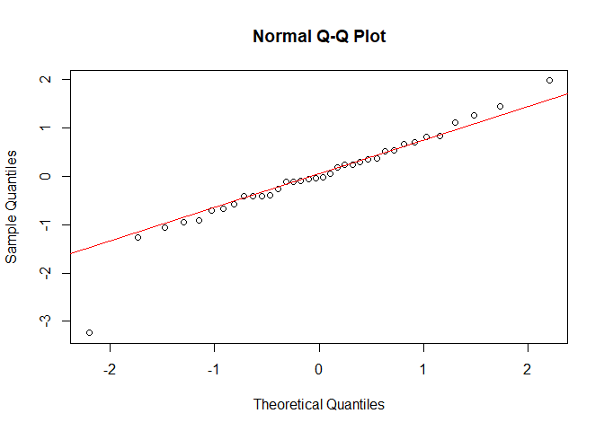<!-- -->

``` r
shapiro.test(volmart$modelBresi)
```

    ## 
    ##  Shapiro-Wilk normality test
    ## 
    ## data:  volmart$modelBresi
    ## W = 0.93771, p-value = 0.04314

``` r
#Check for Homoscedasticity using BreuschPagan Test. Ho is constant variance assumption. Pvalue is 0.2438. WE accept the null hypothesis
library(car)
ncvTest(modelB)
```

    ## Non-constant Variance Score Test 
    ## Variance formula: ~ fitted.values 
    ## Chisquare = 1.358006, Df = 1, p = 0.24388

``` r
#Check for Autocorrelation using Durbin Watson Test. DW Stats is 1.16 indicating  autocorrelation between errors
library(car)
durbinWatsonTest(modelB)
```

    ##  lag Autocorrelation D-W Statistic p-value
    ##    1       0.1705088      1.166454   0.004
    ##  Alternative hypothesis: rho != 0

``` r
##Adding Dummy Variables to account for Auto Correlation
##We add  dummy variables in the dataset for 2010-2012 Jan and 2010-2011 Dec
volmart$month_Yr<-format(as.Date(volmart$Weekending), "%Y-%m")
volmart$Jan <- ifelse(volmart$month_Yr == "2010-01" | volmart$month_Yr == "2011-01" | volmart$month_Yr == "2012-01", 1,0)
volmart$Dec <- ifelse(volmart$month_Yr == "2010-12" | volmart$month_Yr == "2011-12", 1,0)

#Running the models again using the above two variables

modelAD <-lm(Volume.1~Price.1+Distribution.1+Trade.promotion.1+Magazine.1+Discount.1+TV.3+Jan+Dec,data=volmart)
summary(modelAD)
```

    ## 
    ## Call:
    ## lm(formula = Volume.1 ~ Price.1 + Distribution.1 + Trade.promotion.1 + 
    ##     Magazine.1 + Discount.1 + TV.3 + Jan + Dec, data = volmart)
    ## 
    ## Residuals:
    ##     Min      1Q  Median      3Q     Max 
    ## -3.1969 -0.4789  0.0000  0.5144  1.5283 
    ## 
    ## Coefficients:
    ##                     Estimate Std. Error t value Pr(>|t|)    
    ## (Intercept)        4.082e+01  4.873e+00   8.377 5.48e-09 ***
    ## Price.1           -3.980e-01  6.008e-02  -6.625 4.15e-07 ***
    ## Distribution.1     5.956e-03  9.116e-04   6.534 5.25e-07 ***
    ## Trade.promotion.1  4.089e-06  1.076e-06   3.799 0.000751 ***
    ## Magazine.1         6.587e-02  1.530e-02   4.304 0.000197 ***
    ## Discount.1         8.232e-02  4.393e-02   1.874 0.071808 .  
    ## TV.3               1.107e+00  5.470e-01   2.023 0.053091 .  
    ## Jan                1.358e+00  6.275e-01   2.163 0.039528 *  
    ## Dec                1.251e+00  9.088e-01   1.377 0.179975    
    ## ---
    ## Signif. codes:  0 '***' 0.001 '**' 0.01 '*' 0.05 '.' 0.1 ' ' 1
    ## 
    ## Residual standard error: 1.005 on 27 degrees of freedom
    ## Multiple R-squared:  0.8167, Adjusted R-squared:  0.7624 
    ## F-statistic: 15.04 on 8 and 27 DF,  p-value: 3.974e-08

``` r
modelBD<-lm(Volume.1~Price.1+Distribution.1+Trade.promotion.1+Magazine.1+Discount.1+TV.3+AverageComprice+Jan+Dec,data=volmart)
summary(modelBD)
```

    ## 
    ## Call:
    ## lm(formula = Volume.1 ~ Price.1 + Distribution.1 + Trade.promotion.1 + 
    ##     Magazine.1 + Discount.1 + TV.3 + AverageComprice + Jan + 
    ##     Dec, data = volmart)
    ## 
    ## Residuals:
    ##      Min       1Q   Median       3Q      Max 
    ## -3.15746 -0.40540  0.06818  0.55127  1.54061 
    ## 
    ## Coefficients:
    ##                     Estimate Std. Error t value Pr(>|t|)    
    ## (Intercept)        2.858e+01  7.182e+00   3.979 0.000494 ***
    ## Price.1           -4.279e-01  5.779e-02  -7.404 7.32e-08 ***
    ## Distribution.1     5.037e-03  9.487e-04   5.310 1.49e-05 ***
    ## Trade.promotion.1  3.403e-06  1.054e-06   3.230 0.003343 ** 
    ## Magazine.1         6.740e-02  1.433e-02   4.703 7.36e-05 ***
    ## Discount.1         1.071e-01  4.259e-02   2.515 0.018405 *  
    ## TV.3               1.002e+00  5.138e-01   1.950 0.061987 .  
    ## AverageComprice    2.970e-01  1.346e-01   2.207 0.036355 *  
    ## Jan                1.209e+00  5.907e-01   2.047 0.050941 .  
    ## Dec                1.398e+00  8.525e-01   1.639 0.113170    
    ## ---
    ## Signif. codes:  0 '***' 0.001 '**' 0.01 '*' 0.05 '.' 0.1 ' ' 1
    ## 
    ## Residual standard error: 0.9401 on 26 degrees of freedom
    ## Multiple R-squared:  0.8456, Adjusted R-squared:  0.7922 
    ## F-statistic: 15.83 on 9 and 26 DF,  p-value: 1.944e-08

``` r
##We will go with model B as all the p values and sign are acceptable. 

#Predicting the volumes and calculating the residuals

volmart$predvolBD<-fitted(modelBD)

volmart$modelBDresi<-residuals(modelBD) 

# Running further tests

#Check for normality of errors. Results indicate it is not normally distributed with p value of less than 5%
shapiro.test(volmart$modelBDresi)
```

    ## 
    ##  Shapiro-Wilk normality test
    ## 
    ## data:  volmart$modelBDresi
    ## W = 0.89003, p-value = 0.001843

``` r
#Check for Homoscedasticity using BreuschPagan Test. Ho is constant variance assumption. Pvalue is 0.85. We accept the null hypothesis
ncvTest(modelBD)
```

    ## Non-constant Variance Score Test 
    ## Variance formula: ~ fitted.values 
    ## Chisquare = 0.03266752, Df = 1, p = 0.85657

``` r
#Check for Autocorrelation using Durbin Watson Test. DW Stats is 1.26 
durbinWatsonTest(modelBD)
```

    ##  lag Autocorrelation D-W Statistic p-value
    ##    1        0.138072      1.266525   0.004
    ##  Alternative hypothesis: rho != 0
